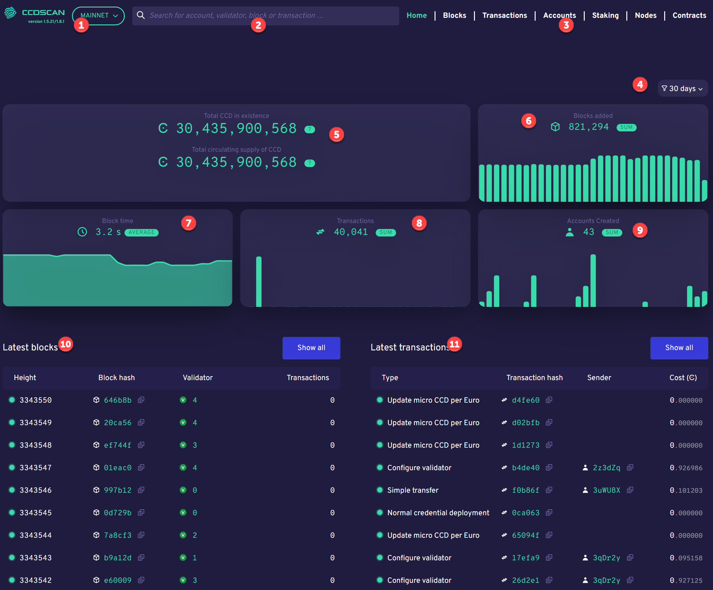

.. _ccd-scan:

=======
CCDScan
=======

`CCDScan <https://ccdscan.io>`_ is a Concordium blockchain explorer. CCDScan effectively serves as a search engine for data on the Concordium blockchain and enables users to search for, explore, and analyze relevant on-chain data. CCDScan includes functionality to scan and gain insights into Concordium blockchain data, such as:

- Block list view of the latest block data
- Block details for each block
- Transaction list view of the latest transaction data
- Transaction details for each transaction
- Account list view of the most recent account data
- Account details for each account address
- Easy search for specific details on blocks, transactions, and accounts
- Cross-linking and drill-through between all relevant entities for easy navigation between blocks, transactions and accounts.
- A dashboard landing page with real-time updates from the Concordium blockchain
- Core metrics, graphs, and statistics on blocks, transactions, and accounts

Delegation and baker pools
==========================

The CCDScan tool allows bakers to view information that helps them to :ref:`manage their baker and pool responsibly<baker-pool>`. It also allows potential delegators to :ref:`research bakers and pools<baker-pool>` to find out which one is reliable and trustworthy.

Use CCDScan
===========

CCDScan shows information about blocks, transactions, accounts, and bakers. Each of the following sections describes what you see.

Home
----

On the Home page that appears when you navigate to CCDScan, you see the following information:

|

1.  Mainnet/Testnet selector. The information shown is dependent on whether you have selected Mainnet or Testnet.
2.  Search field
3.  Page selector: change between pages to see other information. On a smaller screen, the page selector is available in the hamburger menu |hamburger|.
4.  Time range filter
5.  Total CCD in existence on either Mainnet or Testnet; on Mainnet Total CCD in circulation is also shown
6.  Blocks added
7.  Block Time
8.  Transactions
9.  Accounts created
10. Latest blocks: shows latest 10 blocks
11. Latest transactions: shows latest 10 transactions

In Latest blocks and Latest transactions click on information in the highlighted columns for details about the :ref:`block<home-screen-block>`, :ref:`baker<home-screen-baker>`, :ref:`transaction<home-screen-transaction>`, or :ref:`sender<home-screen-sender>`.

.. image:: ../images/ccd-scan/ccd-scan-home-clickable.png

|

You can click Copy |copy| to copy the entire hash or account number.

.. _home-screen-block:

Block hash
^^^^^^^^^^

When you click a block hash, the following appears:

.. image:: ../images/ccd-scan/ccd-scan-home-block-hash.png

|

The block details shows the following information about the block.

- **Block**: the first six characters of the block hash. You can click Copy |copy| to copy the entire hash.
- **Finalised** or **Rejected**: status of the block.
- **Age**: age of the block with date/time stamp.
- **Baker id**: baker ID of the baker who baked the block.
- **Tokenomics**: shows the tokenomics of the accrued block rewards.
- **Transactions**: shows the transaction(s) contained in the block, including the first six characters of the transaction hash, transaction type, first six characters of the Sender account, and the cost of the transaction. You can click **Hash** for more :ref:`information about the transacation<home-screen-transaction>`, or click **Sender** for more :ref:`information about the sender<home-screen-sender>`. You can click Copy |copy| to copy the entire hash or account number.
- **Block statistics**: shows block time and finalization time.

.. _home-screen-baker:

Baker
^^^^^

When you click a baker ID, the following appears:

.. image:: ../images/ccd-scan/ccd-scan-baker-details.png

|

The baker details shows the following information about the baker.

- **Baker**: the baker ID. This is the ID you need if you want to delegate to the baker pool in a wallet.
- **Open, Closed**: the baker pool status.
- **Total stake**: the baker's total stake. Below the total is the amount staked by the baker and the amount of stake that comes from delegators.
- **Account**: the first six characters of the baker account. You can click on the characters for more :ref:`information about the sender<home-screen-sender>`. You can click Copy |copy| to copy the entire account number.
- **Baker rank**: the baker's rank out of all bakers on Mainnet/Testnet based on the baker's total stake.
- **Baking commission**: the baker's baking commission percent.
- **Finalisation commission**: the baker's finalization commission percent.
- **Transaction commission**: the baker's transaction commission percent.
- **Rewards**: shows the sum of rewards earned by the baker and the individual rewards transactions for the time range selected in the filter. Shows the date/time the reward was earned, the transaction type, reference shows the first six characters of the transaction hash, and amount shows the amount of the reward. You can click on the first six characters of a number in Reference to see :ref:`information about the transaction<home-screen-transaction>`. Click Copy |copy| to copy the entire hash number.
- **Related transactions**: shows other transactions related to this baker ID. You see the hash (transaction hash), transaction type, and the transaction age. You can click on the hash characters for more :ref:`information about the transacation<home-screen-transaction>`. Click Copy |copy| to copy the entire hash number.
- **Delegators**: shows the first six characters of the account delegating to the baker, that account's delegated stake, and whether earnings are restaked. You can click on the characters of the account for more :ref:`information about the delegator<home-screen-sender>`. Click Copy |copy| to copy the entire account number.

.. _home-screen-transaction:

Transaction hash
^^^^^^^^^^^^^^^^

When you click a transaction hash, transaction information appears. The information is different depending upon whether the transaction was successful or rejected.

|

The transaction details shows the following.

- **Transaction**: the first six characters of the transaction hash. You can click Copy |copy| to copy the entire transaction hash.
- **Block height/block hash**: the block height and the first six characters of the block hash. You can click Copy |copy| to copy the entire block hash. If you click on an block hash, the :ref:`account details<blocks-view>` appears.
- **Age**: the transaction age with date/time stamp when the transaction was finalized.
- **Transaction type/cost**: the transaction type and the transaction fee.
- **Sender**: the first six characters of the account that sent the transaction. You can click Copy |copy| to copy the entire hash. If you click on an account hash, the :ref:`account details<accounts-view>` appears.

A successful transaction shows the **Events** that were included in the transaction.

If the transaction was rejected, you see something similar to the following:

|

The only difference between a successful and rejected transaction is that the rejected transaction shows the **Reject reason** instead of the events.

.. _home-screen-sender:

Sender
^^^^^^

When you select a sender, the following appears.

.. image:: ../images/ccd-scan/ccd-scan-home-sender.png

|

The following information is shown in the account details:

- **Account**: the first six characters of the account number are shown. You can click Copy |copy| to copy the entire account number.
- **Balance**: the account balance is shown.
- **Age**: the age of the account.
- **Transactions**: Use the navigation buttons at the bottom to navigate through transactions.
- **Account statement**: Use the navigation buttons at the bottom to navigate through account statements.

.. _blocks-view:

Blocks
------

Blocks shows information about the blocks created during the selected time range in the filter.

.. image:: ../images/ccd-scan/ccd-scan-blocks.png

|

You can see the number of blocks added, the average block time, and the average finalization time.

Below the graphs, the table contains the following:

- **Block hash**: the first six digits of the block hash. You can click Copy |copy| to copy the entire hash.
- **Status**: the block status
- **Height**: block height
- **Age**: block age
- **Baker**: the baker ID of the baker who baked the block
- **Transactions**: the number of transactions in the block

.. _transactions-view:

Transactions
------------

Transactions shows information about the transactions during the selected time range in the filter.

.. image:: ../images/ccd-scan/ccd-scan-transactions.png

|

You can see the cumulative number of transactions and the number of transactions in a range as determined by the time selected in the filter.

Below the graphs, the table contains the following:

- **Transaction hash**: the first six digits of the transaction hash. You can click Copy |copy| to copy the entire hash. If you click on a transaction hash, the :ref:`transaction details<home-screen-transaction>` appears.
- **Status**: transaction status
- **Age**: transaction age
- **Type**: transaction type
- **Block height**: the block height of the transaction.
- **Sender**: the first six characters of the account that sent the transaction. You can click Copy |copy| to copy the entire hash. If you click on an account hash, the :ref:`account details<accounts-view>` appears.
- **Cost**: the transaction fee.

.. _accounts-view:

Accounts
--------

Accounts shows information about accounts during the selected time range in the filter.

.. image:: ../images/ccd-scan/ccd-scan-accounts.png

|

On the Accounts page you see the Cumulative accounts created and the Accounts created during the selected time range in the filter.

Below the graphs, the table contains the following:

- **Address**: the first six characters of the account hash. You can click Copy |copy| to copy the entire hash. If you click on an account hash, the :ref:`account details<accounts-view>` appears.
- **Amount**: The publicly visible balance of the account. Does not include shielded amounts.
- **Transaction count**: number of transactions the account has conducted during the selected time range.
- **Account age**: how long the account has existed.

.. _bakers-view:

Bakers
------

Bakers shows information about bakers during the selected time range in the filter:

.. image:: ../images/ccd-scan/ccd-scan-bakers.png

|

On this page you see the graphs showing when the next payday happens, the amount of staked CCD, the number of bakers, and the total of rewards.

Below the graphs, the table contains the following:

- **Baker ID**: ID of the baker. This is the ID you need if you want to delegate to the baker pool in a wallet. If you click on a baker ID, the :ref:`baker details<home-screen-baker>` appears.
- **Delegation pool Status**: the baker's pool status.
- **Account**: the first six characters of the acccount hash appears. You can click Copy |copy| to copy the entire hash. If you click on an account hash, the :ref:`account details<accounts-view>` appears.
- **Delegators**: the number of delegators that baker has.
- **Staked amount**: the total stake of that baker.

.. |copy| image:: ../images/ccd-scan/ccd-scan-copy.png
             :class: button
             :alt: Green document on top of another green document

.. |hamburger| image:: ../images/ccd-scan/hamburger-menu.png
             :class: button
             :alt: Three horizontal lines on a dark background
