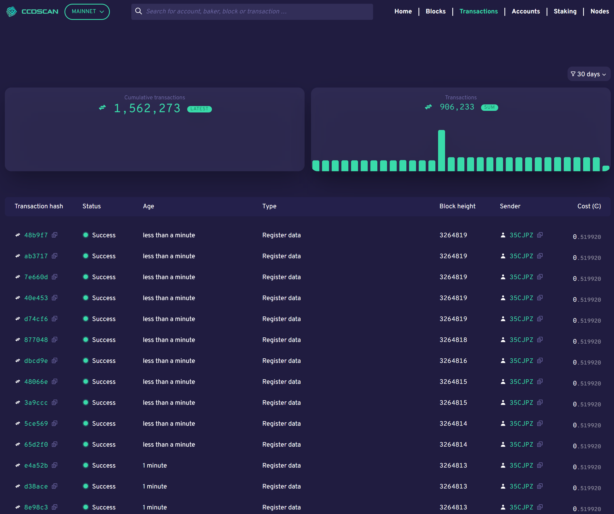

.. _ccd-scan:

=======
CCDScan
=======

`CCDScan <https://ccdscan.io>`_ is a Concordium blockchain explorer. CCDScan effectively serves as a search engine for data on the Concordium blockchain and enables users to search for, explore, and analyze relevant on-chain data. CCDScan includes functionality to scan and gain insights into Concordium blockchain data, such as:

- Block list view of the latest block data
- Block details for each block
- Transaction list view of the latest transaction data
- Transaction details for each transaction
- Account list view of the most recent account data
- Account details for each account address
- Easy search for specific details on blocks, transactions, and accounts
- Cross-linking and drill-through between all relevant entities for easy navigation between blocks, transactions and accounts.
- A dashboard landing page with real-time updates from the Concordium blockchain
- Core metrics, graphs, and statistics on blocks, transactions, and accounts

Delegation and baker pools
==========================

The CCDScan tool allows bakers to view information that helps them to :ref:`manage their baker and pool responsibly<baker-pool>`. It also allows potential delegators to :ref:`research bakers and pools<baker-pool>`.

Use CCDScan
===========

CCDScan shows information about blocks, transactions, accounts, and bakers. Each of the following sections describes what you see.

Home
----

On the Home page that appears when you navigate to CCDScan, you see the following information:

.. image:: ../images/ccd-scan/ccd-scan-overview.png

|

1.  Mainnet/Testnet selector. The information shown is dependent on whether you have selected Mainnet or Testnet.
2.  Search field: search across all relevant blockchain data for specific information, such as a particular account, transaction, block, or baker and see all relevant details associated with that entity.
3.  Page naviation: change between pages to see other information. On a smaller screen, the page selector is available in the hamburger menu |hamburger|.
4.  Time range filter: controls the time range of the data shown.
5.  Total CCD in existence on either Mainnet or Testnet; on Mainnet Total CCD in circulation is also shown
6.  Blocks added
7.  Block Time
8.  Transactions
9.  Accounts created
10. Latest blocks: continuously updated list of the latest 10 blocks baked on the blockchain, including links to details for the individual blocks and bakers.
11. Latest transactions: continuously updated list of the latest 10 transactions on the blockchain, including links to details for the individual transactions and senders (where available).

In Latest blocks and Latest transactions click on information in the highlighted columns for details about the :ref:`block<home-screen-block>`, :ref:`baker<home-screen-baker>`, :ref:`transaction<home-screen-transaction>`, or :ref:`sender<home-screen-sender>`.

.. image:: ../images/ccd-scan/ccd-scan-home-clickable.png

|

You can click Copy |copy| to copy the entire hash or account number.

.. _home-screen-block:

Block hash
^^^^^^^^^^

When you click a block hash, the following appears:

.. image:: ../images/ccd-scan/ccd-scan-home-block-hash.png

|

The block details shows the following information about the block.

- **Block**: the first six characters of the block hash. You can click Copy |copy| to copy the entire hash.
- **Finalised** or **Rejected**: state of the block.
- **Age**: age of the block with date/time stamp.
- **Baker id**: baker ID of the baker who baked the block. Click on the baker ID for details about the :ref:`baker<home-screen-baker>`.
- **Tokenomics**: shows the tokenomics of the accrued block rewards, including the minted CCDs for the block with a breakdown of the distribution plus finalisers and baker rewards. A subsection of tokenomics is the full list of finalisers for each individual block including their weight and reward. It is possible to copy the full address of the finalizer |copy| or drillthrough to the account information of the finaliser. Baker rewards includes a breakdown of the baker rewards details about the rewards, transaction fees, and so on.
- **Transactions**: shows the transaction(s) contained in the block, if any, including the first six characters of the transaction hash, transaction type, first six characters of the Sender account, and the cost of the transaction. You can click **Hash** for more :ref:`information about the transacation<home-screen-transaction>`, or click **Sender** for more :ref:`information about the sender<home-screen-sender>`. You can click Copy |copy| to copy the entire hash or account number.
- **Block statistics**: shows the block time (time since last block) and the finalization time of the block (the time before proof of finalization of the selected block was included in a subsequent block).

.. _home-screen-baker:

Baker
^^^^^

When you click a baker ID, the following appears:

.. image:: ../images/ccd-scan/ccd-scan-baker-details.png

|

The baker details shows the following information about the baker.

- **Baker**: the baker ID. This is the ID you need if you want to delegate to the baker pool in a wallet. If the Baker has been removed (i.e. the baker is no longer active), **Removed** appears next to the ID and a timestamp shows when the baker stopped.
- If there are any pending changes, they are shown here. Events such as stake increase, stake reduction, or baker stop are displayed.
- **Total stake**: the baker's total stake. Below the total is the amount staked by the baker and the amount of stake that comes from delegators.
- **Open, Closed**: the baker pool status.
- **Account**: the first six characters of the baker account. You can click on the characters for more :ref:`information about the sender<home-screen-sender>`. You can click Copy |copy| to copy the entire account number.
- **APY Period**: choose between 7 days or 30 days. This seletion affects the **Total APY**, **Baker APY**, and **Delegators APY**.
- **Baker rank**: the baker's rank out of all bakers on Mainnet/Testnet based on the baker's total stake.
- **Baking commission**: the baker's baking commission percent.
- **Finalisation commission**: the baker's finalization commission percent.
- **Transaction commission**: the baker's transaction commission percent.
- **Payday rewards**: shows the sum of rewards earned by the baker and the individual rewards transactions for the time range selected in the filter. Shows the date/time the reward was earned, the transaction type, reference shows the first six characters of the transaction hash, and amount shows the amount of the reward. You can click on the first six characters of a number in Reference to see :ref:`information about the transaction<home-screen-transaction>`. Click Copy |copy| to copy the entire hash number.
- **Related transactions**: shows other transactions related to this baker ID. You see the hash (transaction hash), transaction type, and the transaction age. You can click on the hash characters for more :ref:`information about the transacation<home-screen-transaction>`. Click Copy |copy| to copy the entire hash number.
- **Delegators**: shows the first six characters of the account delegating to the baker, that account's delegated stake, and whether earnings are restaked. You can click on the characters of the account for more :ref:`information about the delegator<home-screen-sender>`. Click Copy |copy| to copy the entire account number.
- **Metadata**: contains the URL that the baker can optionally provide with information about the baker pool.

.. _home-screen-transaction:

Transaction hash
^^^^^^^^^^^^^^^^

When you click a transaction hash, transaction information appears. The information is different depending upon whether the transaction was successful or rejected.

.. image:: ../images/ccd-scan/ccd-scan-home-transaction-success.png

|

The transaction details shows the following.

- **Transaction**: the first six characters of the transaction hash. You can click Copy |copy| to copy the entire transaction hash. It also shows the transaction state.
- **Block height/block hash**: the block height and the first six characters of the block hash. You can click Copy |copy| to copy the entire block hash. If you click on an block hash, the :ref:`account details<blocks-view>` appears.
- **Age**: the transaction age with date/time stamp.
- **Transaction type/cost**: the transaction type and the transaction fee.
- **Sender**: the first six characters of the account that sent the transaction if available for that transaction. You can click Copy |copy| to copy the entire hash. If you click on an account hash, the :ref:`account details<accounts-view>` appears.
- **Events/Reject reason**:  list of events included in the transaction. It contains more details about the transaction, including drill-through links and copy options where available. There are many different transaction types and descriptions. If you see the transaction type **Update micro CCD per Euro**, it is possible to see the new rate and the effective timestamp.

A successful transaction shows the **Events** that were included in the transaction.

If the transaction was rejected, you see something similar to the following:

.. image:: ../images/ccd-scan/ccd-scan-home-transaction-reject.png

|

The only difference between a successful and rejected transaction is that the rejected transaction shows the **Reject reason** instead of the events.

.. _home-screen-sender:

Sender/Account
^^^^^^^^^^^^^^

When you select a sender or account, the following appears.

|

The following information is shown in the account details:

- **Account**: the first six characters of the account number are shown. You can click Copy |copy| to copy the entire account number.
- **Balance**: the account balance is shown.
- **Age**: the age of the account including the exact timestamp for all individual accounts.
- **Transactions**: a list of all related transactions associated with the account. Use the navigation buttons at the bottom to navigate through transactions.
- **Account statement**: shows how the account balance has changed over time, including the types of changes that have impacted the balance of the account. Use the navigation buttons at the bottom to navigate through account statements.

.. _blocks-view:

Blocks
------

Blocks shows information about the blocks created during the selected time range in the filter.

.. image:: ../images/ccd-scan/ccd-scan-blocks.png

|

The graphs show the number of blocks added, the average block time, and the average finalization time.

Below the graphs, the table contains the latest blocks added to the blockchain with the following information:

- **Block hash**: the first six digits of the block hash. You can click Copy |copy| to copy the entire hash.
- **Status**: the block status
- **Height**: block height
- **Age**: block age
- **Baker**: the baker ID of the baker who baked the block
- **Transactions**: the number of transactions in the block

.. _transactions-view:

Transactions
------------

Transactions shows information about the transactions during the selected time range in the filter.

|

The graphs show the cumulative number of transactions since inception and the number of transactions in a range as determined by the time selected in the filter.

Below the graphs, the table contains the following:

- **Transaction hash**: the first six digits of the transaction hash. You can click Copy |copy| to copy the entire hash. If you click on a transaction hash, the :ref:`transaction details<home-screen-transaction>` appears.
- **Status**: transaction status
- **Age**: transaction age
- **Type**: transaction type
- **Block height**: the block height of the transaction.
- **Sender**: the first six characters of the account that sent the transaction. You can click Copy |copy| to copy the entire hash. If you click on an account hash, the :ref:`account details<accounts-view>` appears.
- **Cost**: the transaction fee.

.. _accounts-view:

Accounts
--------

Accounts shows information about accounts during the selected time range in the filter.

.. image:: ../images/ccd-scan/ccd-scan-accounts.png

|

The graphs show the Cumulative accounts created since inception and the Accounts created during the selected time range in the filter.

Below the graphs, the table contains the following:

- **Address**: the first six characters of the account hash. You can click Copy |copy| to copy the entire hash. If you click on an account hash, the :ref:`account details<accounts-view>` appears.
- **Amount**: The publicly visible balance of the account. Does not include shielded amounts.
- **Transaction count**: number of transactions the account has conducted during the selected time range.
- **Account age**: how long the account has existed.

.. _bakers-view:

Staking
-------

Staking shows information about bakers during the selected time range in the filter:

.. image:: ../images/ccd-scan/ccd-scan-bakers.png

|

The graphs show when the next payday happens, the amount of staked CCD, the number of bakers, and the total of rewards during the selected time range in the filter. If you click **Previous payday block**, the :ref:`block details<home-screen-block>` for the previous pay day block appears.

Below the graphs, you can switch between **Baker pools** and **Top delegators**. You can also choose to see details for **Passive delegation**. There is a switch to **Show only open pools** and a filter where you can choose how the data shown in the table should be ordered.

If you select **Baker pools** the table contains the following:

- **Baker ID**: ID of the baker. This is the ID you need if you want to delegate to the baker pool in a wallet. If you click on a baker ID, the :ref:`baker details<home-screen-baker>` appears. If the Baker has been removed (i.e. the baker is no longer active), **Removed** appears next to the ID.
- **Account**: the first six characters of the acccount hash appears. You can click Copy |copy| to copy the entire hash. If you click on an account hash, the :ref:`account details<accounts-view>` appears.
- **APY (7 days)**: the annual percentage yield of the baker for the past 7 days.
- **Delegation pool Status**: the baker's pool status.
- **Delegators**: the number of delegators that baker has.
- **Available for delegation**:
- **Total stake**: the total stake of that baker.

If you select **Top delegaators** the table contains the following:

- **Account address**: the first six characters of the account hash. You can click Copy |copy| to copy the entire hash. If you click on an account hash, the :ref:`account details<accounts-view>` appears.
- **Delegation target**: the baker whose pool the account has staked. If you click on a baker ID, the :ref:`baker details<home-screen-baker>` appears.
- **Restake earnings**: shows the delegator's restaking preference.
- **Staked amount**: amount of CCD the delegator has staked.

If you select **Passive delegation** the following appears:

.. image:: ..images/ccd-scan/ccd-scan-passive-delegation.png

- **Delegated stake**: amount of CCD delegated to passive delegation.
- **APY (7 days)**: the annual percentage yield of passive delegation based on past 7 days.
- **APY (30 days)**: the annual percentage yield of passive delegation based on past 30 days.
- **Baking commission**: percent of rewards paid as commission to baker.
- **Finalisation commission**: percent of finalization commission.
- **Transaction commission**:
- **Rewards**: list of rewards paid out during the selected time range. **Time** shows the date/time the reward was paid; **Reference** shows the first six characters of the block hash in which the reward was paid. You can click Copy |copy| to copy the entire hash. If you click on the hash, the :ref:`block details<home-screen-block>` appear.
- **Delegators**: the delegators staking to passive delegation, their restake preference, and amount staked. Click on a **Hash** to see :ref:`account details<accounts-view>`. You can click Copy |copy| to copy the entire hash.

Nodes
-----

Nodes shows information about the nodes on Mainnet/Testnet in alphabetical order by node name. The list contains the following information:

- **Node name**: node name as given by the node runner.
- **Baker ID**: if the node is a baker, the baker ID appears. If you click on a baker ID, the :ref:`baker details<home-screen-baker>` appears.
- **Uptime**: amount of time the node has been running.
- **Node version**: version of Concordium node software that the node is running.
- **Avg. ping**: average ping time between the peers of the participant.
- **Peers**: number of peers connected to the participant.
- **Fin. length**: length of participant’s chain up to last finalized block.

.. image:: ../images/ccd-scan/ccd-scan-nodes.png

|

.. |copy| image:: ../images/ccd-scan/ccd-scan-copy.png
             :class: button
             :alt: Green document on top of another green document

.. |hamburger| image:: ../images/ccd-scan/hamburger-menu.png
             :class: button
             :alt: Three horizontal lines on a dark background
