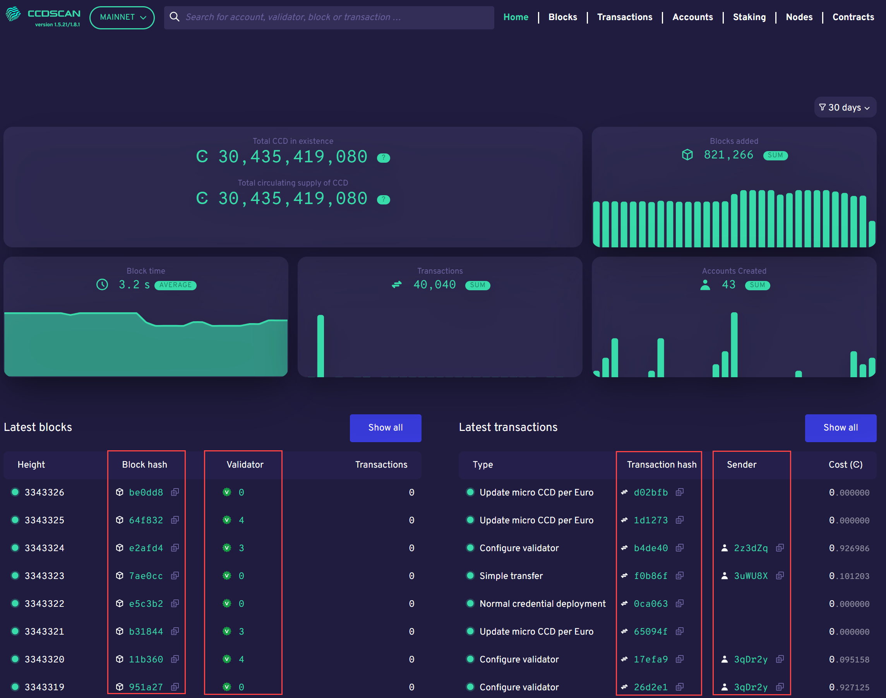

.. _ccd-scan:

=======
CCDScan
=======

`CCDScan <https://ccdscan.io>`_ is a Concordium blockchain explorer. CCDScan effectively serves as a search engine for data on the Concordium blockchain and enables users to search for, explore, and analyze relevant on-chain data. CCDScan includes functionality to scan and gain insights into Concordium blockchain data, such as:

- Block list view of the latest block data
- Block details for each block
- Transaction list view of the latest transaction data
- Transaction details for each transaction
- Account list view of the most recent account data
- Account details for each account address
- Easy search for specific details on blocks, transactions, and accounts
- Cross-linking and drill-through between all relevant entities for easy navigation between blocks, transactions and accounts.
- A dashboard landing page with real-time updates from the Concordium blockchain
- Core metrics, graphs, and statistics on blocks, transactions, and accounts

Delegation and baker pools
==========================

The CCDScan tool allows bakers to view information that helps them to :ref:`manage their baker and pool responsibly<baker-pool>`. It also allows potential delegators to :ref:`research bakers and pools<baker-pool>`.

Use CCDScan
===========

CCDScan shows information about :ref:`blocks<blocks-view>`, :ref:`transactions<transactions-view>`, :ref:`accounts<accounts-view>`, and :ref:`staking<bakers-view>`.

Home
----

On the Home page that appears when you navigate to CCDScan, you see the following information:

.. image:: ../images/ccd-scan/ccd-scan-overview.png

|

1.  Mainnet/Testnet selector. The information shown is dependent on whether you have selected Mainnet or Testnet.
2.  Search field: search across all relevant blockchain data for specific information, such as a particular account, transaction, block, or baker and see all relevant details associated with that entity.
3.  Site naviation: change between pages to see other information. On a smaller screen, the page selector is available in the hamburger menu |hamburger|.
4.  Time range filter: controls the time range of the data shown.
5.  Total CCD in existence on either Mainnet or Testnet; on Mainnet Total CCD in circulation is also shown.
6.  Blocks added: sum of blocks added in the selected time range.
7.  Block Time: average time since last block created in the selected time range.
8.  Transactions: sum of transactions in the selected time range.
9.  Accounts created: sum of accounts created in the selected time range.
10. Latest blocks: continuously updated list of the latest 10 blocks baked on the blockchain, including links to details for the individual blocks and bakers.
11. Latest transactions: continuously updated list of the latest 10 transactions on the blockchain, including links to details for the individual transactions and senders (where available).

In Latest blocks and Latest transactions click on information in the highlighted columns for details about the :ref:`block<home-screen-block>`, :ref:`baker<home-screen-baker>`, :ref:`transaction<home-screen-transaction>`, or :ref:`sender<home-screen-sender>`.

|

You can click Copy |copy| to copy the entire hash or account number.

.. |copy| image:: ../images/ccd-scan/ccd-scan-copy.png
             :class: button
             :alt: Green document on top of another green document

.. |hamburger| image:: ../images/ccd-scan/hamburger-menu.png
             :class: button
             :alt: Three horizontal lines on a dark background

.. toctree::
    :hidden:
    :maxdepth: 1

    ccd-scan-blocks
    ccd-scan-transactions
    ccd-scan-accounts
    ccd-scan-staking
    ccd-scan-nodes
