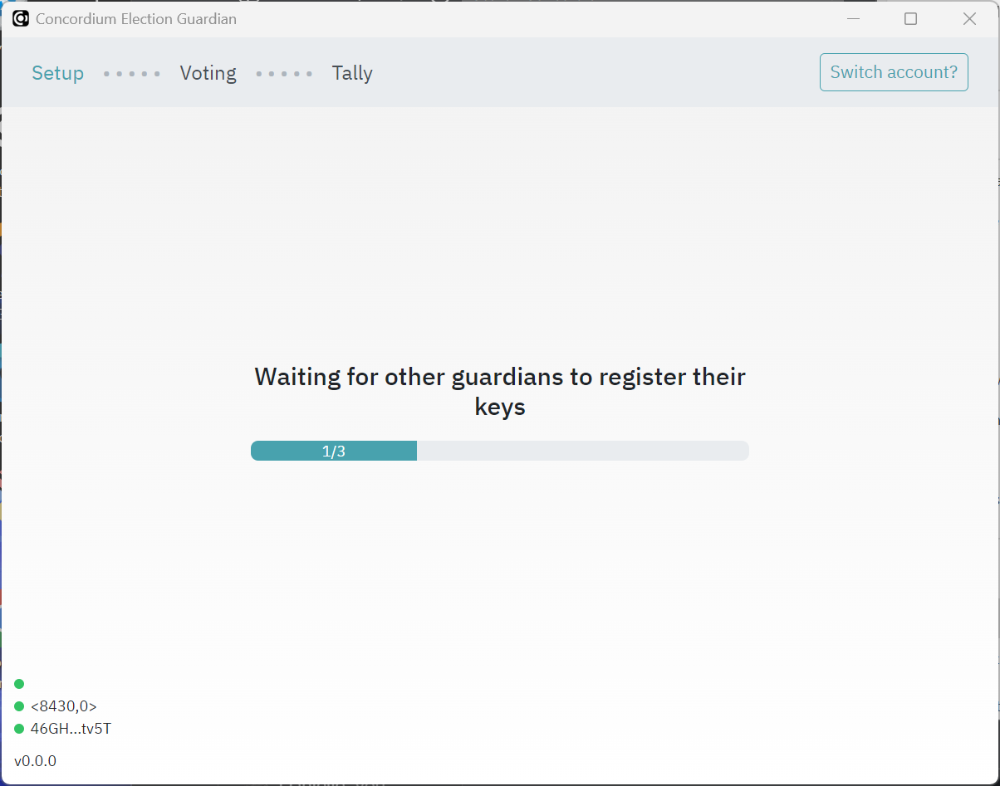

.. _guardians:
.. include:: ../../variables.rst

=========
Guardians
=========

The guardian (via the guardian application) participates in two flows: the setup flow before the election and the decryption flow at the end of the election.

The setup flow ensures that the election tallying is decentralized. A number of guardians as defined by the election parameters in the smart contract register their public keys in the smart contract to say that they will tally election votes. After the election closes, the guardians decrypt their share of the votes and send the decrypted tally back to the smart contract. In this way, no one party tallies the votes for the election, ensuring a fair election.

.. note::

    Guardians cannot use the Desktop wallet or |mw-gen1| because these wallets cannot export account keys.

Pre-setup
=========

The guardians must give account addresses to the organizer of the election. If you need to know how to find your account address, see :ref:`share-address-mw`

Guardians must download and install the Guardian desktop application that is created by the election coordinator.

Setup
=====

Before the election opens, the guardians must use the Guardian app to generate a pre-key.

#. Open the Guardian app.

#. To connect your account to the Guardian app, you must add your export file for your private account keys. For information about how to generate an export file, see :ref:`<export-key>`.

    .. image:: ../images/voting/guardian-await-key.png
        :alt: screen showing drag-drop or browse to export file
        :width: 50%

#. Once you have added the export file, enter a password.

    .. image:: ../images/voting/guardian-set-pw.png
        :alt: password dialog
        :width: 50%

#. Click **Generate guardian key** to create your secret key and register your public key in the election smart contract.

    .. image:: ../images/voting/guardian-generate-keys.png
        :alt: generate key pair dialog
        :width: 50%

   The progress dialog shows the status. Click **Send key registration** to complete the process.

    .. image:: ../images/voting/guardian-send-key-reg.png
        :alt: key pair generation progress dialog
        :width: 50%

Once you have generated your pre-key you must wait until the other guardians have done the same.

After the steps above are complete, all of the guardians generate the real public key together with shares of encryption.

    #. Share this (together with proof) in the contract

    #. Store private keys securely in a JSON file.

    #. Wait until other guardians have done the same and check their proofs.

    #. If corruption is detected the guardian should register a complaint in the contract.

After the election
==================

The app retrieves the encrypted tally from the contract automatically.

#. Find the secret key stored during the Setup phase and decrypt the guardian’s share.

#. Send the decrypted share to the contract.

Uninstall the app
=================

Once the election is final, guardians should uninstall the app. The instructions below describe how to uninstall the app for each platform.

Windows
-------

Uninstall the app as you uninstall all apps on Microsoft.

Delete the file XXXX to remove all guardian keys.

MacOS
-----

Uninstall the app as you uninstall all apps on MacOS.

Delete the file XXXX to remove all guardian keys.

Linux
-----

