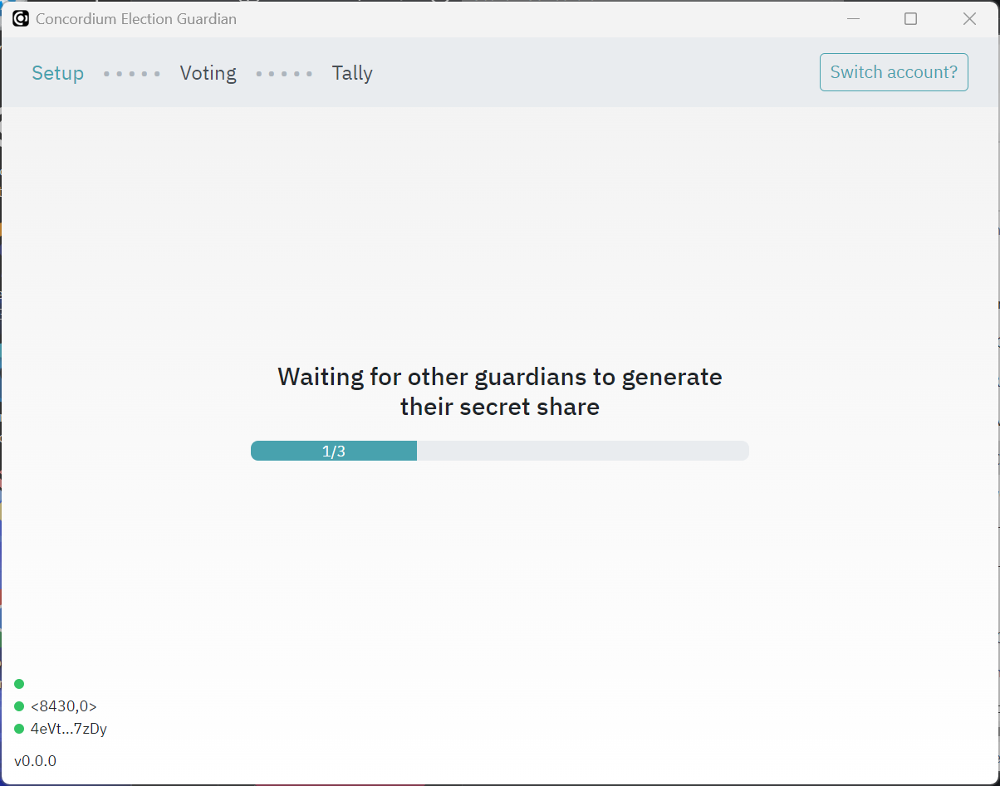
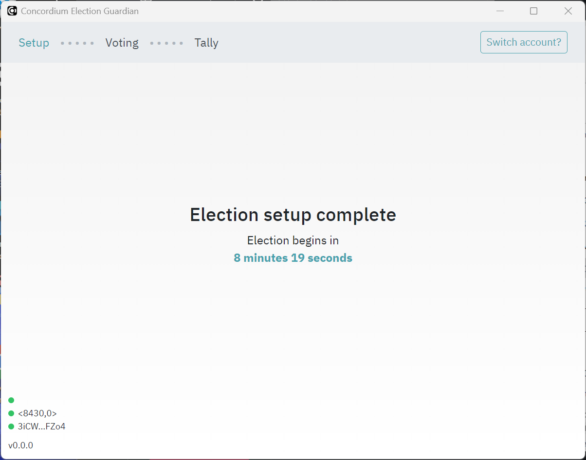
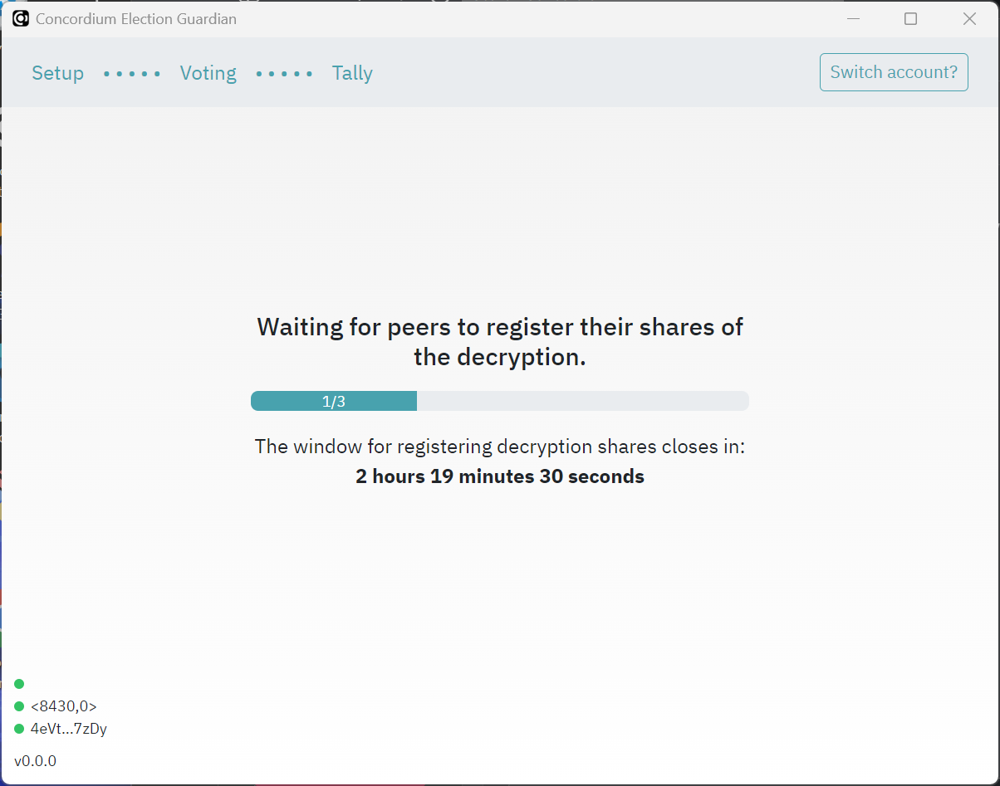
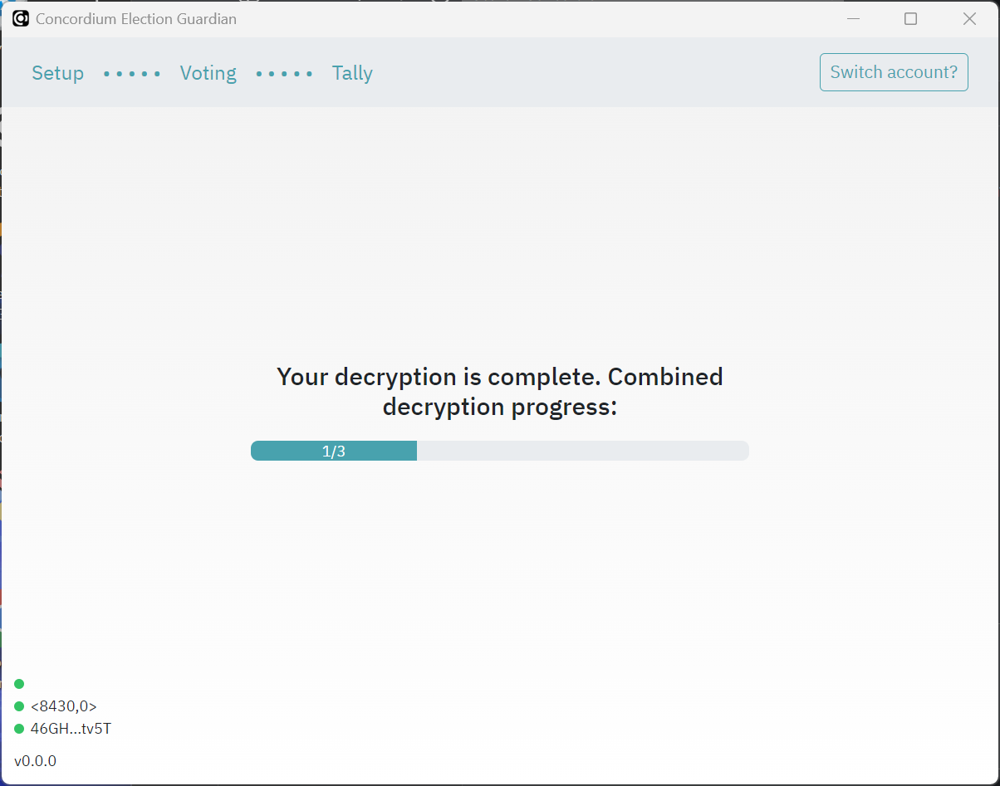

.. _guardians:
.. include:: ../../variables.rst

=========
Guardians
=========

The guardian (via the guardian application) participates in two flows: the setup flow before the election and the decryption flow at the end of the election.

The setup flow ensures that the election tallying is decentralized. A number of guardians as defined by the election parameters in the smart contract register their public keys in the smart contract to say that they will tally election votes. After the election closes, the guardians decrypt their share of the votes and send the decrypted tally back to the smart contract. In this way, no one party tallies the votes for the election, ensuring a fair election.

.. note::

    Guardians cannot use the Desktop wallet or |mw-gen1| because these wallets cannot export account keys.

Pre-setup
=========

The guardians must give account addresses to the organizer of the election. If you need to know how to find your account address, see :ref:`share-address-mw`

Guardians must download and install the Guardian desktop application that is created by the election coordinator.

Setup
=====
Before the election opens, the guardians must use the Guardian app to create their key pairs, register encrypted shares, and generate their secret key share to be used to decrypt the tally after the election.

Generate guardian keys
----------------------

Before the election opens, the guardians must use the Guardian app to generate a pre-key.

#. Open the Guardian app.

#. To connect your account to the Guardian app, you must add your export file for your private account keys. For information about how to generate an export file, see :ref:`<export-key>`.

    .. image:: ../images/voting/guardian-await-key.png
        :alt: screen showing drag-drop or browse to export file
        :width: 50%

#. Once you have added the export file, enter a password.

    .. image:: ../images/voting/guardian-set-pw.png
        :alt: password dialog
        :width: 50%

#. Click **Generate guardian key** to create your secret key and register your public key in the election smart contract.

    .. image:: ../images/voting/guardian-generate-keys.png
        :alt: generate key pair dialog
        :width: 50%

   The progress dialog shows the status. Click **Send key registration** to complete the process.

    .. image:: ../images/voting/guardian-send-key-reg.png
        :alt: key pair generation progress dialog
        :width: 50%

Once you have generated your pre-key you must wait until the other guardians have done the same.

.. image:: ../images/voting/guardian-waiting.png
    :alt: dialog shown when awaiting other guardians
    :width: 50%

Generate and register encrypted shares
--------------------------------------

Once all guardians have generated their keys as described above, each guardian must go through the steps below to generate encrypted shares of their secret key for the other guardians.

#. Click **Generate encrypted shares**.

    .. image:: ../images/voting/guardian-generate-encrypted-shares.png
        :alt: generate encrypted shares dialog
        :width: 50%

#. Click **Register encrypted shares** to register the encrypted shares information to the election smart contract.

    .. image:: ../images/voting/guardian-reg-encrypted-shares.png
        :alt: register encrypted shares progress dialog
        :width: 50%

Once you have generated and registered your encrypted shares you must wait until the other guardians have done the same.

Generate secret key share
-------------------------

The final step is to generate your secret key share. This creates your share of the decryption key using your secret key along with the encrypted shares of the secret keys of the other guardians.

#. Click **Generate secret key share**.

    .. image:: ../images/voting/guardian-generate-secret-key-share.png
        :alt: generate secret key share dialog
        :width: 50%

#. Click **Register validation OK**.

Once you have generated your secret key share you must wait until the other guardians have done the same.

After all guardians have complete the process, a screen shows that election setup is complete and a countdown to the election start.

If corruption is detected the guardian should register a complaint in the contract.

After the election
==================

The app retrieves the encrypted tally from the contract automatically.

Generate your decrypted share
-----------------------------

#. Open the Guardian app.

#. Click **Generate decryption share**.

    .. image:: ../images/voting/guardian-generate-decryption-share.png
        :alt: generate decryption share dialog
        :width: 50%

#. Click **Send share registration**.

    .. image:: ../images/voting/guardian-register-decryption-share.png
        :alt: register decryption share dialog
        :width: 50%

Once you have registered your decryption share you must wait until the other guardians have done the same.

Register the decrypted share in the contract
--------------------------------------------

The final step creates a proof that can be checked by others to determine that the election has been fair.

#. Click **Generate decryption proof**.

    .. image:: ../images/voting/guardian-generate-decryption-proof.png
        :alt: generate decryption proof dialog
        :width: 50%

#. Click **Send proof registration**.

    .. image:: ../images/voting/guardian-register-decryption-proof.png
        :alt: generate decryption proof dialog
        :width: 50%

Once you have registered your decryption proof you must wait until the other guardians have done the same.

After all guardians have registered decryption proofs, the decryption is shown as complete.

.. image:: ../images/voting/guardian-await-decryption-complete.png
    :alt: dialog shown when awaiting other guardians
    :width: 50%

Uninstall the app
=================

Once the election is final, guardians should uninstall the app. The instructions below describe how to uninstall the app for each platform.

Windows
-------

Uninstall the app as you uninstall all apps on Microsoft.

Delete the file XXXX to remove all guardian keys.

MacOS
-----

Uninstall the app as you uninstall all apps on MacOS.

Delete the file XXXX to remove all guardian keys.

Linux
-----

