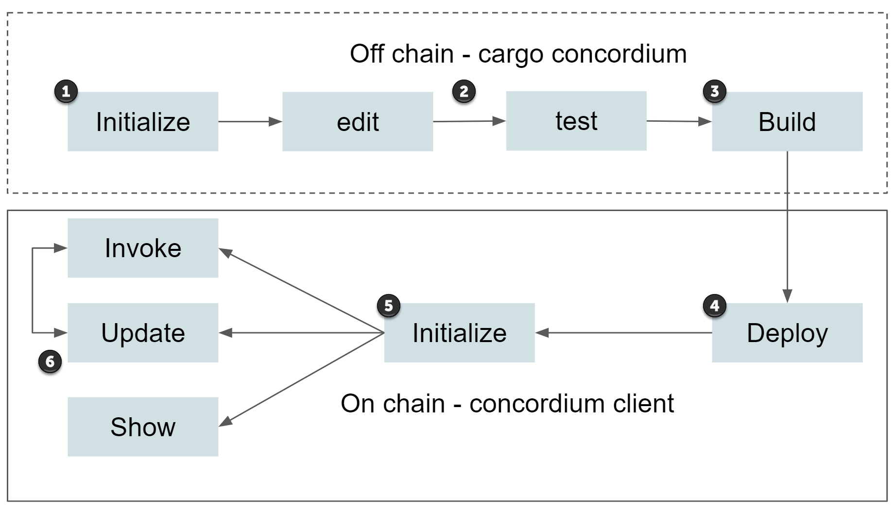

.. Should answer:
    - What is a smart contract
    - Why use a smart contract
    - What are the use cases
    - What are not the use cases

.. _introduction:

===============================
Introduction to smart contracts
===============================

A smart contract is a user-supplied piece of code submitted to the Concordium
blockchain, used to define behavior that is not directly part of the core
protocol. Smart contracts are executed by nodes in the Concordium network
according to predefined rules. Their execution is fully transparent, and all
nodes must agree on what the outcome of execution is based on only publicly
available information.

A smart contract can receive, hold and send CCD, it is able to observe some
aspects of the chain, and maintain its own state. Smart contracts are always
executed as a response to **external** actions, e.g., an account sending a
message. In practice smart contracts will often be a small part of a larger
system, combining on and off-chain functionality. An example of off-chain
functionality could be a server that invokes the smart contract based on
data from the real-world, such as prices of stocks, or weather information.

What are smart contracts for?
=============================

Smart contracts can reduce the needed amount of trust in third-parties, in some cases
removing the need for a trusted third-party, in other cases reducing their
capabilities and thus reducing the amount of trust needed in them.

Because smart contracts are executed completely transparently, in a way that
anybody with access to a node can verify, they can be very useful for ensuring
agreement between parties.

.. _auction:

Auction smart contract example
------------------------------

A use case for smart contracts could be for holding an auction; here we program
the smart contract to accept different bids from anyone and have it keep track
of the highest bidder.
When the auction is over, the smart contract sends the winner bid CCD to the seller and all other bids back. The seller then should send the item to the winner.

The smart contract replaces the main role of the auctioneer. The contract itself
only governs the bidding part, and the on-chain distribution of CCDs. It will
likely also need some logic for reimbursing the highest bidder if the seller
does not fulfil their obligations. This will most likely mean that the contract
needs to support some notion of proof that the seller has indeed fulfilled their
obligation, or some way for the highest bidder to file a complaint. Smart
contracts cannot resolve these real-world issues automatically, and the best
solution is likely going to depend on the specifics of the auction.

What are smart contracts *not* for?
===================================

Smart contracts are a very exciting technology and people are still finding new
ways to take advantage of them.
However, there are some cases where smart contracts are not a good solution.

One of the key advantages of smart contracts is the trust in the code
execution, and to achieve this, a large number of nodes in the blockchain network
have to execute the same code and ensure agreement of the result.
Naturally, this becomes expensive compared to running the same code on one node
in some cloud service.

In cases where a smart contract depends on heavy calculations, it might be
possible moving this calculation out of the smart contract and have the smart
contract execute only some key parts of the computation, using cryptographic
techniques to ensure the other parts are executed correctly.

Finally, it is important to remember that smart contracts have no privacy and
**everything** the smart contract has access to is accessible to everybody else
on the Concordium network, meaning it is difficult to handle sensitive data in a
smart contract. In some cases it might be possible to use cryptographic tools to
not work with the data directly, but rather have the smart contracts work with
derived notions such as encryptions and commitments, which hide the actual data.

Life cycle of a smart contract
==============================

A smart contract is first deployed to the chain as part of a :ref:`contract
module <contract-module>`. After this a smart contract can be *initialized* to
obtain a :ref:`smart contract instance <contract-instances>`. Finally a smart
contract instance can be repeatedly updated according to its own logic.

#. In ``cargo-concordium`` run the ``init`` command to start a new project.

#. Edit your contract, including the entrypoints, functions, and parameters necessary to execute what is needed.

#. In ``cargo-concordium`` run the ``build`` command to build the Wasm module that can be deployed on chain.

#. In ``concordium-client`` run the ``deploy`` command to deploy the Wasm module. This makes the contract available on chain.

#. In ``concordium-client`` run the ``init`` command to initialize the contract on chain. This gives you a fresh state.

#. In ``concordium-client`` you can then run ``invoke`` to simulate or test your contract and see what kind of energy it uses, ``contract show`` to see the schema or parameters in the contract, or ``update`` to execute transactions and update the state.

.. toctree::
   :hidden:
   :maxdepth: 1
   :caption: General

   contract-module
   contract-instances
   contract-schema
   develop-contracts
