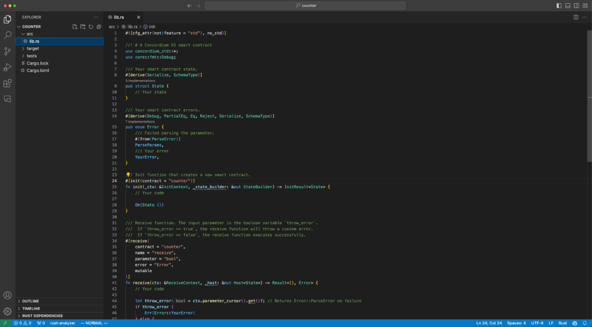
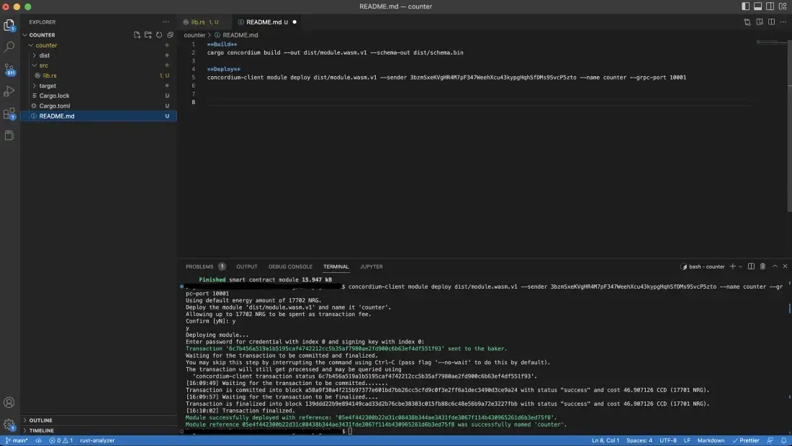
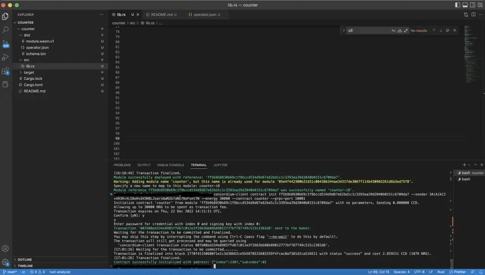
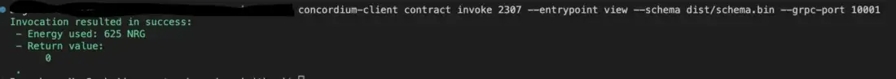
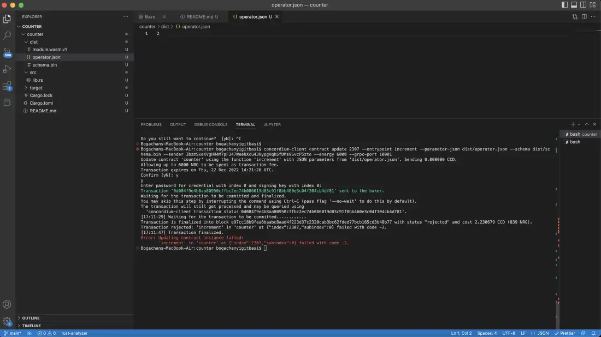
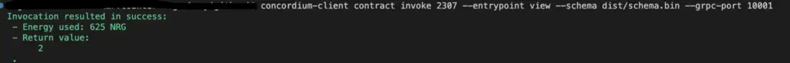
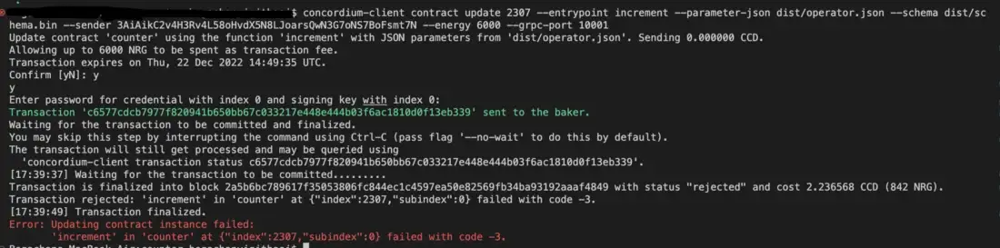

.. _counter-sc:

=================================
Concordium counter smart contract
=================================

This tutorial guides you through creating a smart contract using the Concordium a default contract template that simply keeps a counter value in its state. It is a super simple, fundamental example contract that touches on the following points:

- to be able to increase/decrease the counter value by the parameter given by the user if it is a positive number
- view the current value
- return a custom error when someone tries to increase it with a negative value (or vice versa)
- all these operations have to be done by only the owner of the contract.

.. Attention::

   Before starting the next steps, make sure that you have :ref:`setup the developer environment<setup-env>` with the tools needed.

Once you have set up the tools needed you are ready to create your smart contract project. First, create a working directory, and run the command below in that directory. It will set up the initial project for you, including necessary rust dependencies.

.. Note::

    The template repository contains `short GIFs <https://github.com/Concordium/concordium-rust-smart-contracts/tree/main/templates>`_ that show many of these commands.

.. code-block:: console

    cargo concordium init

Select the ``Default`` option from the menu.

.. image:: images/select-default.png
    :width: 100%

Then it will ask for a name and a description of your project. Fill them in.
The result is a basic skeleton of a smart contract.
Initially, it has a ``State`` struct, an ``init`` function for creating new instances, an ``Error`` enum for custom errors, a ``view`` function, and a ``receive`` function.

Add the counter to the state and i8 for integer. Then add the values ``OwnerError``, ``IncrementError``, and ``DecrementError`` to the ``Error`` enum, and specify the counter initial value as zero in the ``init`` function so the counter value starts from 0 when you create a new, fresh instance the contract. Your contract now looks like the example below.

.. code-block:: rust

    /// Your smart contract state.
    #[derive(Serialize, SchemaType, Clone)]
    pub struct State {
        // Your state
        counter: i8,
    }

    /// Your smart contract errors.
    #[derive(Debug, PartialEq, Eq, Reject, Serial, SchemaType)]
    enum Error {
        /// Failed parsing the parameter.
        #[from(ParseError)]
        ParseParamsError,
        /// Your error
        OwnerError,
        IncrementError,
        DecrementError,
    }

    /// Init function that creates a new smart contract.
    #[init(contract = "counter")]
    fn init<S: HasStateApi>(
        _ctx: &impl HasInitContext,
        _state_builder: &mut StateBuilder<S>,
    ) -> InitResult<State> {
        // Your code

        Ok(State { counter: 0 })
    }

Increment and decrement counter
===============================

Increment counter
-----------------

Then change the update function as described below. Remember that input needs to be parsed without any errors. The value must be positive, otherwise you will get an ``Error::IncrementError``. The transaction must be triggered by the owner of the contract instance or it will throw ``Error::OwnerError``. And the function itself has to be a mutable function because you are going to change the state of the contract.

.. code-block:: rust

    type IncrementVal = i8;
    /// Receive function. The input parameter is the increment value `i8`.
    ///  If the account owner does not match the contract owner, the receive function will throw [`Error::OwnerError`].
    ///  If the number to increment by is negative, the receive function will throw a custom error.
    #[receive(
        contract = "counter",
        name = "increment",
        parameter = "i8",
        error = "Error",
        mutable
    )]
    fn increment<S: HasStateApi>(
        ctx: &impl HasReceiveContext,
        host: &mut impl HasHost<State, StateApiType = S>,
    ) -> Result<(), Error> {
        // Your code

        let param: IncrementVal = ctx.parameter_cursor().get()?;
        let state = host.state_mut();
        ensure!(
            ctx.sender().matches_account(&ctx.owner()),
            Error::OwnerError
        );

        ensure!(param > 0, Error::IncrementError);
        state.counter += param;
        Ok(())
    }

Decrement counter
-----------------

Add a new mutable function to implement decrement with a similar approach. It will also take an input parameter, but this time make sure that it is negative because a violation will be caused by an ``Error::DecrementError``. Like the other one, this can be triggered by only the owner of the contract,otherwise it will throw an ``Error::OwnerError``.

.. code-block:: rust

    #[receive(
        contract = "counter",
        name = "decrement",
        parameter = "i8",
        error = "Error",
        mutable
    )]
    fn decrement<S: HasStateApi>(
        ctx: &impl HasReceiveContext,
        host: &mut impl HasHost<State, StateApiType = S>,
    ) -> Result<(), Error> {
        // Your code

        let param: IncrementVal = ctx.parameter_cursor().get()?;
        let state = host.state_mut();
        ensure!(
            ctx.sender().matches_account(&ctx.owner()),
            Error::OwnerError
        );

        ensure!(param < 0, Error::DecrementError);
        state.counter += param;
        Ok(())
    }

View function
-------------

The view function will return only the counters value so you need to update its return value as i8 and return it from the host.state().

.. code-block:: rust

    /// View function that returns the content of the state.
    #[receive(contract = "counter", name = "view", return_value = "i8")]
    fn view<'a, 'b, S: HasStateApi>(
        _ctx: &'a impl HasReceiveContext,
        host: &'b impl HasHost<State, StateApiType = S>,
    ) -> ReceiveResult<i8> {
        Ok(host.state().counter)
    }

Build, deploy, and initialize the contract
==========================================

Create a ``dist`` folder to keep the schema output file and Wasm compiled contract in and run the build command.

.. code-block:: console

    cargo concordium build --out dist/module.wasm.v1 --schema-out dist/schema.bin

.. image:: images/build.png
    :width: 100%

Deploy it with the command below.

.. code-block:: console

    concordium-client module deploy dist/module.wasm.v1 --sender <YOUR-ACCOUNT> --name counter --grpc-port 10001

Initialize it to create your contract instance, so you are ready to invoke the functions in the next section.

.. code-block:: console

    concordium-client contract init <YOUR-MODULE-HASH> --sender <YOUR-ADDRESS> --energy 30000 --contract counter --grpc-port 10001

Interact with the contract
==========================

View function
-------------

First, check the initial state of the contract.

.. code-block:: console

    concordium-client contract invoke <YOUR-CONTRACT-INSTANCE> --entrypoint view --schema dist/schema.bin --grpc-port 10001

Since you just initialized the contract it is 0.

Increment function
------------------

Create a JSON file that holds your operator that will be given as input to the function and run the command below. Basically, you are saying to the contract instance “with this transaction I will update your state from the increment entrypoint” which is your function name with this parameter.

.. code-block:: console

    concordium-client contract update <YOUR-CONTRACT-INSTANCE> --entrypoint increment --parameter-json <PATH-TO-JSON> --schema dist/smart-contract-multi/schema.bin --sender <YOUR-ADDRESS> --energy 6000 --grpc-port 10001

Start by testing with your conditions. First, try another account other than the owner of the contract since you want that only the owner can call this function.

You get error code: -2. Check the developer portal of Concordium for information about :ref:`custom errors<custom-errors>`. Basically, -2 means you are calling the second error code from your Error enum, which is OwnerError. So that means you have fulfilled the requirement that only the owner can call these functions. Update the state with number 2 now.

.. image:: images/owner-error-ok.png
    :width: 100%

Now check the state once more.

Unsurprisingly, the state is 2. Now check the other requirement: that you cannot increment it with a negative number. Change the value in the JSON file to a negative number like -2.

You cannot do it because of error code -3 which is the third element in the enum: ``IncrementError``. That means the increment method operates as expected in your contract.

You can play with decrement in the same way.
