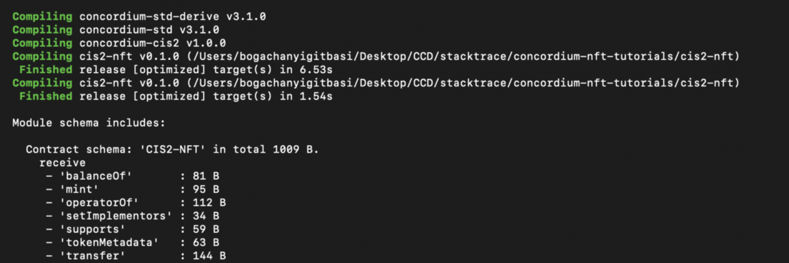
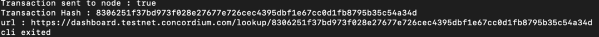
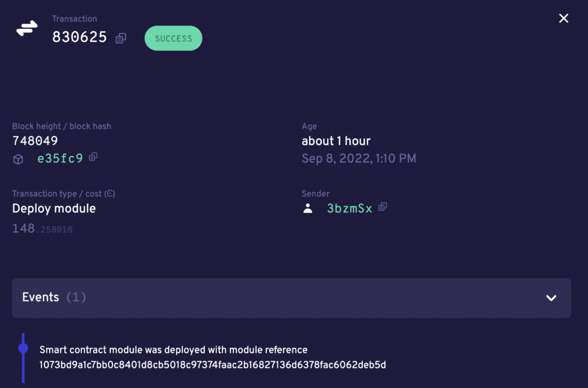
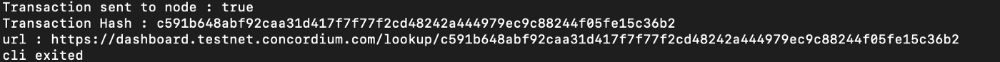
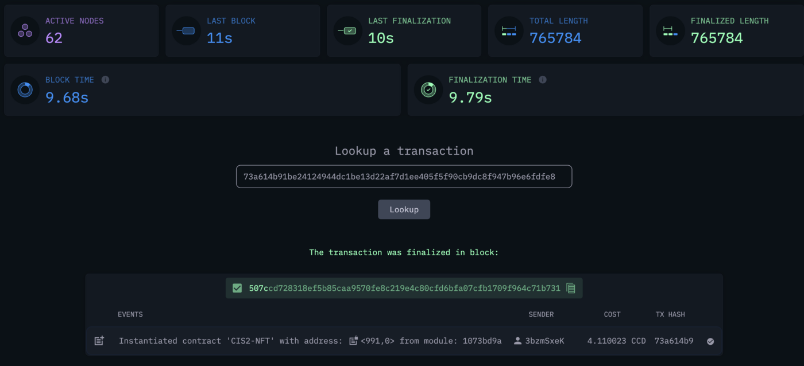

.. _build-smart-contract:

========================
Build the Smart contract
========================

Now, in order to deploy your contract you need to change directory (with “cd” command) to the cis2-nft folder. Then run the commands below to build and deploy your contract. For the sake of simplicity, in this tutorial you are going to use the sample smart contract shared by Concordium in this repository.

.. code-block:: console

    cd cis2-nft

.. code-block:: console

    mkdir -p ../dist/smart-contract

.. code-block:: console

    cargo concordium build --out ../dist/smart-contract/module.wasm --schema-out ../dist/smart-contract/schema.bin

After these steps, you should be able to see something like the below.

Run a node
==========

You are almost ready to mint your first NFT on Concordium. To do that you need to run a local node, which in this tutorial is a :ref:`Docker image<run-a-node>`. This runs a Docker image of a node and this step currently takes some time, potentially hours based on your device configuration, because your node is freshly started and needs to recover all the previous blocks. Once the height value is the same as the height in `CCDScan <https://testnet.ccdscan.io/blocks>`__, then you can continue with the development. Docker file configurations can be found in the docker-compose.yml file as described below. Don't forget the set a name for your node with the parameter ``CONCORDIUM_COLLECTOR_NODE_NAME``.

Remember you are working on the testnet. Check if your node collector is up and running in CCDScan. Look for the name of your node that is specified in the docker-compose.yml file in the network section of the dashboard.

.. image:: images/node-collector.png
    :width: 100%

Deploy your smart contract
==========================

In order to deploy the contract add the following lines to your cli.ts file to specify the compiled module file and the other arguments that will be passed from the terminal.

.. code-block:: console

    function setupCliDeployModule(cli: commander.Command) {
        return (
            cli
            .command("deploy")
            .description(`Deploy Smart Contract Wasm Module`)
            .requiredOption("--wasm <wasm>", "Compile Module file path", "../dist/smart-contract/module.wasm")
            // Sender Account Args
            .requiredOption("--sign-key <signKey>", "Account Signing Key")
            .requiredOption("--sender <sender>", "Sender Account Address. This should be the owner of the Contract")
            // Node Client args
            .requiredOption("--auth-token <authToken>", "Concordium Node Auth Token", "rpcadmin")
            .requiredOption("--ip <ip>", "Concordium Node IP", "127.0.0.1")
            .requiredOption("--port <port>", "Concordium Node Port", (v) => parseInt(v), 10001)
            .requiredOption("--timeout <timeout>", "Concordium Node request timeout", (v) => parseInt(v), 15000)
            .action(
                async (args: DeployModuleArgs) =>
                await sendAccountTransaction(
                    args,
                    args.sender,
                    args.signKey,
                    // payload
                    { content: Buffer.from(readFileSync(args.wasm)) } as DeployModulePayload,
                    // Transaction Type
                    AccountTransactionType.DeployModule,
                ),
            )
        );
    }
    setupCliDeployModule(cli);

Run the command below on your terminal. Paste the signKey value and the address from the `your wallet export file<signkey>`.

.. code-block:: console

    ts-node ./src/cli.ts deploy \
    --wasm ../dist/smart-contract/module.wasm \
    --sender <ACCOUNT-ADDRESS> \
    --sign-key <SIGN-KEY>

If you have the output below, you’ve successfully deployed your first smart contract on Concordium! You can also verify it either by looking at `CCDScan <https://ccdscan.io/>`__ or the `testnet dashboard lookup section <https://dashboard.testnet.concordium.com/>`__.

As you can see below the NFT minting contract is deployed and it allows you to verify the time, sender account and the block itself. It costs ~148 CCD which is less than 1.9 euros currently which is not bad for a 39.8 KB contract.
You can check the remaining balance in your Concordium wallet too.

Now you need go to the `dashboard <https://dashboard.testnet.concordium.com/>`__ and get the hash value from there, using the URL in the terminal. Click **Deployed module with reference** and copy the hash value. You will need it to initialize the contract in the next section.

Initializing the smart contract
===============================

After deploying a contract you have to initialize it. It’s like object-oriented programming: you create a class which is a module, and then you initialize it to create an object. It is the same here. An object of a class is a way to store both states of the class and its functionality. This time you are going to use the hash value you got in the previous step. First, make sure the ``initialize`` function is implemented in your cli.ts file.

.. code-block:: console

    function setupCliInitContract(cli: commander.Command) {
        return (
            cli
            .command("init")
            .description(`Initializes a Smart Contract`)
            .requiredOption("--module <module>", "Module Reference", "CIS2-NFT")
            .requiredOption("--energy <energy>", "Maximum Contract Execution Energy", (v) => BigInt(v), 6000n)
            .requiredOption("--contract <contract>", "Contract name", "CIS2-NFT")
            // Sender Account Args
            .requiredOption("--sender <sender>", "Sender Account Address. This should be the owner of the Contract")
            .requiredOption("--sign-key <signKey>", "Account Signing Key")
            // Node Client args
            .requiredOption("--auth-token <authToken>", "Concordium Node Auth Token", "rpcadmin")
            .requiredOption("--ip <ip>", "Concordium Node IP", "127.0.0.1")
            .requiredOption("--port <port>", "Concordum Node Port", (v) => parseInt(v), 10001)
            .requiredOption("--timeout <timeout>", "Concordium Node request timeout", (v) => parseInt(v), 15000)
            .action(
                async (args: InitContractArgs) =>
                await sendAccountTransaction(
                    args,
                    args.sender,
                    args.signKey,
                    // Payload
                    {
                    amount: new GtuAmount(0n),
                    moduleRef: new ModuleReference(args.module),
                    contractName: args.contract,
                    parameter: Buffer.from([]),
                    maxContractExecutionEnergy: args.energy,
                    } as InitContractPayload,
                    // Transaction Type
                    AccountTransactionType.InitializeSmartContractInstance,
                ),
            )
        );
    }
    setupCliInitContract(cli);

Run the code below. Use the hash value in the <Module Hash> part, and the signKey and address of your account from `your wallet export file<signkey>`. That will create another transaction on chain.

.. code-block:: console

    ts-node ./src/cli.ts init --module <Module Hash> --sender <ACCOUNT-ADDRESS> --sign-key <SIGN-KEY>

If you have the output shown below that means you have successfully initialized your contract.

Go to the URL to get your contract's index value. From the dashboard you can easily see the index, account address as sender, event details and transaction hash.

Continue to the :ref:`final part<mint-transfer>` of the tutorial to mint and transfer your NFT.
