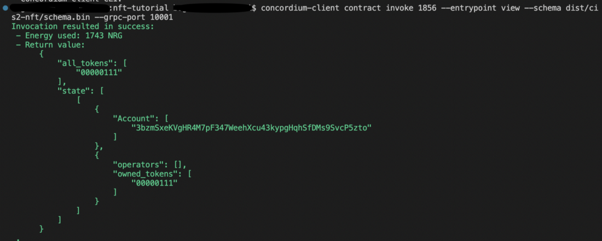
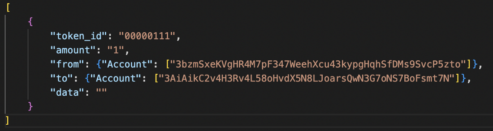
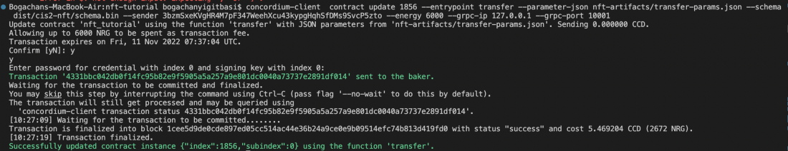
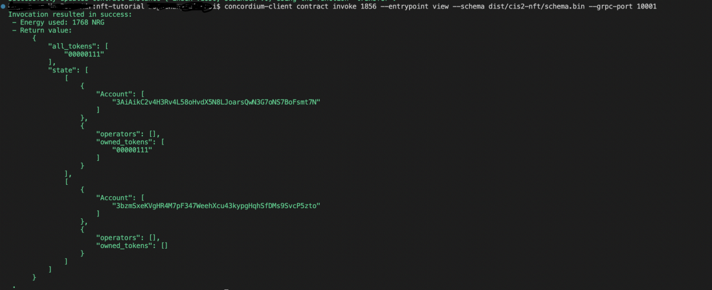

.. _mint-transfer:

=========================
Mint and transfer the NFT
=========================

Now, you are ready to call the mint function. In order to invoke the mint function, you need the contract instance and you must set the owner/minter address, the metadata URL, and the token ID. Because you can mint more than one token with this instance address you need to specify the token ID. You can use either your terminal to give these parameters as inputs or you can create a JSON file and give that file as a parameter to ``concordium-client``. To make it more user-friendly, a JSON file is created in this tutorial. In your project file create a folder with any name you want. In this tutorial it is called “nft-artifacts” and the JSON file is called ``nft-params.json``. You can either do it manually or with following commands.

.. code-block:: console

    mkdir nft-artifacts

.. code-block:: console

    cd nft-artifacts

.. code-block:: console

    touch nft-params.json

With a text editor open up that file and place your account address and token ID in the JSON file as shown in the example below.

.. code-block:: console

    {
        "owner": {
            "Account": ["3bzmSxeKVgHR4M7pF347WeehXcu43kypgHqhSfDMs9SvcP5zto"]
        },
        "tokens": ["00000111"]
    }

Then run the command below to invoke the mint function with the given params.

.. code-block:: console

    concordium-client contract update <YOUR-CONTRACT-INSTANCE> --entrypoint mint --parameter-json nft-artifacts/nft-params.json --sender <YOUR-ADDRESS> --energy 6000 --grpc-port 20001

Minting is successful.

.. image:: images/mint-success.png
    :width: 100%

.. _nft-view-fn:

View function
=============

Now check the current state of the cis2-nft token contract by invoking view function.

.. code-block:: console

    concordium-client contract invoke <YOUR-INDEX> --entrypoint view --grpc-port 20001

Your result will be similar to what is shown below where the user is the owner of the token with ID **00000111**.

You are going to invoke the tokenMetadata function from your contract. It accepts parameters as a vector. (See the function ``fn contract_token_metadata()``). To give a list of the tokenIDs create another JSON file and call it as ``token-ids.json`` and add your tokenID(s) as a vector, so the content of the ``token-ids.json`` file looks like this:

.. code-block:: json

    ["00000111"]

You can query the metadata with the following command.

.. code-block:: console

    concordium-client contract invoke <YOUR-INDEX> --entrypoint tokenMetadata --parameter-json nft-artifacts/token-ids.json --grpc-port 20001

This returns the metadata URL combined with your tokenID.

.. image:: images/metadata-query.png
    :width: 100%

Now the metadata is stored on-chain and no one will be able to change it.

.. _transfer-nft:

Transfer function
=================

Now you will transfer the token and check the balance of your account and the other wallet in the following steps.

Before you transfer the NFT, you should change the sender account and receiver account in the  ``../nft-artifacts/transfer-params.json`` file. Make sure you make the adjustments of addresses accordingly as shown below. You can create another account on your wallet to transfer this token to that.

Now you can transfer it. One reminder, you should be the owner of it to be able to transfer it, so try not to get confused in this step. The original minter account should be in the **from** key’s value and the receiver will be located in the **to** key’s value. When you specify your account addresses and tokenID to be transferred, run the command below. You are going to invoke the transfer function with given parameters.

.. code-block:: console

    concordium-client  contract update <YOUR-INDEX> --entrypoint transfer --parameter-json nft-artifacts/transfer-params.json --sender <YOUR-ADDRESS> --energy 6000 --grpc-ip 127.0.0.1 --grpc-port 20001

The transfer is successfully completed.

Check the state of the token once more with the :ref:`view function<nft-view-fn>`.

As you can see the second account is now the owner of the asset and the first account has nothing.

You have now completed the NFT minting tutorial.
