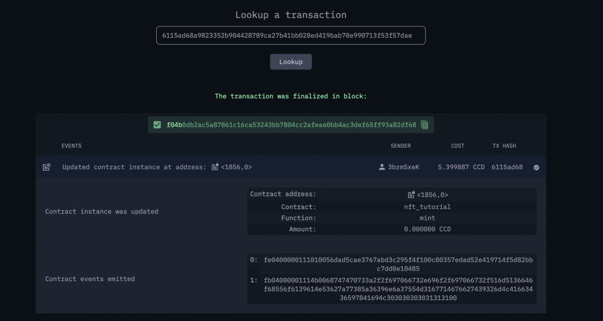

.. _mint-transfer:

=========================
Mint and transfer the NFT
=========================

Now, you are ready to call the mint function. First, place the ``setupCliUpdateContract`` function below in your cli.ts file. In this step, you serialize the parameters taken from the terminal that are going to be input for your update function.

You need to set the mint parameters in mint-params.json file as described below. The account address is the wallet address. You are going to generate one copy of it since it’s a non-fungible token. (A semi-fungible token tutorial will be published soon.) The URL is the IPFS link of the metadata file and hash is the SHA-256 output of the link.

Run the command below with the index value you got previously, your account address and the signKey from your decrypted wallet.json file.

.. code-block:: console

    ts-node ./src/cli.ts mint --params ../nft-artifacts/mint-params.json --schema ../dist/smart-contract/schema.bin --index <YOUR INDEX> --sender <ACCOUNT-ADDRESS> --sign-key <SIGN-KEY>

The result should look similar to the following:

.. image:: ./images/mint-result.png
    :width: 100%

Check the dashboard again to see the transaction.

You have just minted your first NFT on Concordium successfully! Now you will want to get the metadata on-chain and see what you have in there. In order to do that, use ``setupCliInvokeContract`` and use view functions. Since with this function you are not going to change the state of the blockchain, there will be no transaction fee. This is almost the same with the ``setupCliUpdateContract`` except there are no internal state changes in the smart contract. View functions read the current state of the contract.

It expects the IPFS url that you add in metadata-json file and a hash value as you add it in the mint function. I just wanted to show you how can you store on-chain another value in addition to the url. In order to get the details on-chain run the following command.

.. code-block:: console

    ts-node src/cli.ts view --index <YOUR INDEX> --sender <YOUR ADDRESS>

Now you can visit the URL you stored on-chain in a web browser.

If you stored the metadata successfully in IPFS you should see something similar to what is shown below.

.. image:: .images/mint-metadata-result.png
    :width: 100%

If you are implementing a project it is a good idea to run your own IPFS node and pin the data to guarantee that at least one participant has it. Here is an example.

Transfer function
=================

Now let’s transfer it with the following command. We will check the balance of our account and the other wallet in the following steps. Sometimes you just don’t want to hide this beauty for yourself, right?

Before that, you should go and change the sender account and receiver account in this file ../nft-artifacts/transfer-params.json. One little note here, you dont have to do it like this, I just decided to read all these values from a JSON file because it’s easier to understand&follow otherwise it can get quickly messy. So make sure you made the adjustments of addresses accordingly like the one I shared below. I created another account on my mobile wallet (and this time I made some changes to my data like revealing my nationality and country of residence. Which is one of the strongest parts of Concordium, explore it!) and will transfer this token to that.

One reminder, you should be the owner of it to be able to transfer it, so try not to get confused in this step. The original minter account should be in the “from” key’s value and the receiver will be located in the “to” key’s value.

.. code-block:: console

    ts-node ./src/cli.ts transfer --params ../nft-artifacts/transfer-params.json --schema ../dist/smart-contract/schema.bin --index <YOUR INDEX> --sender <ACCOUNT-ADDRESS> --sign-key <SIGN-KEY>

The transfer is successfully completed. Check the state of the token once more with the view function.

As you can see the second account is now the owner of the asset and you can see the previous owners. As a final step,  try to transfer it with your first account again. This should not be possible!

As expected, it can not be transferred because the owner is changed. The second account is the owner and you need to use its signKey and address in order to transfer it.

You have now completed the NFT minting tutorial.
