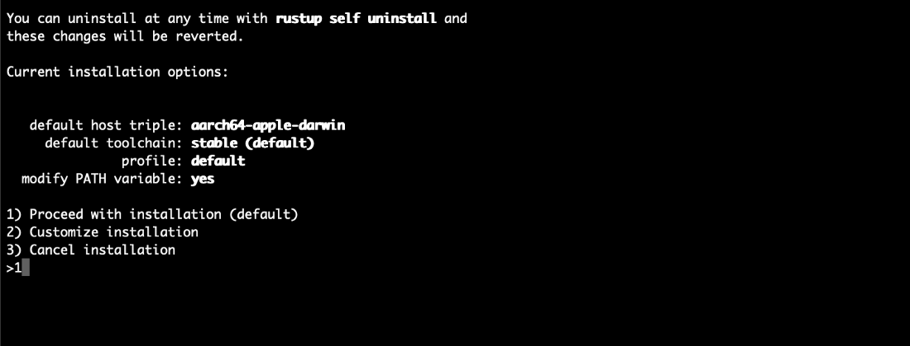

.. include:: ../../../variables.rst
.. _setup-nft-env:

=================================
Setup the development environment
=================================

First, you need to install “rustup” which installs Rust and Cargo to your computer. To do that, you can use this command.

.. code-block:: console

   curl --proto '=https' --tlsv1.2 -sSf https://sh.rustup.rs | sh

Select **1** to continue the installation.

Finally, when Rust and Cargo are successfully installed in your system, you should see something similar to below.

.. image:: images/mint-rust-install-done.png
    :width: 100%

Copy and paste the commands in a terminal to install Wasm which will be used for building contracts.

.. code-block:: console

    source “$HOME/.cargo/env”
    rustup target add wasm32-unknown-unknown

During Wasm installation in your system you should see something similar to below.

.. image:: images/mint-wasm-install.png
    :width: 100%

Now you need to install the Concordium software package. :ref:`Click here<cargo-concordium-testnet>` and download the correct version of cargo-concordium for your operating system. The tool is the same for both testnet and mainnet.

First, rename the “cargo-congordium-v.x.x” file to “cargo-concordium”. Then go to the directory where the file is downloaded and run this command to make it executable. You also need to move the cargo-concordium executable to the cargo folder. :ref:`Follow the information here<setup-tools>` to ensure that your cargo-concordium is configured correctly. The step below is specifically for MacOS. (Note : In this tutorial, we are not going to use concordium-client for our operations so you don’t have to install it.)

.. code-block:: console

    sudo chmod +x cargo-concordium

.. code-block:: console

    mv cargo-concordium ~/.cargo/bin

If everything is correct, when you enter the command ``cargo concordium --help`` it should print something similar below.

.. image:: images/cargo-help.png
    :width: 100%

.. Note::

    If you have a warning on a Mac device that says “cargo-condordium cannot be opened because the developer cannot be verified” that means it requires permission to run and you should go to **System Preferences → Security** and unlock it with your password and click **Allow Anyway**.

    .. image:: images/mac-warning.png
        :width: 100%

Clone the repository
====================

You can start by cloning `this repository <https://github.com/chainorders/concordium-nft-tutorials>`_ which includes some essential binaries, Docker files, and configurations that are provided by Concordium.

There are multiple collections of sample images provided in this link. You can find detailed information about the nft-artifact’s folder in the repository.

In order to start the tutorial, you need to install Docker Compose which you will use for running a Concordium node because you need to run a node to deploy your contracts.

Run the following command on your terminal to clone `this repository <https://github.com/chainorders/concordium-nft-tutorials>`_. It will clone the repository to your local computer.

.. code-block:: console

    git clone --recurse-submodules
    https://github.com/chainorders/concordium-nft-tutorials.git

Setup a wallet
==============

Now you need a Concordium wallet. Use `this link <https://chrome.google.com/webstore/detail/concordium-wallet/mnnkpffndmickbiakofclnpoiajlegmg?hl=en-US>`_ to install a |bw| in a Chrome web browser and configure it to run on testnet. Follow :ref:`these instructions<setup-bw>` to install the extension for testnet and set it up with an identity and account. Use the Testnet faucet to claim 2000 CCDs for testing purposes.

After that step, you need to :ref:`export the keys<export-key>` for your wallet. Save the file on your local machine in the same folder as the rest of the repository.

Continue to the :ref:`next part<upload-nft>` of the tutorial to upload your NFT and assign metadata to it.
