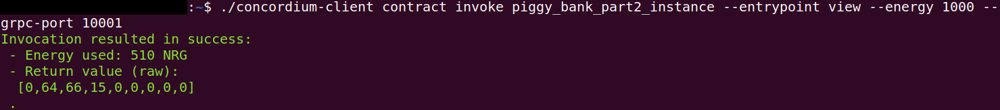

.. _Rust: https://www.rust-lang.org/

.. _piggy-bank-deploying:

=======================================
Deploying the piggy bank smart contract
=======================================

This is the fourth :ref:`part of a tutorial<piggy-bank>` on smart contract
development.
So far you have written and tested a piggy bank smart contract in the Rust_ programming language.

Furthermore, you set up your testnet node on a server, created an account that is funded with some CCD, and imported your account key into the ``concordium-client`` configuration.

This part focuses on how you can deploy your developed piggy bank smart contract to the Concordium testnet and interact with it.


.. warning::

   The reader is assumed to have basic knowledge of what a blockchain and smart
   contract is, and some experience with Rust_.


Preparation
===========

Before you start, make sure you completed the previous parts of the tutorial and have a running testnet node that has caught up to the head of the blockchain and an account with some CCD setup.

Building a Wasm module
======================

You have already built a Wasm module from your piggy bank smart contract in a :ref:`previous part<cargo-concordium-build>` of this tutorial.

Repeat this step since you might have done some changes to the smart contract code in :ref:`part 2<piggy-bank-testing>` of this tutorial. Go to the folder where you saved your piggy bank smart contract and use ``cargo concordium build`` to create a Wasm module.

.. code-block:: console

   $cargo concordium build --out piggy_bank_part2.wasm.v1

.. note::

   This command outputs the module ``piggy_bank_part2.wasm.v1`` to the project's root folder.

.. note::

   When you use the above command without the ``--out`` flag, you can find the module in the folder ``./target/concordium/wasm32-unknown-unknown/release/``.
   Use the Wasm module file suffixed with ``v1`` when deploying to the chain. The ``piggy_bank_part2.wasm`` file (without the ``v1`` suffix) is not the ``v0`` module, but rather the raw Wasm module produced by cargo.
   The ``v1`` suffixed module has been stripped for debugging information, which makes it significantly smaller.


The ``piggy_bank_part2.wasm.v1`` file can be deployed to the Concordium chain. Transfer the ``piggy_bank_part2.wasm.v1`` file to the place where you are running your ``concordium-client`` tool. Navigate to the folder as well.

Deploying a module
==================
You are now set up to deploy the piggy bank module to the testnet chain. Give the module the name ``piggy_bank_part2_module`` so it can be referenced in this tutorial.

.. note::

   Remember to adjust the following commands when you are running your ``concordium-client`` tool locally and want to connect to your node on the server. You can look up the different options on how to connect the ``concordium-client`` tool to your testnet node :ref:`here<interacting-with-your-testnet-node>`.

.. note::

   Names are only stored locally in the ``concordium client`` configuration.
   They are not visible to others on the chain. This is the case for all contracts, modules, and account names/aliases.

.. code-block:: console

   $./concordium-client module deploy piggy_bank_part2.wasm.v1 --sender <account-name> --name piggy_bank_part2_module --grpc-port 10001

.. note::

   This tutorial uses ``Concordium`` for the <account-name>.

.. note::

   You will be asked to input a password. Use the ``export password`` that you used to create the key backup file.

If everything works correctly the output has a green line with your module reference.

.. code-block:: console

   Module successfully deployed with reference: <module-reference>.
   Module reference <module-reference> was successfully named 'piggy_bank_part2_module'.

You can find additional information about deploying a module in this :ref:`guide<deploy-module>`.

.. note::

   Deploying the piggy bank module will fail with an error message if a module with the exact same hash (the <module-reference>) has already been deployed.
   If you compile the same contract on different systems or versions of rustc, then their hashes will often differ.
   You can continue this tutorial by using the module reference printed in the error message instead of the name ```piggy_bank_part2_module```.

.. code-block:: console

   Error: Module deployment failed:
   Module <module-reference> already exists.

.. image:: ./images/pb_tutorial_20.png
   :width: 100 %

Initializing a module
=====================

You can initialize your smart contract now to create a smart contract instance. Give the instance the name ``piggy_bank_part2_instance`` so it can be referenced in this tutorial.

.. code-block:: console

   $./concordium-client contract init piggy_bank_part2_module --sender <account-name> --contract PiggyBank --name piggy_bank_part2_instance --energy 1000 --grpc-port 10001

.. note::

   1000 is enough energy to initialize the piggy bank smart contract but you
   might need more energy for larger smart contracts. The ``--energy`` parameter sets the maximum allowed
   energy to be used. You only pay for the actual energy used.

If everything works correctly the output has a green line with your smart contract instance index.

.. code-block:: console

   Contract successfully initialized with address: {"index":<smart-contract-instance-index>,"subindex":0}
   Contract address {"index":<smart-contract-instance-index>,"subindex":0} was successfully named 'piggy_bank_part2_instance'.

.. image:: ./images/pb_tutorial_22.png
   :width: 100 %

You can find additional information about initializing a smart contract instance in this :ref:`guide<initialize-contract>`.

Updating the piggy bank smart contract
======================================

Deposit 1 CCD into the piggy bank to test if you can update the smart contract instance.

.. code-block:: console

   $./concordium-client contract update piggy_bank_part2_instance --entrypoint insert --energy 1000 --sender <account-name> --amount 1 --grpc-port 10001

If everything works correctly the output has a green line as follows:

.. code-block:: console

   Successfully updated contract instance {"index":<smart-contract-instance-index>,"subindex":0} ('piggy_bank_part2_instance') using the function 'insert'.


You can find additional information about updating a smart contract instance in this :ref:`guide<interact-instance>`.


Viewing the piggy bank state
============================

You can display the raw return value of your piggy bank smart contract with the following command.

.. code-block:: console

   $./concordium-client contract invoke piggy_bank_part2_instance --entrypoint view --energy 1000 --grpc-port 10001

If everything works correctly the output has a green line as follows:

.. code-block:: console

   Invocation resulted in success:
   - Energy used: 510 NRG
   - Return value (raw):
   [0,64,66,15,0,0,0,0,0]
   .



You can find additional information about invoking in this :ref:`guide<invoke-instance>`.


Smashing the piggy bank smart contract
======================================

Smash the piggy bank contract to test that you can invoke this entry point. After smashing the piggy bank you cannot enter any additional CCD into the piggy bank anymore.

.. code-block:: console

   $./concordium-client contract update piggy_bank_part2_instance --entrypoint smash --sender <account-name> --energy 2000 --grpc-port 10001


If everything works correctly the output has a green line as follows:

.. code-block:: console

   Successfully updated contract instance {"index":<smart-contract-instance-index>,"subindex":0} ('piggy_bank_part2_instance') using the function 'smash'.

.. image:: ./images/pb_tutorial_25.png
   :width: 100 %

You can find additional information about updating a smart contract instance in this :ref:`guide<interact-instance>`.

.. note::

   Ensure that you don't send any CCD to the smart contract instance and that the ``--sender`` flag uses the <account-name>
   that initialized the piggy bank smart contract instance (the owner of this smart contract instance).
   You can find explanations about the behavior of the ``Smash`` entry point in this :ref:`guide<smashing-the-piggy-bank-writing>`.
   The ``Smash`` entry point is ``non-payable`` and will print the below error message if you send CCD with the ``--amount`` flag.
   The opposite is not true and you can omit the ``--amount`` flag when interacting
   with a ``payable`` function without raising an error because in that case 0 CCD is sent to the ``payable`` entry point.

.. code-block:: console

   Error: Updating contract instance failed:
   'smash' in 'PiggyBank' at {"index":<smart-contract-instance-index>,"subindex":0} failed with code -2147483636.


Congratulations. You have completed the whole piggy bank tutorial.
