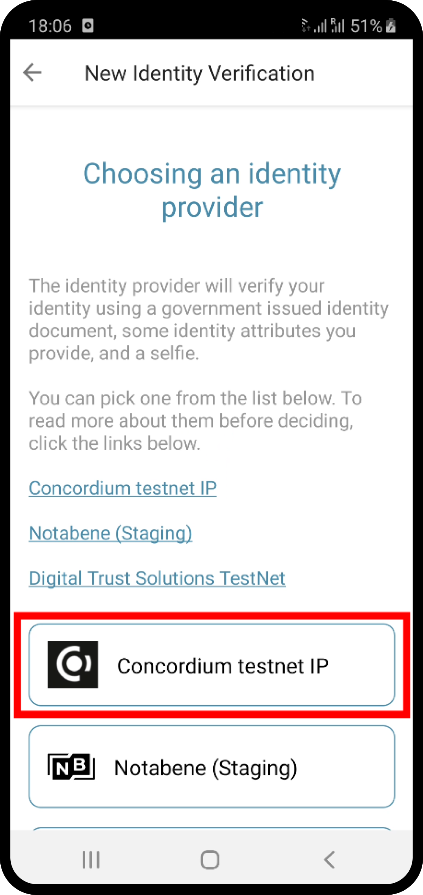
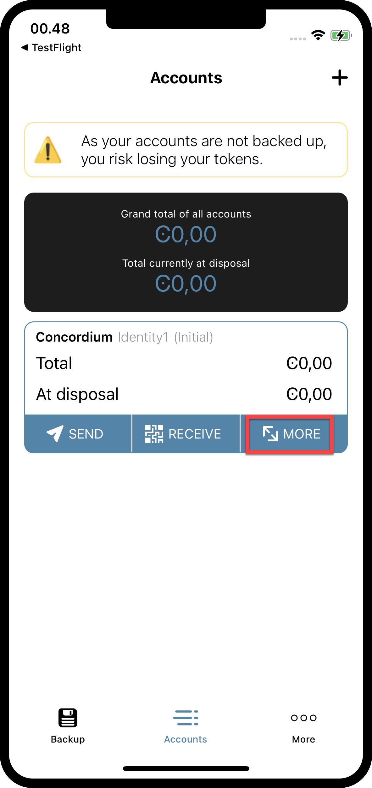

.. _Rust: https://www.rust-lang.org/
.. _concordium-std: https://docs.rs/concordium-std/latest/concordium_std/index.html
.. |concordium-std| replace:: ``concordium-std``
.. _test_infrastructure: https://docs.rs/concordium-std/latest/concordium_std/test_infrastructure/index.html
.. |test_infrastructure| replace:: ``test_infrastructure``
.. _init: https://docs.rs/concordium-std/latest/concordium_std/attr.init.html
.. |init| replace:: ``#[init]``
.. _receive: https://docs.rs/concordium-std/latest/concordium_std/attr.receive.html
.. |receive| replace:: ``#[receive]``
.. _TestInitContext: https://docs.rs/concordium-std/latest/concordium_std/test_infrastructure/type.TestInitContext.html
.. |TestInitContext| replace:: ``TestInitContext``
.. _TestReceiveContext: https://docs.rs/concordium-std/latest/concordium_std/test_infrastructure/type.TestReceiveContext.html
.. |TestReceiveContext| replace:: ``TestReceiveContext``
.. _TestHost: https://docs.rs/concordium-std/latest/concordium_std/test_infrastructure/struct.TestHost.html
.. |TestHost| replace:: ``TestHost``
.. _TestStateBuilder: https://docs.rs/concordium-std/latest/concordium_std/test_infrastructure/type.TestStateBuilder.html
.. |TestStateBuilder| replace:: ``TestStateBuilder``
.. _HasInitContext: https://docs.rs/concordium-std/latest/concordium_std/trait.HasInitContext.html
.. |HasInitContext| replace:: ``HasInitContext``
.. _HasStateApi: https://docs.rs/concordium-std/latest/concordium_std/trait.HasStateApi.html
.. |HasStateApi| replace:: ``HasStateApi``
.. _AccountAddress: https://docs.rs/concordium-std/latest/concordium_std/struct.AccountAddress.html
.. |AccountAddress| replace:: ``AccountAddress``
.. _set_owner: https://docs.rs/concordium-std/latest/concordium_std/test_infrastructure/type.TestReceiveContext.html#method.set_owner
.. |set_owner| replace:: ``set_owner``
.. _Address: https://docs.rs/concordium-std/latest/concordium_std/enum.Address.html
.. |Address| replace:: ``Address``
.. _set_sender: https://docs.rs/concordium-std/latest/concordium_std/test_infrastructure/type.TestReceiveContext.html#method.set_sender
.. |set_sender| replace:: ``set_sender``
.. _set_self_balance: https://docs.rs/concordium-std/latest/concordium_std/test_infrastructure/struct.TestHost.html#method.set_self_balance
.. |set_self_balance| replace:: ``set_self_balance``
.. _invoke_transfer: https://docs.rs/concordium-std/latest/concordium_std/trait.HasHost.html#tymethod.invoke_transfer
.. |invoke_transfer| replace:: ``invoke_transfer``
.. _get_transfers: https://docs.rs/concordium-std/latest/concordium_std/test_infrastructure/struct.TestHost.html#method.get_transfers
.. |get_transfers| replace:: ``get_transfers``
.. _concordium_cfg_test: https://docs.rs/concordium-std/latest/concordium_std/attr.concordium_cfg_test.html
.. |concordium_cfg_test| replace:: ``#[concordium_cfg_test]``
.. _concordium_test: https://docs.rs/concordium-std/latest/concordium_std/attr.concordium_test.html
.. |concordium_test| replace:: ``#[concordium_test]``
.. _fail: https://docs.rs/concordium-std/latest/concordium_std/macro.fail.html
.. |fail| replace:: ``fail!``
.. _expect_report: https://docs.rs/concordium-std/latest/concordium_std/trait.ExpectReport.html#tymethod.expect_report
.. |expect_report| replace:: ``expect_report``
.. _expect_err_report: https://docs.rs/concordium-std/latest/concordium_std/trait.ExpectErrReport.html#tymethod.expect_err_report
.. |expect_err_report| replace:: ``expect_err_report``
.. _claim: https://docs.rs/concordium-std/latest/concordium_std/macro.claim.html
.. |claim| replace:: ``claim!``
.. _claim_eq: https://docs.rs/concordium-std/latest/concordium_std/macro.claim_eq.html
.. |claim_eq| replace:: ``claim_eq!``
.. _ensure: https://docs.rs/concordium-std/latest/concordium_std/macro.ensure.html
.. |ensure| replace:: ``ensure!``
.. _mutable: https://docs.rs/concordium-std-derive/latest/concordium_std_derive/attr.receive.html#mutable-function-can-mutate-the-state
.. |mutable| replace:: ``mutable``

.. _piggy-bank-preparing:

====================================
Preparing a testnet node on a server
====================================

This is the third :ref:`part of a tutorial<piggy-bank>` on smart contract
development.
So far you have written and tested a piggy bank smart contract in the Rust_ programming
language.
This part will focus on how you can set up your own testnet node on a server, and create a testnet account.
In more detail, you will create an instance on a server that will host your own testnet node. Secondly, you will create your own testnet account and import the keys to your testnet node.

.. warning::

   The reader is assumed to have basic knowledge of what a blockchain and smart
   contract is, and some experience with Rust_.

Preparation
===========

Before you start, make sure you create an account at your favourite cloud provider to set up your instance.

You are now ready to select an instance on the cloud provider that matches the following requirements to run a testnet node:

.. list-table::
   :widths: 25 25
   :header-rows: 1

   * - Hardware (Testnet node)
     - Recommended
   * - CPU (Core)
     - ?
   * - RAM (Memory)
     - 16 GB
   * - Storage
     - 50 GB
   * - Operating System
     - Ubuntu 20.04 x64

Create an ubuntu instance on a server
=====================================

The :ref:`run a node <node-requirements>` guide will help you set up your instance correctly. It is recommended using an ubuntu instance on a server in the cloud for this tutorial.

.. Note::
   It is technically fine to run your testnet node locally on your machine instead of on a server in the cloud. Since blockchain nodes have to run 24/7 to be up-to-date with the blockchain, you have to run your local machine 24/7. Alternatively if you don't want to run your local machine 24/7, you can let catch up your node whenever you start your machine. Because this takes some time, this tutorial recommends a cloud provider setup for convenience.

Sync a testnet node
===================

You are now ready to download the :ref:`Concordium Client<concordium-node-and-client-download-testnet>` package to your instance. This software package will allow you to run a testnet node on your server. You find important commands that Concordium Client provides :ref:`here<concordium_client>`.

.. Note::
   It is possible to download the package to your local laptop/computer and then use a file-sharing tool (such as `FileZilla`) to transfer the software package to your instance.

Start the syncing process of the testnet node by following the guide for your platform :ref:`Ubuntu<ubuntu-node>`, :ref:`Docker<docker-node>`, :ref:`Windows<windows-node>`, or :ref:`MacOS<macos-node>`.

.. Note::
   It is a good practice to enable inbound connection at the port 8889 (testnet). This is not mandatory for the node to sync but it will make your node a good network participant.

Create a mobile wallet account on testnet
=========================================

You can create an account with any of the officially provided wallets from Concordium. This tutorial focuses on the mobile wallet but feel free to explore the setup of the :ref:`desktop wallets<overview-account-desktop>` alternatively.

You can download the mobile wallet package from the :ref:`installation page<downloads-mobile-wallet-testnet>`.
If you follow the instruction in the mobile app you are asked to name your account and to name your initial identity card. This tutorial uses `Concordium` for the account name and `Account1` for the identity card name but feel free to chose your own naming.

.. image:: ./images/pb_tutorial_1.png
   :width: 20 %

.. image:: ./images/pb_tutorial_2.png
   :width: 20 %

.. image:: ./images/pb_tutorial_3.png
   :width: 20 %

You don't have to provide an ID to create an account on testnet when selecting `Concordium testnet IP`. This allows you to insert some dummy identity data and is meant for testnet testing only.

.. Note::
   On mainnet you will have to provide your personal ID to an identity provider to get a mainnet account.

You also have to request some testnet CCD. The mobile app wallet has a button that you can use to request 20000 testnet CCD.

.. image:: ./images/pb_tutorial_6.png
   :width: 20 %

.. Note::
   Some CCD on your testnet account is needed later when sending transactions from your account to the testnet blockchain.

Create a backup of your wallet by clicking the `Backup` button in the mobile app. Safe the file for now because it will be used in the next section.

.. image:: ./images/pb_tutorial_7.png
   :width: 20 %

.. Note::
   Please remember the `identity card name` and the `export password` that you used for creating the backup file. These two variables are needed later when important your account key into the testnet node.

Import your mobile wallet account key to your testnet node
==========================================================

You are ready now to import your keys to your testnet node. You have to transfer your wallet backup file to the place where your testnet node is running at.

.. Note::
   You can use a file-sharing tool (such as `FileZilla`) to transfer your wallet backup file from e.g. your laptop or computer to your instance in the server.

If you used the desktop wallet for creating your account, you can find the equivalent steps :ref:`here<export-import>` for exporting and backing up your wallet account.

You are set for importing your key to your testnet node now with this command:

.. code-block:: console

   $concordium-client config account add-keys --account ACCOUNT --keys KEYS
