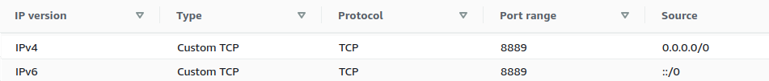
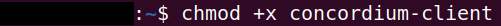
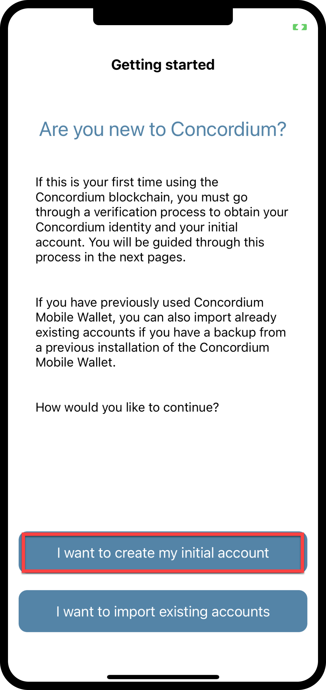
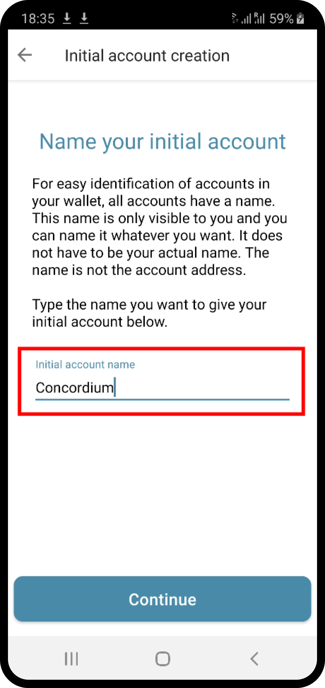
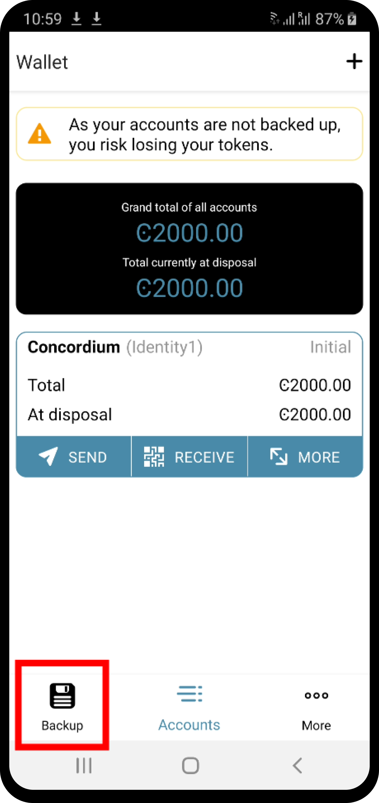

.. _Rust: https://www.rust-lang.org/

.. _piggy-bank-preparing:

====================================
Preparing a testnet node on a server
====================================

This is the third :ref:`part of a tutorial<piggy-bank>` on smart contract
development.

So far you have written and tested a piggy bank smart contract in the Rust_ programming
language.

This part focuses on how you can set up your own testnet node on a server and create a testnet account.
In more detail, you will create an instance on a server that will host your own testnet node. Secondly, you will create your own testnet account and prepare it so you can use it in the fourth :ref:`part of this tutorial<piggy-bank-deploying>` for deploying and interacting with your piggy bank smart contract.

.. warning::

   The reader is assumed to have basic knowledge of what a blockchain and smart
   contract is, and some experience with Rust_.

Preparation
===========

Before you start, make sure you create an account on your favorite cloud provider to set up your instance unless you intend to run a testnet node locally on your machine, see more details below.

You are now ready to select an instance on the cloud provider that matches the following requirements to run a testnet node:

.. list-table::
   :widths: 25 25
   :header-rows: 1

   * - Hardware (Testnet node)
     - Recommended
   * - CPU (Core)
     - 2
   * - RAM (Memory)
     - 8 GB
   * - Storage
     - 25 GB
   * - Operating system
     - Ubuntu 20.04 x64

.. note::

   The above requirements are simple and meant for a testnet node only. See the :ref:`requirements <system-requirements-node-mainnet>` for mainnet nodes.

Syncing a testnet node
======================

The :ref:`run a node <node-requirements>` guide will help you set up your instance correctly. It is recommended to use an Ubuntu instance on a server in the cloud for this tutorial.

.. note::

   It is technically fine to run your testnet node locally on your machine instead of on a server in the cloud. Since blockchain nodes have to run 24/7 to be up-to-date with the blockchain, you have to run your local machine 24/7. Alternatively, if you don't want to run your local machine 24/7, you can let your node catch up whenever you start your machine. Because this takes some time, this tutorial recommends a cloud provider setup for convenience.

Start the syncing process of the testnet node by following the guide for your platform :ref:`Ubuntu<ubuntu-node>`, :ref:`Docker<docker-node>`, :ref:`Windows<windows-node>`, or :ref:`MacOS<macos-node>`.

You should find your node name on the `Concordium testnet dashboard <https://dashboard.testnet.concordium.com/>`_. It will take less than a day until your testnet node is fully synced. You can observe the syncing process by watching the finalization length of your node. Wait until the ``Fin Length`` (finalization length) of your node is the same as the highest value used by the majority of nodes.

.. note::

   To allow the network dashboard to display nodes in the network and their current status, a node must run a collector. The collector is enabled by the default start-up script but can be disabled.

.. image:: ./images/pb_tutorial_13.png
   :width: 100 %

Alternatively, you can query the syncing state of your node with ``concordium-client``. You will learn how to set up ``concordium-client`` in the next section. You can return to this command after reading the next section.
Wait until the ``last finalized block height`` of your node is the same as the highest value used by the majority of nodes.

.. code-block:: console

   ./concordium-client consensus status --grpc-port 10001

.. image:: ./images/pb_tutorial_19.png
   :width: 100 %

.. note::

   It is a good practice to enable inbound connections on port 8889 (testnet) in your instance. You can allow inbound connections from any IPv4 and IPv6 address, by selecting ``0.0.0.0/0`` and ``::/0`` on the port 8889. This is not mandatory for the node to sync but it will make your node a good network participant. Feel free to skip this step if you are not feeling confident editing the inbound connection rules of your instance.

.. _interacting-with-your-testnet-node:

Interacting with your testnet node
==================================

You are now ready to download the :ref:`concordium-client<concordium-node-and-client-download-testnet>` package. Rename the package to ``concordium-client`` in case it has some version annotation so you can follow the commands in this guide easily.

.. note::

   If you are not using Ubuntu/Linux as your operating system, the following screenshots will look different.
   Remember to adjust the following commands based on your operating system.

Go to the folder where you downloaded the ``concordium-client``. You can check if you are in the correct folder when you see the output ``concordium-client`` from the command:

.. code-block:: console

   $ls | grep 'concordium-client'

.. image:: ./images/pb_tutorial_10.png
   :width: 70 %

.. note::

   Alternatively, if you don't want to navigate around in the folders, you can add the folder where the ``concordium-client`` tool is located to your PATH variable with the command:
   ``export PATH="$HOME/path/to/your/concordium-client:$PATH"``.
   This allows you to use the following commands (such as ``concordium-client --help``)
   without prepending them with ``./``. Effectively,  prepending with ``./``
   searches for the executable package in the current directory while
   omitting ``./`` searches for the executable package in the PATH variable.

The package is not yet executable. You change this with the command:

.. code-block:: console

   $chmod +x concordium-client

Check whether you can execute the ``concordium-client`` tool.

.. code-block:: console

   $./concordium-client --help

You should see some output that will help you in getting familiar with the ``concordium-client`` tool.

.. image:: ./images/pb_tutorial_9.png
   :width: 100 %

The ``concordium-client`` tool will allow you to interact with your testnet node. You find important commands that the ``concordium-client`` tool provides :ref:`here<concordium-client>`.

Your next task enables the ``concordium-client`` tool to talk to your testnet node. There are two options to achieve this:

**Option 1 (beginners)**

This option explains how to transfer the ``concordium-client`` tool to your instance and execute commands from within the instance.

**Advantage**: You can execute the commands within your instance.

**Disadvantage**: You have to transfer files between your local machine and your instance later in the tutorial.

Transfer the ``concordium-client`` package from your machine via a file-sharing tool (such as `FileZilla <https://filezilla-project.org/>`_ or the ``sftp`` command) to your instance.

Connect to your instance and make your package executable again as you have done previously already:

.. code-block:: console

   $chmod +x concordium-client

Check if everything is connected correctly by displaying the best/latest block.

.. code-block:: console

   $./concordium-client block show --grpc-port 10001

You should see some block data output.

.. image:: ./images/pb_tutorial_18.png
   :width: 100 %

.. note::

   Port 10001 is open by default on your testnet node to interact with it.

**Option 2 (advanced users)**

This option explains how you can use the ``concordium-client`` tool locally on your machine and connect remotely to your node running on the server.

**Advantage**: You don't have to transfer files between your local machine and your instance later in the tutorial.

**Disadvantage**: You have to use ssh with port forwarding when you run a command locally.

Since you have a remote server your cloud provider usually gives you an option to ssh into it. Add the following port forwarding rule to your method to ssh into your instance. The port 10001 on your localhost is forwarded to the port 10001 on your instance.

.. code-block:: console

   $ssh -L localhost:10001:<IP-address-of-your-instance>:10001 <username>@<host>

.. note::

   Port 10001 is open by default on your testnet node to interact with it. Cloud providers often use ``ubuntu`` as the default <username> and the <IP-address-of-your-instance> as the default <host>.

Go to the folder where you downloaded the ``concordium-client``. Check if everything is connected correctly by displaying the best/latest block.

.. code-block:: console

   $ssh <method-to-ssh-into-your-instance-given-by-your-cloud-provider> ./concordium-client block show --grpc-ip <IP-address-of-your-instance> --grpc-port 10001

You should see some block data output.

.. image:: ./images/pb_tutorial_17.png
   :width: 100 %

Creating a mobile wallet account on testnet
===========================================
You are ready to create a mobile wallet account now.

.. note::

   Only the Concordium mobile wallet currently supports exporting of keys. Do not use the Concordium desktop wallet for this tutorial.

You can download the mobile wallet package from the :ref:`downloads page<downloads-mobile-wallet-testnet>`.
If you follow the instruction in the mobile app you are asked to name your account and to name your initial identity card. This tutorial uses ``Concordium`` for the account name and ``Account1`` for the identity card name but feel free to choose your own naming.

.. image:: ./images/pb_tutorial_3.png
   :width: 20 %

You don't have to provide an ID to create an account on testnet when selecting ``Concordium testnet IP``. This gives you an example of a test identity that you can customize or use as it is. Test identities are meant for testnet/stagenet testing only.

.. image:: ./images/pb_tutorial_4.png
   :width: 20 %

.. note::

   On mainnet you will have to provide your personal ID to an identity provider to get a mainnet account.

You also have to request some testnet CCD. The mobile app wallet has a button that you can use to request 2000 testnet CCD.

.. image:: ./images/pb_tutorial_5.png
   :width: 20 %
.. image:: ./images/pb_tutorial_6.png
   :width: 20 %

.. note::

   You need some CCD in your testnet account to send transactions from your account to the testnet blockchain.

Create a backup of your wallet by clicking the ``Backup`` button in the mobile app. Save the file ``concordium-backup.concordiumwallet`` for now because it will be used in the next section.

.. note::

   Remember the ``export password`` that you used to create the backup file. The password is needed later when importing your account key into the ``concordium-client`` configuration.

Importing your mobile wallet account key
========================================

You are ready now to import your key into the ``concordium-client`` configuration. Transfer your wallet backup file (the file ``concordium-backup.concordiumwallet``) to the place where you are running your ``concordium-client`` tool. Navigate to the folder as well.

Import your key into the ``concordium-client`` configuration:

.. code-block:: console

   $./concordium-client config account import ./concordium-backup.concordiumwallet

.. note::

   You will be asked to input a password. Use the ``export password`` that you used to create the key backup file.

