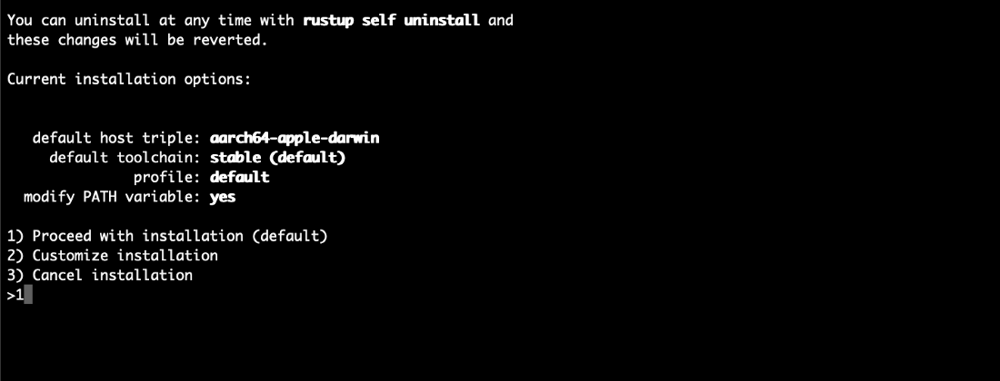
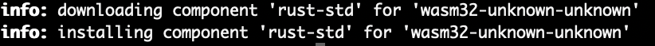
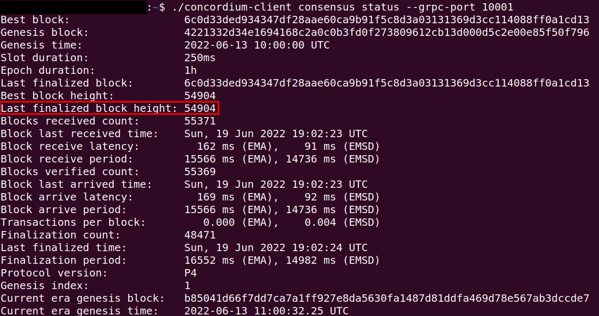
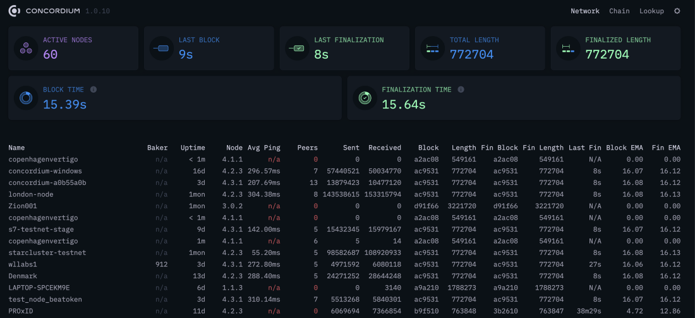
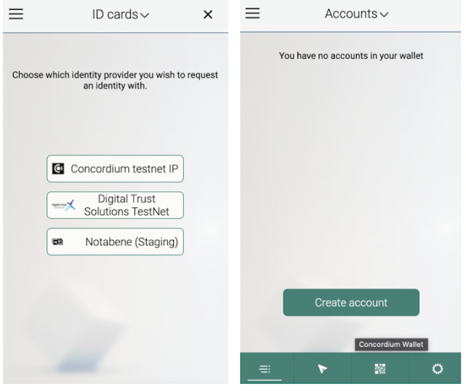
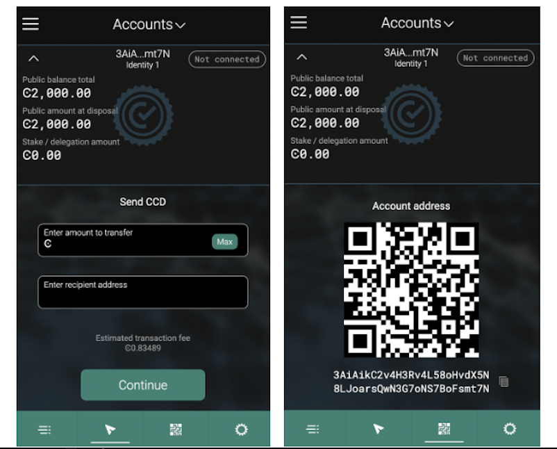
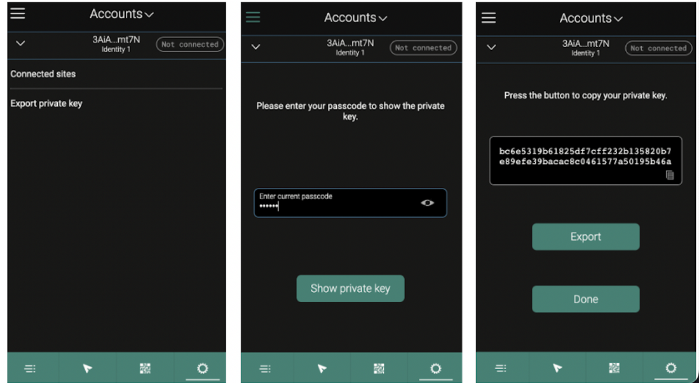

.. include:: ../../variables.rst
.. _setup-env:

=================================
Setup the development environment
=================================

First, you need to install ``rustup`` which installs Rust and Cargo to your computer. Go to `Rustup <https://rustup.rs/>`_ to install ``rustup`` for your platform.

Select **1** to continue the installation.

Finally, when Rust and Cargo are successfully installed in your system, you should see something similar to below.

.. image:: images/mint-rust-install-done.png
    :width: 100%

Copy and paste the commands in a terminal to install Wasm which will be used for building contracts.

.. code-block:: console

    rustup target add wasm32-unknown-unknown

During Wasm installation in your system you should see something similar to below.

Now you need to install the Concordium software package. :ref:`Click here<cargo-concordium-testnet>` and download the version 2.2.0 or greater of ``cargo-concordium`` for your operating system. The tool is the same for both testnet and mainnet.

First, rename the ``cargo-congordium-v.x.x`` file to ``cargo-concordium``. Then go to the directory where the file is downloaded and run this command to make it executable. You also need to move the ``cargo-concordium`` executable to the cargo folder. :ref:`Follow the information here<setup-tools>` to ensure that your cargo-concordium is configured correctly. The commands below are specifically for MacOS. Remember to adjust the commands based on your operating system.

.. code-block:: console

    sudo chmod +x cargo-concordium

.. code-block:: console

    mv cargo-concordium ~/.cargo/bin

If everything is correct, when you enter the command ``cargo concordium --help`` it shows something similar to the below.

.. Note::

    If you have a warning on a Mac device that says “cargo-concordium cannot be opened because the developer cannot be verified” that means it requires permission to run and you should go to **System Preferences → Security** and unlock it with your password and click **Allow Anyway**.

    .. image:: images/mac-warning.png
        :width: 100%

.. _interact-with-your-contract:

Install Concordium Client
=========================

The tutorials use ``concordium-client`` as a command line tool to deploy, mint, and transfer. :ref:`Download it here<concordium-node-and-client-download-testnet>`. Rename the package to ``concordium-client`` in case it has some version annotation.

.. note::

   If you are not using Ubuntu/Linux as your operating system, the following screenshots will look different.
   Remember to adjust the following commands based on your operating system.

Go to the folder where you downloaded the ``concordium-client``. You can check if you are in the correct folder when you see the output ``concordium-client`` from the command:

.. code-block:: console

   $ls | grep 'concordium-client'

.. image:: images/pb_tutorial_10.png
   :width: 70 %

.. note::

   Alternatively, if you don't want to navigate around in the folders, you can add the folder where the ``concordium-client`` tool is located to your PATH variable with the command:
   ``export PATH="$HOME/path/to/your/concordium-client:$PATH"``.
   This allows you to use the following commands (such as ``concordium-client --help``)
   without prepending them with ``./``. Effectively,  prepending with ``./``
   searches for the executable package in the current directory while
   omitting ``./`` searches for the executable package in the PATH variable.

The package is not yet executable. You change this with the command:

.. code-block:: console

   $chmod +x concordium-client

.. image:: images/pb_tutorial_8.png
   :width: 50 %

Check whether you can execute the ``concordium-client`` tool.

.. code-block:: console

   $./concordium-client --help

You should see some output that will help you in getting familiar with the ``concordium-client`` tool.

.. image:: images/pb_tutorial_9.png
   :width: 100 %

The ``concordium-client`` tool allows you to interact with your testnet node. You find important commands that the ``concordium-client`` tool provides :ref:`here<concordium-client>`.

Your next task enables the ``concordium-client`` tool to talk to your testnet node. There are two options to achieve this:

.. dropdown:: **Option 1 (beginners)**

    This option explains how to transfer the ``concordium-client`` tool to your instance and execute commands from within the instance.

    **Advantage**: You can execute the commands within your instance.

    **Disadvantage**: You have to transfer files between your local machine and your instance.

    Transfer the ``concordium-client`` package from your machine via a file-sharing tool (such as `FileZilla <https://filezilla-project.org/>`_ or the ``sftp`` command) to your instance.

    Connect to your instance and make your package executable again as you have done previously already:

    .. code-block:: console

        $chmod +x concordium-client

    Check if everything is connected correctly by displaying the best/latest block.

    .. code-block:: console

        $./concordium-client block show --grpc-port 20001

    You should see some block data output.

    .. image:: images/pb_tutorial_18.png
        :width: 100 %

    .. note::

        Port 20001 is open by default on your testnet node to interact with it.

.. dropdown:: **Option 2 (advanced users)**

    This option explains how you can use the ``concordium-client`` tool locally on your machine and connect remotely to your node running on the server.

    **Advantage**: You don't have to transfer files between your local machine and your instance later in the tutorial.

    **Disadvantage**: You have to use ssh with port forwarding when you run a command locally.

    Since you have a remote server your cloud provider usually gives you an option to ssh into it. Add the following port forwarding rule to your method to ssh into your instance in terminal A. The port 20001 on your localhost is forwarded to the port 20001 on your instance.

    .. code-block:: console

        $ssh -NL localhost:20001:<IP-address-of-your-instance>:20001 <username>@<host>

    .. image:: images/pb_tutorial_26.png
        :width: 100 %

    .. note::

        Port 20001 is open by default on your testnet node to interact with it. Cloud providers often use ``ubuntu`` as the default <username> and the <IP-address-of-your-instance> as the default <host>.

    Go in another terminal B to the folder where you downloaded the ``concordium-client``. Check if everything is connected correctly by displaying the best/latest block.

    .. code-block:: console

        $./concordium-client block show --grpc-port 20001

    You should see some block data output.

    .. image:: images/pb_tutorial_17.png
        :width: 100 %

Run a node
==========

.. note::

   It is technically fine to run your testnet node locally on your machine instead of on a server in the cloud. Since blockchain nodes have to run 24/7 to be up-to-date with the blockchain, you have to run your local machine 24/7. Alternatively, if you don't want to run your local machine 24/7, you can let your node catch up whenever you start your machine. Because this takes some time, the tutorials recommend a cloud provider setup for convenience.

You will need to run a node. You can run any node platform you wish. You can create an account on your favorite cloud provider to set up your instance unless you intend to run a testnet node locally on your machine. The following are the requirements to run a simple testnet node. See the :ref:`requirements <system-requirements-node-mainnet>` for mainnet nodes.

.. list-table::
   :widths: 25 25
   :header-rows: 1

   * - Hardware (Testnet node)
     - Recommended
   * - CPU (Core)
     - 2
   * - RAM (Memory)
     - 8 GB
   * - Storage
     - 25 GB
   * - Operating system
     - Ubuntu 20.04 or 22.04

You can also run a Docker image of a node that can be :ref:`found here<run-a-node>`.  Docker file configurations can be found in the ``docker-compose.yml`` file as described :ref:`here<run-a-node>`. Don't forget the set a name for your node with the parameter ``CONCORDIUM_COLLECTOR_NODE_NAME``.

Sync your node
--------------

Start the syncing process of the testnet node by following the guide for your platform :ref:`Ubuntu<ubuntu-node>`, :ref:`Docker<docker-node>`, :ref:`Windows<windows-node>`, or :ref:`MacOS<macos-node>`. This step currently takes some time, potentially hours based on your device configuration, because your node is freshly started and needs to recover all the previous blocks.

You should find your node name on the `Concordium testnet dashboard <https://dashboard.testnet.concordium.com/>`_. It will take less than a day until your testnet node is fully synced. You can observe the syncing process by watching the finalization length of your node. Wait until the ``Fin Length`` (finalization length) of your node is the same as the highest value used by the majority of nodes. Once the height value is the same as the height in `CCDScan <https://testnet.ccdscan.io/blocks>`__, then you can continue with the development.

.. note::

   To allow the network dashboard to display nodes in the network and their current status, a node must run a collector. The collector is enabled by the default start-up script but can be disabled.

.. image:: ./images/pb_tutorial_13.png
   :width: 100 %

Alternatively, you can query the syncing state of your node with ``concordium-client``. Wait until the ``last finalized block height`` of your node is the same as the highest value used by the majority of nodes.

.. code-block:: console

   ./concordium-client consensus status --grpc-port 20001

.. note::

   It is a good practice to enable inbound connections on port 8889 (testnet) in your instance. You can allow inbound connections from any IPv4 and IPv6 address, by selecting ``0.0.0.0/0`` and ``::/0`` on the port 8889. This is not mandatory for the node to sync but it will make your node a good network participant. Feel free to skip this step if you are not feeling confident editing the inbound connection rules of your instance.

.. image:: ./images/pb_tutorial_12.png
   :width: 100 %

Remember you are working on the testnet. Check if your node collector is up and running in CCDScan. Look for the name of your node in the network section of the dashboard.

.. Note::

    For testing purposes, a node is available on testnet to use when testing smart contracts and dApps. You can use this node for API calls of chain methods only with GRPC v1, gRPC v2, and gRPC web. The address is node.testnet.concordium.com on port 10000 (GRPCv1) and port 20000 (gRPCv2 and gRPC-web). This node is maintained by Concordium, but Concordium does not guarantee availability. The status of this node is available on the `Testnet status page <https://status.testnet.concordium.software>`__.

.. _setup-wallet:

Setup a wallet
==============

Now you need a Concordium wallet. Use the |bw|. The |bw| uses a 24 word secret recovery phrase to secure your wallet. Make sure to protect your 24 word secret recovery phrase and store it in a secure place. Anyone who knows the secret recovery phrase can access your wallet.

Use `this link <https://chrome.google.com/webstore/detail/concordium-wallet/mnnkpffndmickbiakofclnpoiajlegmg?hl=en-US>`_ to install a |bw| in a chromium web browser. Follow :ref:`these instructions<setup-bw>` to install the extension. Configure it to run on testnet with an identity created from the Concordium testnet IP (shown below) and an account based on that identity. You don't have to provide an ID to create an identity on testnet when selecting ``Concordium testnet IP``. Test identities are meant for testnet testing only.

.. _testnet-faucet:

Use the Testnet faucet in your account to claim 2000 CCDs for testing purposes.

One thing to note is that if you click |send|, you enter transaction window. This allows you to transfer CCDs. You can type the amount of CCD and the recipient’s address in this section. As you can see just below those textboxes, there is a value highlighting the “Estimated transaction fee” in CCD terms. This allows you to estimate the costs beforehand and it allows helps you to calculate your business expenses in the future.

After that step, you need to :ref:`export the keys<export-key>` for your wallet. Save the file on your local machine in the same folder as the rest of the repository. It will have a name like this <YOUR PUBLIC ADDRESS>.export. You can open it with a text editor and see your signKey, verifyKey in there. Copy signKey and your address. You will use them while deploying and interacting with your contract.

When you export the key it creates a file named ``<YOUR PUBLIC ADDRESS>.export``. Open it with a text editor and find your ``signKey``, ``verifyKey`` in there. Copy the ``signKey`` and your address. You will use it while deploying and interacting with your contract.

Import the key
--------------

You are ready to import your key into the ``concordium-client`` configuration. Transfer your wallet key export file to the place where you are running your ``concordium-client`` tool. Navigate to the folder as well.

Import your key into the ``concordium-client`` configuration:

.. code-block:: console

    concordium-client config account import <Wallet.export> --name <Your-Wallet-Name>.json

.. |send| image:: images/send-ccd.png
             :alt: button with paper airplane
             :width: 50px
