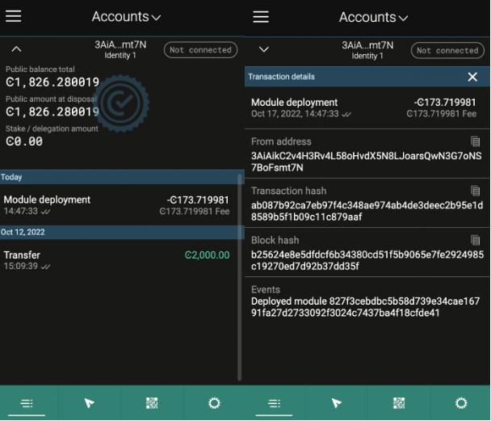
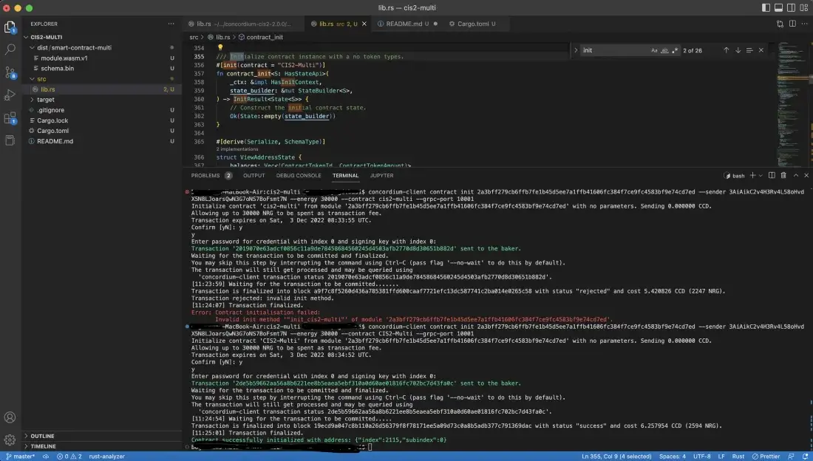

.. _build-sft-sc:

=================================
Build and deploy a smart contract
=================================

Finally, you have everything prepared in order to mint your tokens. Y have created a wallet, exported it, and stored your data on IPFS using Pinata. You have an API Key that will allow you to upload from your system, both your data and metadata are available and pinned already so you don't need to run a local node. You are ready to mint your semi-fungible tokens.

Make sure you are working in the cis2-multi directory, and create a dist folder for your schema and smart contract compiled into wasm. Remember that CIS-2 allows you to mint fungible, non-fungible, and semi-fungible tokens. Concordium’s token standard is applicable to all types of tokens.

.. code-block:: console

    cd cis2-multi

.. code-block:: console

    mkdir -p ../dist/smart-contract-multi

.. code-block:: console

    cargo concordium build --out ../dist/smart-contract-multi/module.wasm --schema-out ../dist/smart-contract-multi/schema.bin

Install required packages
=========================

You will invoke some functions from your deployed contract using ts-client for minting and transferring NFTs. You can install all the dependent packages with either “yarn” or “npm”. If you don't have the node in your system you should install it first.

.. code-block:: console

    cd node-cli

.. code-block:: console

    yarn install

.. code-block:: console

    yarn add -g ts-node

Deploy contract module
======================

When you cloned the repository, all necessary functions for node-cli were automatically cloned into the node-cli folder. These functions allow you to interact with the smart contract. Basically, there are 1:1 implementations of all functions in the smart contract. Make sure you have the function below in the cli.ts file.

.. code-block:: console

    function setupCliDeployModule(cli: commander.Command) {
        return (
            cli
            .command("deploy")
            .description(`Deploy Smart Contract Wasm Module`)
            .requiredOption("--wasm <wasm>", "Compile Module file path", "../dist/smart-contract/module.wasm.v1")
            // Sender Account Args
            .requiredOption("--sign-key <signKey>", "Account Signing Key")
            .requiredOption("--sender <sender>", "Sender Account Address. This should be the owner of the Contract")
            // Node Client args
            .requiredOption("--auth-token <authToken>", "Concordium Node Auth Token", "rpcadmin")
            .requiredOption("--ip <ip>", "Concordium Node IP", "127.0.0.1")
            .requiredOption("--port <port>", "Concordium Node Port", (v) => parseInt(v), 10001)
            .requiredOption("--timeout <timeout>", "Concordium Node request timeout", (v) => parseInt(v), 15000)
            .action(
                async (args: DeployModuleArgs) =>
                await sendAccountTransaction(
                    args,
                    args.sender,
                    args.signKey,
                    // payload
                    { content: Buffer.from(readFileSync(args.wasm)) } as DeployModulePayload,
                    // Transaction Type
                    AccountTransactionType.DeployModule,
                ),
            )
        );
    }
    setupCliDeployModule(cli);

Run the command below in order to deploy the contract that was built in the previous step.

.. code-block:: console

    ts-node ./src/cli.ts deploy --wasm ../dist/smart-contract-multi/module.wasm.v1 --sender $ACCOUNT --sign-key $SIGN_KEY

If you have the output below, you’ve successfully deployed your semi-fungible token smart contract on Concordium.

You can also verify it either by looking at `CCDScan <https://ccdscan.io>`_ or the `testnet dashboard lookup section <https://dashboard.testnet.concordium.com/>`_. Now you need to go to the dashboard and get the hash value from there using the URL in the terminal. Simply copy the link from the terminal and visit it to look at the status of your transaction. Click **Deployed module with reference** and copy the hash value. You will use it while initializing the contract in the next section.

And you can see it in the wallet.

Initialize the contract
=======================

Now you need to initialize the deployed contract. It’s a lot easier than the previous steps. After deploying a contract you have to initialize it; it’s like object-oriented programming. You create a class which is a module, and then you initialize it to create an object. An object of a class is a way to store both states of the class and its functionality. This time you are going to use the hash value you got in the previous step. First, make sure initialize function is implemented in your cli.ts file as shown below.

.. code-block:: console

    function setupCliInitContract(cli: commander.Command) {
        return (
            cli
            .command("init")
            .description(`Initializes a Smart Contract`)
            .requiredOption("--module <module>", "Module Reference", "CIS2-NFT")
            .requiredOption("--energy <energy>", "Maximum Contract Execution Energy", (v) => BigInt(v), 6000n)
            .requiredOption("--contract <contract>", "Contract name", "CIS2-NFT")
            // Sender Account Args
            .requiredOption("--sender <sender>", "Sender Account Address. This should be the owner of the Contract")
            .requiredOption("--sign-key <signKey>", "Account Signing Key")
            // Node Client args
            .requiredOption("--auth-token <authToken>", "Concordium Node Auth Token", "rpcadmin")
            .requiredOption("--ip <ip>", "Concordium Node IP", "127.0.0.1")
            .requiredOption("--port <port>", "Concordum Node Port", (v) => parseInt(v), 10001)
            .requiredOption("--timeout <timeout>", "Concordium Node request timeout", (v) => parseInt(v), 15000)
            .action(
                async (args: InitContractArgs) =>
                await sendAccountTransaction(
                    args,
                    args.sender,
                    args.signKey,
                    // Payload
                    {
                    amount: new GtuAmount(0n),
                    moduleRef: new ModuleReference(args.module),
                    contractName: args.contract,
                    parameter: Buffer.from([]),
                    maxContractExecutionEnergy: args.energy,
                    } as InitContractPayload,
                    // Transaction Type
                    AccountTransactionType.InitializeSmartContractInstance,
                ),
            )
        );
    }
    setupCliInitContract(cli);

Run the code below, using the ``hash`` value in the ``<MODULE-HASH>`` part, ``signKey`` from your exported key file, contract name as ``<YOUR-CONTRACT-NAME>`` (in this case CIS2-Multi), and the address of your account.

.. code-block:: console

    ts-node ./src/cli.ts init --module <MODULE-HASH> --sender <ACCOUNT-ADDRESS> --sign-key <SIGN-KEY> --contract <YOUR-CONTRACT-NAME>

If you have this output that means you have successfully initialized your contract.

Now go to the URL to get your contracts index value. From the dashboard, you can easily see the index, your account address as sender, event details, and transaction hash. The Index value is important here; it’s like the address of my contract instance, and you will need it when we are interacting with the contract.

:ref:`Click here to continue to part 4 of this tutorial<mint-xfer-sft>`.
