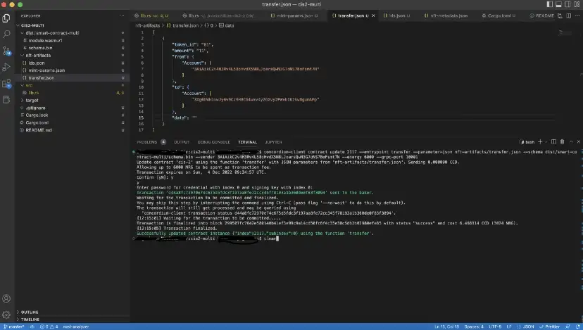

.. _mint-xfer-sft:

=====================================
Mint and transfer semi-fungible token
=====================================

Now, you are ready to call the mint function. First, you should place the ``setupCliUpdateContract`` function below in your cli.ts file. In this step, you serialize the parameters taken from the terminal that is going to be input for your update function.

.. code-block:: console

    function setupCliUpdateContract(cli: commander.Command, updateContractAction: string) {
        return (
        cli
        .command(updateContractAction)
        .description(`${updateContractAction} an NFT`)
        .requiredOption("--params <params>", "params file path", (f) => fs.realpathSync(f))
        .requiredOption(
            "--schema <schema>",
            "Contract schema file path",
            (f) => fs.realpathSync(f),
            "../dist/smart-contract/schema.bin",
        )
        .requiredOption("--energy <energy>", "Maximum Contract Execution Energy", (v) => BigInt(v), 6000n)
        .requiredOption("--contract <contract>", "Contract name", "CIS2-NFT")
        .requiredOption("--function <function>", "Contract function name to call", updateContractAction)
        .requiredOption("--index <index>", "Contract Address Index", (v) => BigInt(v))
        .requiredOption("--sub-index <subIndex>", "Contract Address Sub Index", (v) => BigInt(v), 0n)
        // Sender Account Args
        .requiredOption("--sender <sender>", "Sender Account Address. This should be the owner of the Contract")
        .requiredOption("--sign-key <signKey>", "Account Signing Key")
        // Node Client args
        .requiredOption("--auth-token <authToken>", "Concordium Node Auth Token", "rpcadmin")
        .requiredOption("--ip <ip>", "Concordium Node IP", "127.0.0.1")
        .requiredOption("--port <port>", "Concordum Node Port", (v) => parseInt(v), 10001)
        .requiredOption("--timeout <timeout>", "Concordium Node request timeout", (v) => parseInt(v), 15000)
        .action(
            async (args: UpdateContractArgs) =>
            await sendAccountTransaction(
                args,
                args.sender,
                args.signKey,
                // Payload
                {
                parameter: serializeUpdateContractParameters(
                    args.contract,
                    args.function,
                    JSON.parse(readFileSync(args.params).toString()),
                    Buffer.from(readFileSync(args.schema)),
                    SchemaVersion.V2,
                ),
                amount: new GtuAmount(0n),
                contractAddress: {
                    index: BigInt(args.index),
                    subindex: BigInt(args.subIndex),
                },
                receiveName: `${args.contract}.${args.function}`,
                maxContractExecutionEnergy: BigInt(args.energy),
                } as UpdateContractPayload,
                // Transaction Type
                AccountTransactionType.UpdateSmartContractInstance,
            ),
        )
    );
    }
    // Mint
    setupCliUpdateContract(cli, "mint");

Also, you need to set the mint parameters in the ``mint-multi-params.json`` file described below. The account address is your wallet address, you are going to generate 10000 copies of it, the URL is the Pinata link of the metadata file, and the hash is the SHA-256 output of the link.

.. code-block:: console

    {
      "owner": {
        "Account": ["3AiAikC2v4H3Rv4L58oHvdX5N8LJoarsQwN3G7oNS7BoFsmt7N"]
      },
      "tokens": [
        [
          "01",
          [
            {
              "url": "https://ipfs.io/ipfs/QmSyhV2EuRm2id48QkKiFHtQkwhyxB1s2F6xP3b6Sty553",
              "hash": "6201897bd3381192683a55af1cec066d1450ecd907bdb2cff385d43244cc15e3"
            },
            "10000"
          ]
        ]
      ]
    }

Run the command below with the index value you got in the previous step, your account address, and the signKey from your exported private key file.

.. code-block:: console

    ts-node ./src/cli.ts mint --sender $ACCOUNT --sign-key $SIGN_KEY --wait --contract CIS2-Multi --schema ../dist/smart-contract-multi/schema.bin --params ../nft-artifacts/mint-multi.json --index <CONTRACT_INDEX>

You will see something like the below.

Check the dashboard one more time by using the URL value from the terminal.

You have just minted 10000 semi-fungible tokens on Concordium successfully and the cost is quite low! However, it is important to remember that this cost fully depends on the amount of data you store on the chain. As you stored only a metadata link and a hash value, a relatively small amount of CCD is required in order to mint.

Now you can get the metadata on-chain and see what you have in there. In order to do that, use ``setupCliInvokeContract`` and the view functions. Since with this function you are not going to change the state of the blockchain, there will be no transaction fee. This is almost the same with the ``setupCliUpdateContract`` except there are no internal state changes in the smart contract. View functions read the current state of the contract.

You can expect the IPFS URL pinned by Pinata that you added in the metadata.json file and a hash value you added in the mint function. In order to get the details on-chain run the following command. If you are using cargo-concordium 2.1.0 you don't need to specify the schema but for newer versions add <YOUR SCHEMA NAME>. You can check the version of your ``cargo-concordium`` with the commands ``cargo-concordium —help`` or ``cargo-concordium —version``.

.. code-blcok:: console

    ts-node ./src/cli.ts view --sender $ACCOUNT --contract CIS2-Multi --schema ../dist/smart-contract-multi/schema.bin --index <CONTRACT_INDEX>

Transfer
========

Now, you will transfer one token to someone else assume that you are organizing an event/exhibition in your virtual theatre and your guests/visitors have to have a ticket in order to pay you a visit. Go to the ``transfer-multi.json`` file and change the parameters accordingly. **From** is the sender address, **To** is the receiver address, and you need to specify the **token_id** and the **amount**.

.. code-block:: console

    [
        {
            "token_id": "01",
            "amount": "5",
            "from": {"Account": ["3AiAikC2v4H3Rv4L58oHvdX5N8LJoarsQwN3G7oNS7BoFsmt7N"]},
            "to": {"Account": ["3Xg6DWkbxwJy6v9Cz6H8CG4wxv4yZGXvy2PWxb1U2kw8gumAMp"]},
            "data": ""
        }
    ]

These parameters will be read by the command below and put accordingly as arguments while running; however you can also specify them as parameters.

.. code-block:: console

    ts-node ./src/cli.ts transfer --params ../nft-artifacts/transfer-multi.json --schema ../dist/smart-contract/schema.bin --index <YOUR INDEX> --sender <ACCOUNT-ADDRESS> --sign-key <SIGN-KEY> --contract <YOUR-CONTRACT-NAME>

You can check the transaction in CCDScan.

You can check the current state of your token contract with view command in the previous step.

As you can see, the owner has 9995 tokens left and the second account has 5 as you specified the amount of tokens to transfer. Using these tickets, you and your 4 friends can enter the venue now!

