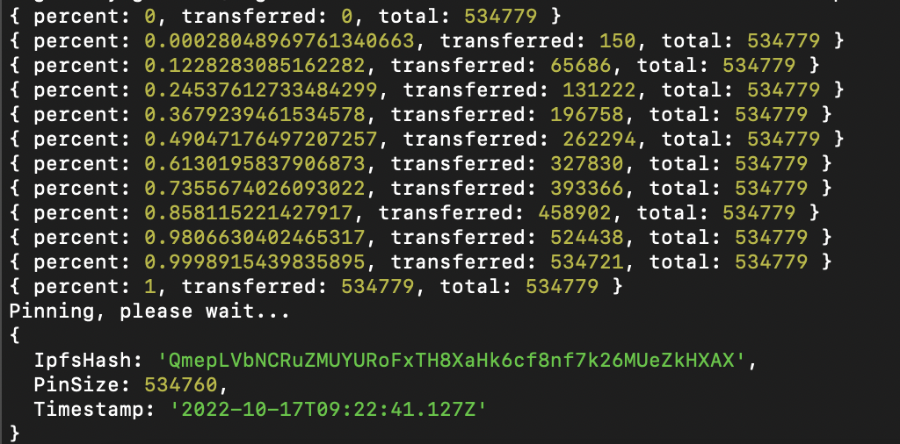
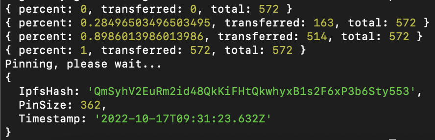

.. _upload-sft:

===============================
Upload your semi-fungible token
===============================

In the first tutorial, you went through all the necessary steps to install and run an IPFS node and uploaded an image  in order to get a CID (Content Identifier) based URL for your token. This tutorial uses a tool called Pinata pinning service. It is free for less than 1GB of storage. If you are doing commercial projects you should have an enterprise account. In basic terms what Pinata does is run a node that pinned your data which means you don't have to run a node on your system. Because it’s a peer-to-peer decentralized storage solution, there has to be at least one node that stores your data. That is why running a node on a server that pins your own data for commercial projects is always a good idea. Anyway, Pinata does that for you.

When you sign-up for it, you’ll be redirected to a dashboard. You can either upload your files one by one using the upload button or you can use the API key. This tutorial uses the second option; it may make things a bit complex but definitely will provide more flexibility and save some time especially if you are going to mint multiple tokens.

Install Pinata
==============

First, make sure you have ``npm`` installed on your system. Then run the command below. This installs the Pinata upload tool on your computer.

.. code-block:: console

    npm i -g pinata-upload-cli

Then you will need a token provided by Pinata. In your profile section when you click it, you’ll see an API Keys section. Visit that page and create an API Key for yourself. You can check the details in `this link <https://knowledge.pinata.cloud/en/articles/6191471-how-to-create-an-pinata-api-key>`_. Copy the JWT and the other API data and store them somewhere and add the JWT token value in the command below. That will authenticate you as the owner of that Pinata account.

.. code-block:: console

    pinata-cli <JWT>

Now you are able to upload data to Pinata from your device. The data will be pinned by it and you can use it freely. Run the command below to upload your data file. If you are in the media folder just type its name and the extension, like ``satoshi.png``.

.. code-block:: console

    pinata-cli -u ../PATH_TO/<YOUR DATA>

If it’s successful you will have something similar to the below. Pay attention to this IpfsHash value. It is your asset’s unique Content Identifier (CID).

Metadata
--------

For your semi-fungible token, you will create metadata that holds the IPFS link inside of it, a description, a name, and the attributes based on the CIS-2 standard. For more details, you can check the :ref:`previous tutorial’s metadata section<nft-metadata>` or `CIS-2 <https://proposals.concordium.software/CIS/cis-2.html#example-token-metadata-non-fungible>`_.

Here is an example of metadata.

.. code-block:: console

    {
        "name": "Satoshi",
        "description": "CypherPunk#001",
        "display": {
            "url": "https://ipfs.io/ipfs/QmepLVbNCRuZMUYURoFxTH8XaHk6cf8nf7k26MUeZkHXAX"
        },
        "attributes": [
            {
                "name": "Courage",
                "type": "string",
                "value": "100"
            },
            {
                "name": "Friendship",
                "type": "string",
                "value": "100"
            }
        ]
    }

Upload your metadata with the command below and your metadata will be stored on the IPFS.

.. code-block:: console

    pinata-cli -u ../PATH_TO/<YOUR METADATA>.json

