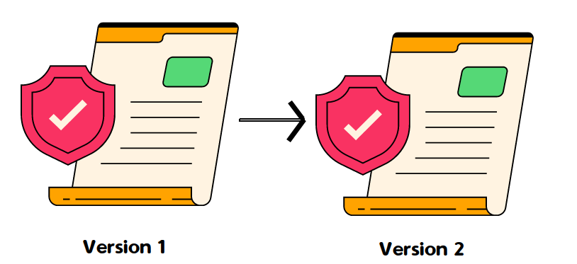

.. include:: ../../../variables.rst
.. _intro-smart-contract-upgrade:

=======================================
Upgrading smart contracts on Concordium
=======================================

In this tutorial, you are going to get familiar with how to upgrade a smart contract natively. You explore how to correctly
migrate the smart contract state from your old contract to the upgraded contract.

An important desired features of blockchains is that smart contracts once deployed are immutable by default.
The past showed that development teams are looking for mutable smart contract options as well if they want to have
the capabilities to fix bugs or to have the option to add additional
features to their smart contract protocol in the future.
Other blockchain require complex ``proxy-implementation`` patterns to achieve upgradability on the by default immutable smart contracts.
Concordium makes this process easier by exposing an upgrade mechanism to natively upgrade the smart contract.

.. toctree::
   :hidden:
   :maxdepth: 1

   Native upgradability <./smartContractUpgrade.rst>

