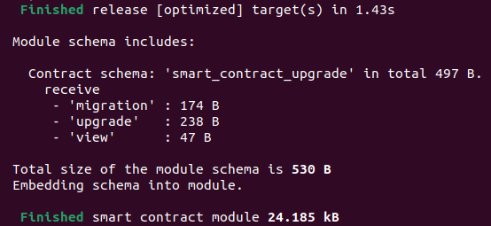
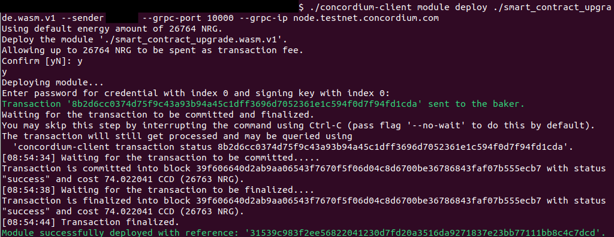

.. include:: ../../../variables.rst
.. _smart-contract-upgrade:

====================
Native upgradability
====================

The goal of this tutorial is to deploy a ``contract-version1``, upgrade its logic and migrate its state to ``contract-version2``.

The `contract-version1 <https://github.com/Concordium/concordium-rust-smart-contracts/tree/main/examples/smart-contract-upgrade/contract-version1>`_
includes an ``upgrade`` function and the `contract-version2 <https://github.com/Concordium/concordium-rust-smart-contracts/tree/main/examples/smart-contract-upgrade/contract-version2>`_
includes a ``migration`` function which the next two sections explore.

``migration`` function
======================

A ``migration`` function can be optionally invoked as part of the upgrade to e.g. change the shape of the smart contract state.
Use the below input file to specify the ``<EntryPointName>`` and the ``<InputParameters>``
of the ``migration`` function.

.. code-block:: json

   {
      "migrate": {
         "Some": [
            [
            "<EntryPointName>",
            "<InputParameters>"
            ]
         ]
      },
      "module": "<ModuleReferenceContractVersion2>"
   }

If the module reference should be upgraded without invoking a ``migration`` function, use the below input file instead:

.. code-block:: json

   {
      "migrate": {
         "None": [
         ]
      },
      "module": "<ModuleReferenceContractVersion2>"
   }

``upgrade`` function
====================

To trigger a smart contract upgrade natively on Concordium, the upgrade needs to be triggered on the ``host`` as seen in the code snippet below:

.. code-block:: rust

   fn contract_name<S: HasStateApi>(
      ...
      host: &mut impl HasHost<S>,
      ...
   )  ... {
      ...
      let result = host.upgrade(module);
      ...
   }

.. note::

   If you don't find a ``host.upgrade(module)`` snippet in a smart contract code, you can be sure that this contract
   can not be natively upgraded. The smart contract can still be part of a ``proxy-implementation`` pattern.
   If you want to ensure a smart contract is truly immutable you need to do your own research
   and study its logic.

The function is marked as ``low_level``. This is ``necessary`` since the high-level mutable functions store the state of the contract at the end of
execution. This conflicts with migration since the shape of the state ``might`` be changed by the ``migration`` function. If the state is then written
by this function it would overwrite the state stored by the ``migration`` function.

Greater control is given to the smart contract developer when using ``low-level`` functions (e.g. additional state manipulation
capabilities are exposed which are unavailable when using ``high-level`` functions). These additional state manipulation features are necessary to change the
shape of the state during the ``migration`` but they bear the risk that the state becomes corrupted if the ``migration`` function has some coding bugs.
Make sure you test your upgrade thoroughly (with integration tests as well as manual tests on testnet)
and ensure your state is correctly migrated before doing
the same smart contract upgrade on mainnet.

.. note::

   Using ``high-level`` function in your smart contract code (except for ``upgrade``/``migration`` functions)
   should be your preferred option to write smart contract code safely because
   it prevents you from accidentally corrupting the state of your smart contract. Smart contract functions are by default
   ``high-level`` (no need to add this attribute explicitly).

.. note::

   You can remove the ``low-level`` attribute at the ``upgrade`` function, in other words, use a ``high-level`` function, in
   the case that the shape of the state stays the same, in other words, no ``migration`` is executed. This means when the ``State`` struct in
   ``contract-version1`` and ``contract-version2`` is identical, you don't need a ``migration`` function and you can remove the ``low-level`` attribute
   at the ``upgrade`` function.

.. warning::

   Since more responsibility is given to the smart contract developer, smart contract ``upgrade``/``migration`` functions
   should be coded and executed by experts that know about the underlying risk. You are about to become such an expert.

You have the required knowledge now to execute the upgrade flow on testnet in the next section.

Executing an upgrade
====================

Clone the `smart contract upgrade example <https://github.com/Concordium/concordium-rust-smart-contracts/tree/main/examples/smart-contract-upgrade>`_.

.. code-block:: console

    $git clone --recurse-submodules git@github.com:Concordium/concordium-rust-smart-contracts.git

Navigate to the ``contract-version1`` example folder:

.. code-block:: console

    $cd ./examples/smart-contract-upgrade/contract-version1

Compile the smart contract to a wasm module which you will deploy to testnet in the next step.

.. code-block:: console

    $cargo concordium build -e --out smart_contract_upgrade.wasm.v1

.. image:: ./images/compile_contract_version1.png
   :alt: Compile contract version 1
   :align: center

.. note::

   Comprehensive instructions on how to download and set up ``cargo-concordium`` can be found in :ref:`Setup the development environment<setup-env>`.

This command will create the ``smart_contract_upgrade.wasm.v1`` file in your current folder. Deploy the smart contract module to testnet with the command:

.. code-block:: console

    $concordium-client module deploy ./smart_contract_upgrade.wasm.v1 --sender <YourAccountAddress> --grpc-port 10000 --grpc-ip node.testnet.concordium.com

.. image:: ./images/deploy_contract_version1.png
   :alt: Deploy contract version 1
   :align: center

.. note::

   Comprehensive instructions on how to download and set up ``concordium-client`` and how to import an account that you can use
   for the above placeholder ``YourAccountAddress`` can be found in :ref:`Setup the development environment<setup-env>`.

Since other users will read this tutorial, you will likely get an error that the above module is already deployed.
If the module is already deployed or not deployed does not make a
difference because in both cases the console output will print the ``moduleReference`` that you need for the next step.

Initialize a ``contract-version1`` smart contract instance with the command:

.. code-block:: console

   $concordium-client contract init <ModuleReference> --contract smart_contract_upgrade --energy 30000 --sender <YourAccountAddress> --grpc-port 10000  --grpc-ip node.testnet.concordium.com

For example, when using the module reference from the above screenshot, the command will look as follows:

.. code-block:: console

   $concordium-client contract init 8fc09d2519f516cfbb3d139b1e567753780fbb52854ecbf9a12c447756d18eb0 --contract smart_contract_upgrade --energy 30000 --sender <YourAccountAddress> --grpc-port 10000  --grpc-ip node.testnet.concordium.com

.. image:: ./images/initialize_contract.png
   :alt: Initialize contract version 1
   :align: center

As seen in the screenshot above, this command returns your smart contract index ``4462``.

Before upgrading the ``contract-version1``, you can check its state with the view function as follows:

.. code-block:: console

   $concordium-client contract invoke <YourContractVersion1Index> --entrypoint view --grpc-port 10000 --grpc-ip node.testnet.concordium.com

For example, when using the smart contract index from the above screenshot, the command will look as follows:

.. code-block:: console

   $concordium-client contract invoke 4462 --entrypoint view --grpc-port 10000 --grpc-ip node.testnet.concordium.com

You should see the following output.

.. image:: ./images/view_contract_version1.png
   :alt: View contract version 1
   :align: center

You need to compile and deploy ``contract-version2`` before we can upgrade our smart contract instance ``contract-version1``.

Navigate to the ``contract-version2`` example folder:

.. code-block:: console

    $cd ./examples/smart-contract-upgrade/contract-version2

Compile the smart contract to a wasm module which you will deploy to testnet in the next step.

.. code-block:: console

    $cargo concordium build -e --out smart_contract_upgrade.wasm.v1

This command will create the ``smart_contract_upgrade.wasm.v1`` file in your current folder. Deploy the smart contract module to testnet with the command:

.. code-block:: console

    $concordium-client module deploy ./smart_contract_upgrade.wasm.v1 --sender <YourAccountAddress> --grpc-port 10000 --grpc-ip node.testnet.concordium.com

The ``moduleReference`` returned when deploying ``contract-version2`` is different from the ``moduleReference`` when deploying ``contract-version1``.
This shows that the module's code is not identical.

Create the ``upgrade.json`` file with the following content by inserting the ``moduleReference`` returned by the previous step:

.. code-block:: json

   {
      "migrate": {
         "Some": [
            [
            "migration",
            ""
            ]
         ]
      },
      "module": "<ModuleReferenceContractVersion2>"
   }

For example, when using the module reference from the above screenshot, the file will look as follows:

.. code-block:: json

   {
      "migrate": {
         "Some": [
            [
            "migration",
            ""
            ]
         ]
      },
      "module": "31539c983f2ee56822041230d7fd20a3516da9271837e23bb77111bb8c4c7dcd"
   }

When invoking the ``upgrade`` function with the above file, it specifies that the smart contract
code should be upgraded to the module ``31539c983f2ee56822041230d7fd20a3516da9271837e23bb77111bb8c4c7dcd``
and the ``migration`` function should be invoked
with no input parameters (empty string: ``""``) as part of the upgrade.

Upgrade the smart contract as follows:

.. code-block:: console

   $concordium-client contract update <YourContractVersion1Index> --entrypoint upgrade --parameter-json upgrade.json --energy 5000 --sender <YourAccountAddress> --grpc-port 10000 --grpc-ip node.testnet.concordium.com

For example, when using the smart contract index from the above screenshot, the command will look as follows:

.. code-block:: console

   $concordium-client contract update 4462 --entrypoint upgrade --parameter-json upgrade.json --energy 5000 --sender <YourAccountAddress> --grpc-port 10000 --grpc-ip node.testnet.concordium.com

You should see the following output.

You can check that the state migration was successful by inspecting the state with the view function:

.. code-block:: console

   $concordium-client contract invoke <YourContractVersion1Index> --entrypoint view --grpc-port 10000 --grpc-ip node.testnet.concordium.com

.. image:: ./images/view_contract_version2.png
   :alt: View contract version 2
   :align: center

If the migration function had a bug and changed the shape of the state wrongly, your state might be corrupted. You might see different output errors in case of a corrupted state. One example is shown below:

.. image:: ./images/corrupted_state.png
   :alt: Corrupted state
   :align: center
