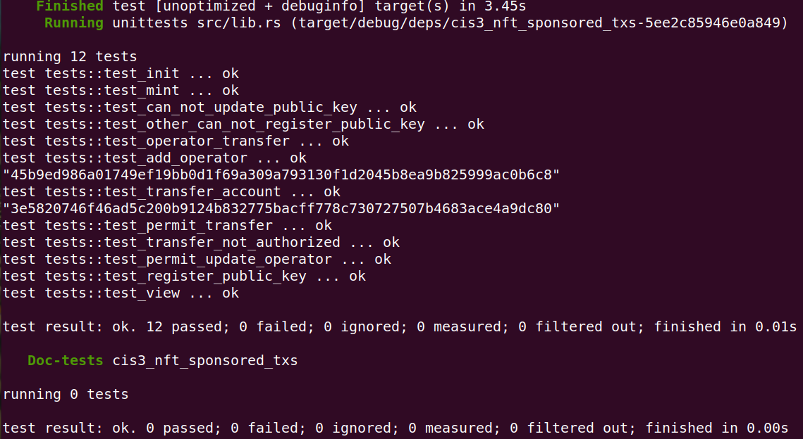
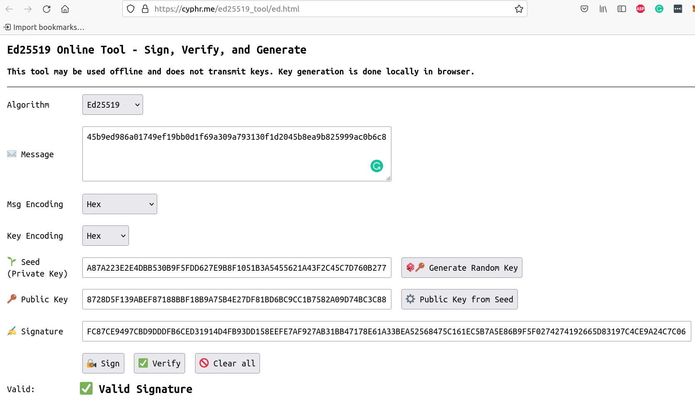

.. include:: ../../../variables.rst
.. _sponsoredTransactionsSmartContract:

=====================================
Sponsored Transactions Smart Contract
=====================================

The goal of this part of the tutorial is to understand how the sponsored
transaction mechanism is implemented in the smart contract and how to create and verify an Ed25519 signature in the smart contract code.

Clone the `sponsored transaction example <https://github.com/Concordium/concordium-rust-smart-contracts/tree/main/examples/cis3-nft-sponsored-txs>`_
which you will modify in this tutorial.

.. code-block:: console

    $git clone --recurse-submodules git@github.com:Concordium/concordium-rust-smart-contracts.git

Navigate into the correct example folder:

.. code-block:: console

    $cd ./examples/cis3-nft-sponsored-txs

The ``cis3_nft`` contract implements the `CIS-3 standard (sponsored transactions) <https://proposals.concordium.software/CIS/cis-3.html>`_. The standard defines that the contract has to expose the
``permit`` and the ``supportsPermit`` functions.

``permit`` function
===================

The ``permit`` function verifies an ed25519 signature from a sponsoree and authorizes the sponsor to execute the logic of
specific entrypoints (``transfer/updateOperator`` in our example code) on behalf of the sponsoree. The sponsored transaction mechanism replaces
the authorization checks conducted on the sender/invoker variable with signature verification.
That is, the sponsoree needs to sign a message (indicating its intended action), then
anyone can invoke the ``permit`` function with this signed message to execute the sponsoree's intended action.
The smart contract logic checks if the ``signature`` was generated by the sponsoree.

.. note::

    Ed25519 is an elliptic curve signing algorithm using EdDSA and Curve25519. It belongs to asymmetric cryptography,
    also known as public-key cryptography, where you generate a pair of related keys --
    one public key and one private key. The sponsoree encrypts/signs a message with its private key
    and anyone can decrypt the sponsoree's message using its public key. The public key is shared with other entities (e.g. the smart contract) while the private key is only known to the sponsoree.
    The smart contract needs to know the public key to be able to verify that the sponsoree signed the message with the corresponding private key.

.. note::

    The |bw| prepends the message with the account address (``signer``) and 8 zero bytes before signing it.
    This ensures that signed messages can be distinguished from transactions that are equally signed by the account address in the |bw| because transactions don't start with an account address.
    The smart contract logic reverse engineers the |bw| implementation by equally prepending the account address (signer) and 8 zero bytes to the message.

.. note::

   Concordium accounts can be multi-sig and each account has at least one ``public key`` and at least
   one ``private key`` associated with it.
   For this sponsored transactions example, the accounts in the |bw| (or |mw-gen2|)
   have exactly one ``public key`` and exactly one ``private key`` (no multi-sig accounts).
   You use your ``private key`` to sign the message in the wallet and your ``public key`` is
   used in the smart contract to verify that this signature was generated in the wallet with the associated ``private key``.
   Never share your ``private key``.

``supportsPermit`` function
===========================

This function can be queried with a list of given entrypoint names.
The response contains corresponding results for each entrypoint,
where the result is either “Entrypoint is not supported and can not be invoked via
the permit function using the sponsored transaction mechanism” or “Entrypoint is supported and
can be invoked via the permit function using the sponsored transaction mechanism”.

You can explore the function by invoking it with the ``concordium-client`` as follows using:

.. code-block:: console

    $concordium-client contract invoke 4329 --entrypoint supportsPermit --parameter-json supportsPermit.json --grpc-port 10000 --grpc-ip node.testnet.concordium.com

For example, this ``supportsPermit.json`` file results in the below screenshot.

.. code-block:: json

    {"queries":["aaaa","transfer","updateOperator"]}

.. image:: ./images/supportsPermit.png
   :alt: Output of supportsPermit function
   :align: center

.. note::

   Comprehensive instructions on how to set up and download ``concordium-client`` can be found in :ref:`Setup the development environment<setup-env>`.

``registerPublicKeys`` function
===============================

Concordium smart contracts currently have no way to query the corresponding
public key(s) of an account within the smart contract code. The Concordium team is working on exposing the public keys in the smart contract code in the next protocol update so that
the registration of a public key within the smart contract code will not be necessary anymore in the future.
For the time being, Concordium suggests using a `public_key_registry`
that allows a special trusted role/account to register the public keys in the smart contract. The example smart contract implements
such a registry. The logic of the code is as such that once an account has a public key registered, the mapping between the public key and the account can not be
updated anymore in the `public_key_registry` as seen below:

.. code-block:: rust

    // Register the public key.
    let old_public_key = host.state_mut().public_key_registry.insert(param.account, (param.public_key, 0));

    // Return an error if the owner tries to update/re-write a new public key for an already registered account.
    ensure!(old_public_key.is_none(), CustomContractError::AccountAlreadyRegistered.into());

The registry in the smart contracts links an account to a public key and its next nonce.
The nonce is increased sequentially every time a signed message (corresponding to the account) is successfully executed in the ``permit`` function.
The nonce is used to prevent replay attacks of the signed message because only a message signed with the next nonce in sequence can be executed as seen below:

.. code-block:: rust

    // Check the nonce to prevent replay attacks.
    ensure_eq!(message.nonce, nonce, CustomContractError::NonceMismatch.into());

Testing the signature verification
==================================

In this paragraph, you will learn how to create an Ed25519 signature
that you can use for your test cases to confirm that the smart contract signature verification logic works as expected.

.. note::
    The commands in this paragraph have to be executed from the `./examples/cis3-nft-sponsored-txs` folder where the ``Cargo.toml`` file is defined for this project.

Run the test cases to confirm that they are passing before you start modifying the code:

.. code-block:: console

    $cargo test
    or
    $cargo concordium test

.. image:: ./images/testCases.png
   :alt: Running the test cases
   :align: center

You should see no errors and all the test cases are green indicating that they passed successfully.

.. note::

   Comprehensive instructions on how to set up and download ``cargo concordium`` can be found in :ref:`Setup the development environment<setup-env>`.

The next few commands will explain how you can display the ``message_hash`` that you would need to sign.
Since hashes are commonly displayed as hex numbers, add the ``hex`` package to your project to convert and display such values easily.

.. code-block:: rust

    cargo add hex

You can check if the ``hex`` package was added in the ``Cargo.toml`` file under ``[dependencies]``.

.. image:: ./images/CargoToml.png
   :alt: Cargo.toml file with hex crate
   :align: center

Add the following to the smart contract ``permit`` function after the variable ``message_hash`` is defined.

.. code-block:: rust

    println!("{:?}", hex::encode(message_hash.to_vec()));

This will print out the ``message_hash`` when running the test cases as follows:

.. code-block:: console

    $cargon test -- --nocapture

The test cases have two tests (`test_permit_transfer/test_permit_update_operator`) that execute the ``permit`` function
that is why you see two ``message_hashes`` printed out in the console. You can comment out one of the tests to not get confused about
which message you are going to sign. You need to generate a public-private key pair to sign this ``message_hash``.
You can use an `Ed25519 signature generation tool <https://cyphr.me/ed25519_tool/ed.html>`_ for testing to generate such keys and signatures.

.. note::

    Only use these online tools that generate private keys for you in your test cases.
    Don't use the key in a production setting, since the private key might be known
    to the online webpage provider and should be considered not safe.

Copy the ``message_hash`` into the message field and switch the ``Msg Encoding`` to ``hex`` (not ``text``).

Click the ``Generate Random Key`` button and click the ``Sign`` button.

This action generates a signature in the last field in the above screenshot.
The ``signature`` and ``public key`` in the above screenshot can be copied into the below code snippets to decode them to bytes.

.. hidden: The private key was "A87A223E2E4DBB530B9F5FDD627E9B8F1051B3A5455621A43F2C45C7D760B277" in case some of the screenshots need to be updated in the future.

.. code-block:: rust

    let signature = "FC87CE9497CBD9DDDFB6CED31914D4FB93DD158EEFE7AF927AB31BB47178E61A33BEA52568475C161EC5B7A5E86B9F5F0274274192665D83197C4CE9A24C7C06";
    let mut converted = [0; 64];
    hex::decode_to_slice(signature, &mut converted);
    println!("signature: {:?}", converted);

Add the above code snippet to the top of a test case and run the test cases again to output the signature in bytes.

.. code-block:: console

    $cargon test -- --nocapture

The output should look similar to:

.. code-block:: console

    $signature: [252, 135, 206, 148, 151, 203, 217, 221, 223, 182, 206, 211, 25, 20, 212, 251, 147, 221, 21, 142, 239, 231, 175, 146, 122, 179, 27, 180, 113, 120, 230, 26, 51, 190, 165, 37, 104, 71, 92, 22, 30, 197, 183, 165, 232, 107, 159, 95, 2, 116, 39, 65, 146, 102, 93, 131, 25, 124, 76, 233, 162, 76, 124, 6]

You can create the below signature constant. This signature can be used in test cases to check if your signature verification logic in the smart contract works.

.. code-block:: rust

    const SIGNATURE: SignatureEd25519 = SignatureEd25519([252, 135, 206, 148, 151, 203, 217, 221, 223, 182, 206, 211, 25, 20, 212, 251, 147, 221, 21, 142, 239, 231, 175, 146, 122, 179, 27, 180, 113, 120, 230, 26, 51, 190, 165, 37, 104, 71, 92, 22, 30, 197, 183, 165, 232, 107, 159, 95, 2, 116, 39, 65, 146, 102, 93, 131, 25, 124, 76, 233, 162, 76, 124, 6]);

The ``public key`` from the above screenshot can be converted in a similar fashion.

.. code-block:: rust

    let public_key = "8728D5F139ABEF87188BBF18B9A75B4E27DF81BD6BC9CC1B7582A09D74BC3C88";
    let mut converted = [0; 32];
    hex::decode_to_slice(public_key, &mut converted);
    println!("public_key: {:?}", converted);

Add the above code snippet to the top of a test case and run the test cases again to output the public key in bytes.

.. code-block:: console

    $cargon test -- --nocapture

The output should look similar to:

.. code-block:: console

    $public_key: [135, 40, 213, 241, 57, 171, 239, 135, 24, 139, 191, 24, 185, 167, 91, 78, 39, 223, 129, 189, 107, 201, 204, 27, 117, 130, 160, 157, 116, 188, 60, 136]

You can create the below public key constant. This public key can be used in test cases to check if your signature verification logic in the smart contract works.

.. code-block:: rust

    const PUBLIC_KEY: PublicKeyEd25519 = PublicKeyEd25519([135, 40, 213, 241, 57, 171, 239, 135, 24, 139, 191, 24, 185, 167, 91, 78, 39, 223, 129, 189, 107, 201, 204, 27, 117, 130, 160, 157, 116, 188, 60, 136]);
