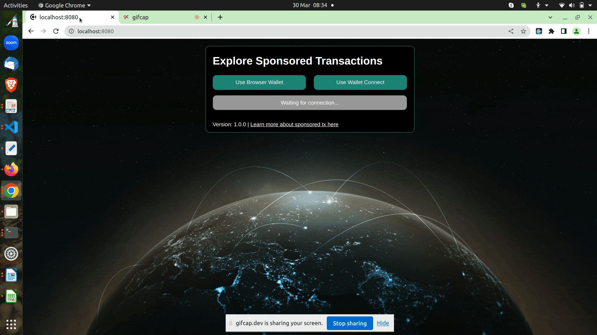
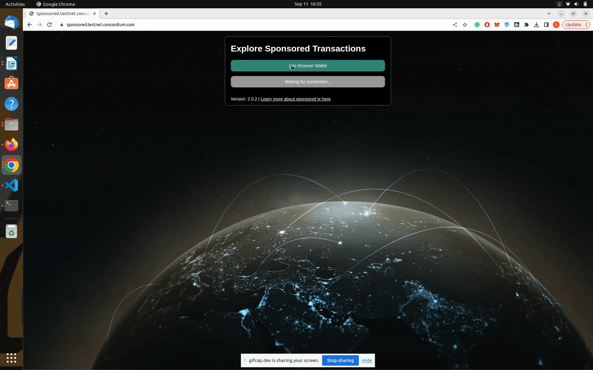
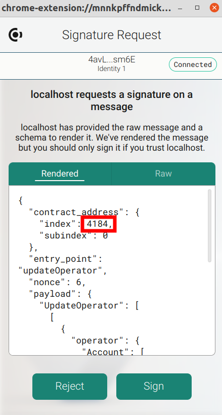
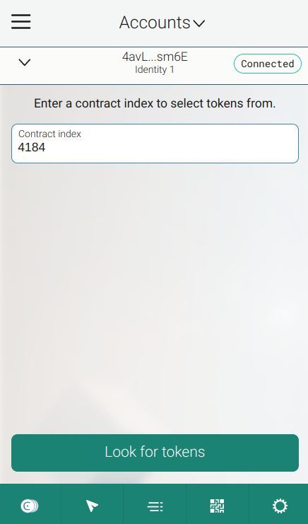

.. include:: ../../../variables.rst
.. _sponsoredTransactions_dapp:

===========================
Sponsored Transactions dApp
===========================

You can explore the `hosted sponsored transaction service <https://todo.com>`_.
The sponsored transaction service consists of a front-end and a back-end. You can start your own service by
following the instructions in the `front-end README.md file <https://github.com/Concordium/concordium-browser-wallet/tree/main/examples/sponsoredTXs/front-end/README.md>`_
and then the instructions in the `back-end README.md file <https://github.com/Concordium/concordium-browser-wallet/tree/main/examples/sponsoredTXs/back-end/README.md>`_.

.. note::

   Comprehensive instructions on how to set up the |bw|, create an account in the |bw|,
   get some testnet CCD and run a local front end can be found in :ref:`wCCD front-end-set-up section <wCCD-front-end-set-up>`.

The front end supports the following three flows with the |bw| (or |mw-gen2| that uses WalletConnect):

-   Register a public key (associated with the account from your wallet) in the smart contract.
-   Compute the message of a sponsored ``updateOperator`` transaction => Sign it with the wallet => Submit the signature to the ``/submitUpdateOperator`` back-end endpoint.
-   Mint an NFT to your wallet => Compute the message of a sponsored ``transfer`` transaction => Sign it with the wallet => Submit the signature to the ``/submitTransfer`` back-end endpoint.

The back-end is a server that exposes two endpoints:

- ``POST /submitUpdateOperator``
- ``POST /submitTransfer``

After submitting the signature to the ``/submitUpdateOperator`` or the ``/submitTransfer`` endpoint,
the back-end creates a sponsored transaction and submits it on-chain to the ``permit`` function in the smart contract ``{index: 4129, subindex: 0}``.
The deployed smart contract is nearly identical to `this contract <https://github.com/Concordium/concordium-rust-smart-contracts/tree/main/examples/cis3-nft-sponsored-txs>`_.
After the transaction is sent to the blockchain node, the back-end returns the transaction hash to the front-end.

The back-end server has to have access to a blockchain node and an account (with its associated private key)
that is funded with some CCD to submit the sponsored transaction to the chain. The back-end wallet
will pay for the transaction fees on behalf of the user.

Register your public key
========================

Ensure that you are connected with the correct account to the front-end.
Select the **Registration Public Key tab** to register
your public key in the smart contract as shown below:

If the registration was successful, you should see your current public key and your current nonce displayed.

.. note::

   Concordium accounts can be multi-sig and each account has at least one ``public key`` and at least
   one ``private key`` associated with it.
   For this sponsored transactions example, the accounts in the |bw| (or |mw-gen2|)
   have exactly one ``public key`` and exactly one ``private key`` (no multi-sig accounts).
   You use your ``private key`` to sign the message in the wallet and your ``public key`` is
   used in the smart contract to verify that this signature was generated in the wallet with the associated ``private key``.
   Never ever share your ``private key``.

You can export your keys file from the |bw| as follows:

.. image:: ./images/pic1.png
   :width: 30 %

.. image:: ./images/pic2.png
   :width: 30 %

.. image:: ./images/pic3.png
   :width: 30 %

In this exported file, you will find a ``verifyKey`` (your ``public key``), which should be
identical to the displayed ``public key`` at the front-end. The front-end also displays your nonce associated with your account.
This nonce is initially 1 and increases every time a successful sponsored transaction
is recorded in the smart contract that was signed by your account.

.. note::

   The nonce is used as a method of preventing replay attacks by ensuring that a signed message by your account
   can not be reused a second time.

Submit a sponsored ``updateOperator`` transaction
=================================================

When exploring the front-end code, you will realize that the input parameter to the ``permit`` function is rather complex as seen below:

.. code-block::

   const operatorAction = addOperator
      ? {
         Add: [],
      }
      : {
         Remove: [],
      };

   const message = {
      contract_address: {
         index: Number(SPONSORED_TX_CONTRACT_INDEX),
         subindex: 0,
      },
      entry_point: 'updateOperator',
      nonce: Number(nonce),
      payload: {
         UpdateOperator: [
            [
               {
                  operator: {
                     Account: [operator],
                     },
                     update: operatorAction,
                  },
               ],
            ],
         },
      timestamp: EXPIRY_TIME_SIGNATURE,
   };

You can use the format returned by the ``concordium-client`` with the below command to have a
guideline on how to create the above object:

.. code-block:: console

   $concordium-client contract show 4184 --grpc-port 10000 --grpc-ip node.testnet.concordium.com

Submit a sponsored ``transfer`` transaction
===========================================

.. image:: ./images/transfer.gif
   :alt: StreamPlayer
   :align: center

.. note::

   The NFT smart contract used in the hosted demo app is meant for exploring sponsored transactions.
   To ease this process, the mint function can be called by any account to mint a token.
   ``Token_ids`` are stored in the smart contract in little-endian order and a counter is used to
   increase the  ``token_id`` by 1 every time the mint function is invoked. The wallet displays the ``token_id`` bytes in a hex string.
   In other words, the first token minted will have the ``token_id=01000000``,
   the second token minted will have ``02000000``, ..., ``0e000000``, ``10000000``, ... .
   You can lock up your minted ``token_id`` in the browser wallet by getting the smart contract
   index as seen below and searching for tokens in that contract that are owned by your account.

.. note::

   Every ``token_id`` would usually have
   its own metadata associated with it by e.g. appending the ``TOKEN_METADATA_BASE_URL`` with the ``token_id``. But to simplify the
   metadata management for Concordium, the NFT smart contract used in the hosted demo app returns
   the same metadata hash (``TOKEN_METADATA_BASE_URL``) for all ``token_ids`` (no appending of ``token_ids``).
   The NFT picture in the below URL changes every few seconds which is why you will see the browser wallet updating the picture as well.

   .. code-block:: rust

      const TOKEN_METADATA_BASE_URL: &str = "https://gist.githubusercontent.com/abizjak/ab5b6fc0afb78acf23ee24d979eb7639/raw/7c03f174d628df1d2fd0dc8cffb319c89e770708/metadata.json";

