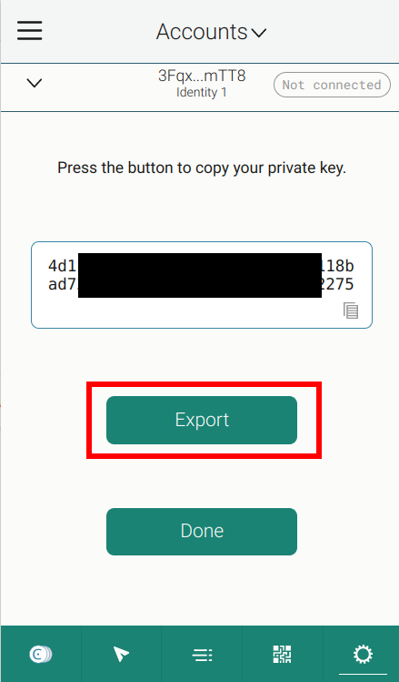

.. include:: ../../../variables.rst
.. _sponsoredTransactions_dapp:

===========================
Sponsored Transactions dApp
===========================

The goal of this part of the tutorial is to set up the frontend and the backend locally and to understand the three flows that the dApp provides.

You can explore the `hosted sponsored transaction service <https://sponsored.testnet.concordium.com>`_.
The sponsored transaction service consists of a frontend and a backend. You can start your own service by
following the instructions in the `frontend README.md file <https://github.com/Concordium/concordium-browser-wallet/tree/main/examples/sponsoredTransactions/front-end/README.md>`_
and then the instructions in the `back-end README.md file <https://github.com/Concordium/concordium-browser-wallet/tree/main/examples/sponsoredTransactions/back-end/README.md>`_.
Alternatively, follow the steps in the `README.md file <https://github.com/Concordium/concordium-browser-wallet/tree/main/examples/sponsoredTransactions/README.md>`_ to deploy the docker container.
The docker container will set up the frontend as well as the backend.

.. note::

   Comprehensive instructions on how to set up the |bw|, create an account in the |bw|,
   get some testnet CCD and run a local frontend can be found in :ref:`wCCD frontend-set-up section <wCCD-front-end-set-up>`.

The frontend supports the following three flows with the |bw| (or |mw-gen2| that uses WalletConnect):

-   Register a public key (associated with the account from your wallet) in the smart contract. This action is paid by the user.
-   Create the message of a sponsored ``updateOperator`` transaction => Sign it with the wallet => Submit the signature to the ``/submitUpdateOperator`` backend endpoint.
-   Mint an NFT to your wallet account => Create the message of a sponsored ``transfer`` transaction => Sign it with the wallet => Submit the signature to the ``/submitTransfer`` backend endpoint.

The backend is a server that exposes two endpoints:

- ``POST /submitUpdateOperator``
- ``POST /submitTransfer``

After submitting the signature to the ``/submitUpdateOperator`` or the ``/submitTransfer`` endpoint,
the backend creates a sponsored transaction and submits it on-chain to the ``permit`` function in the smart contract {index: `SPONSORED_TX_CONTRACT_INDEX <https://github.com/Concordium/concordium-browser-wallet/tree/main/examples/sponsoredTransactions/front-end/src/constants.ts>`_, subindex: 0}.
The deployed smart contract code can be found `here <https://github.com/Concordium/concordium-rust-smart-contracts/tree/main/examples/cis3-nft-sponsored-txs>`_.
After the transaction is sent to the blockchain node, the backend returns the transaction hash to the frontend.

The backend server has to have access to a blockchain node and an account (with its associated private key)
that is funded with some CCD to submit the sponsored transaction to the chain. The backend wallet
will pay for the transaction fees on behalf of the user.

Register your public key
========================

Ensure that you are connected with the correct account to the frontend.
Select the **Registration Public Key tab** to register
your public key in the smart contract as shown below:

.. image:: ./images/registerPublicKey.gif
   :alt: Register public key gif
   :align: center

If the registration was successful, your current public key and your next nonce are displayed.

.. note::

   Concordium accounts can be multi-sig and each account has at least one ``public key`` and at least
   one ``private key`` associated with it.
   For this sponsored transactions example, the accounts in the |bw| (or |mw-gen2|)
   have exactly one ``public key`` and exactly one ``private key`` (no multi-sig accounts).
   You use your ``private key`` to sign the message in the wallet and your ``public key`` is
   used in the smart contract to verify that this signature was generated in the wallet with the associated ``private key``.
   Never share your ``private key``.

.. note::

   Concordium smart contracts currently have no way to query the corresponding
   public key(s) of an account within the smart contract code. The Concordium team is working on exposing the public keys in the smart contract code in the next protocol update so that
   this registration step will not be necessary anymore in the future.
   For the time being, Concordium suggests using a `public_key_registry`
   that allows a special trusted role/account to register the public keys in the smart contract. You can explore
   such a registry in the
   `sponsored transaction example <https://github.com/Concordium/concordium-rust-smart-contracts/blob/main/examples/cis3-nft-sponsored-txs/src/lib.rs>`_.
   In the above smart contract, once an account has a public key registered, the mapping between the public key and the account can not be
   updated anymore.

You can export your keys file from the |bw| as follows:

.. image:: ./images/pic1.png
   :width: 30 %

.. image:: ./images/pic2.png
   :width: 30 %

In this exported file, you will find a ``verifyKey`` (your ``public key``), which should be
identical to the displayed ``public key`` at the frontend. The frontend also displays your next nonce associated with your account.
This nonce is initially 0 and increases every time a successful sponsored transaction
is recorded in the smart contract that was signed by your account.

.. note::

   The nonce is used as a method of preventing replay attacks by ensuring that a signed message by your account
   can not be reused a second time.

Submit a sponsored ``updateOperator`` transaction
=================================================

.. image:: ./images/updateOperator.gif
   :alt: Update operator gif
   :align: center

The gif shows an example of input parameters that can be used to successfully execute a sponsored ``updateOperator`` transaction.
The transaction should be successfully submitted by the backend to the blockchain which can be checked on the
blockchain explorer by clicking the transaction hash displayed at the frontend.

When exploring the code, you will realize that the input parameter to the ``permit`` function
and the ``message`` that is signed in the wallet are rather complex. For example, the ``message`` for the sponsored ``updateOperator`` transaction is as follows:

.. code-block:: javascript

   const operatorAction = addOperator
      ? {
         Add: [],
      }
      : {
         Remove: [],
      };

   const updateOperator =
      [
         {
            operator: {
               Account: [operator],
            },
            update: operatorAction,
         }
      ]

   const payload = serializeTypeValue(
      updateOperator,
      toBuffer(UPDATE_OPERATOR_SCHEMA, 'base64')
   );

   const message = {
      contract_address: {
         index: Number(SPONSORED_TX_CONTRACT_INDEX),
         subindex: 0,
      },
      nonce: Number(nonce),
      timestamp: EXPIRY_TIME_SIGNATURE,
      entry_point: 'updateOperator',
      payload: Array.from(payload),
   };

Because the schema is included in the smart contract, you can use the format returned by the below command to have a
guideline on how to create the ``message`` and input parameters for the functions in the smart contract:

.. code-block:: console

   $concordium-client contract show 4329 --grpc-port 10000 --grpc-ip node.testnet.concordium.com

Submit a sponsored ``transfer`` transaction
===========================================

.. image:: ./images/transfer.gif
   :alt: Transfer gif
   :align: center

The gif shows an example of input parameters that can be used to successfully execute a sponsored ``transfer`` transaction.
The transaction should be successfully submitted by the backend to the blockchain which can be checked on the
blockchain explorer by clicking the transaction hash displayed at the frontend. You can also check that your ``to`` account is now the owner of the ``token_id``.

When exploring the code, you will realize that the input parameter to the ``permit`` function
and the ``message`` that is signed in the wallet are rather complex. For example, the ``message`` for the sponsored ``transfer`` transaction is as follows:

.. code-block:: javascript

   const transfer =
      [
         {
            amount: '1',
            data: '',
            from: {
               Account: [from],
            },
            to: {
               Account: [to],
            },
            token_id: tokenID,
         },
      ]

   const payload = serializeTypeValue(
        transfer,
        toBuffer(TRANSFER_SCHEMA, 'base64')
   );

   const message = {
      contract_address: {
         index: Number(SPONSORED_TX_CONTRACT_INDEX),
         subindex: 0,
      },
      nonce: Number(nonce),
      timestamp: EXPIRY_TIME_SIGNATURE,
      entry_point: 'transfer',
      payload: Array.from(payload),
   };

Because the schema is included in the smart contract, you can use the format returned by the below command to have a
guideline on how to create the ``message`` and input parameters for the functions in the smart contract:

.. code-block:: console

   $concordium-client contract show 4329 --grpc-port 10000 --grpc-ip node.testnet.concordium.com

.. note::

   The NFT smart contract used in the hosted demo app is meant for exploring sponsored transactions.
   To ease this process, the mint function can be called by any account to mint a token.
   ``Token_ids`` are stored in the smart contract in little-endian order and a counter is used to
   increase the  ``token_id`` by 1 every time the mint function is invoked. The wallet displays the ``token_id`` bytes in a hex string.
   In other words, the first token minted will have the ``token_id=01000000``,
   the second token minted will have ``02000000``, ..., ``0f000000``, ``10000000``, ... .
   You can look up your minted ``token_id`` in the |bw| by getting the smart contract
   index as seen below and searching for tokens in that contract that are owned by your account.

.. image:: ./images/SmartContractIndex.png
   :width: 40 %

.. image:: ./images/ManageTokenTab.png
   :width: 40 %

.. note::

   Every ``token_id`` would usually have
   its own metadata associated with it by e.g. appending the ``TOKEN_METADATA_URL`` with the ``token_id``. But to simplify the
   metadata management for Concordium, the NFT smart contract used in the hosted demo app returns
   the same metadata hash (``TOKEN_METADATA_URL``) for all ``token_ids``.
   The NFT picture in the below URL changes every time you access ``https://picsum.photos/40/40``. Hence, the |bw| depicts random new pictures
   for your minted NFT.

   .. code-block:: rust

      const TOKEN_METADATA_URL: &str = "https://gist.githubusercontent.com/abizjak/ab5b6fc0afb78acf23ee24d979eb7639/raw/7c03f174d628df1d2fd0dc8cffb319c89e770708/metadata.json";

