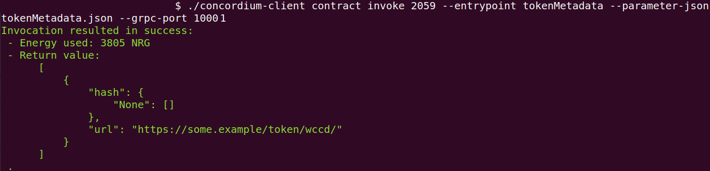

.. _wCCD-interacting:

========================================
Interacting with the wCCD token protocol
========================================

.. note::

    Before you start with part 2 of this tutorial, make sure you have access to a testnet node,
    installed the ``concordium-client``, created an account in the mobile wallet app
    that is funded with some CCD, and imported the keys
    into the ``concordium-client`` configuration. If you haven't completed any of the above steps,
    the piggy bank tutorial :ref:`part 3 <piggy-bank-preparing>`
    will guide you through these setup steps.
    If you haven't completed any of the above steps, you can continue
    with :ref:`part 3 <wCCD-front-end-set-up>` of this tutorial. However, we recommend completing every part of this tutorial.

Non-state-mutative functions
----------------------------

The protocol has four non-state-mutative functions (``balanceOf``, ``operatorOf``, ``tokenMetadata``, and ``supports``)
that you can invoke on the ``proxy`` contract or the ``implementation`` contract.
The schema is embedded into the ``implementation`` contract while you will need to provide a schema file
when invoking the non-state-mutative functions on the ``proxy`` contract. All used schema files in this tutorial can be `downloaded <https://github.com/Concordium/concordium.github.io/tree/main/source/mainnet/smart-contracts/tutorials/wCCD/schemas>`_
or you can create them as described in the
comments of the `upgradable wCCD smart contract <https://github.com/Concordium/concordium-rust-smart-contracts/pull/128>`_.
Because you will use a ``schema`` (embedded or provided with an extra flag),
the input parameters can be provided with the ``--parameter-json`` flag.

.. note::

    While for testings it can be convenient to invoke these functions on the ``implementation`` contract,
    you should always invoke them on the ``proxy`` contract in production.
    When the protocol is upgraded, the ``implementation`` address becomes
    invalid, you would need to update your production product to the new ``implementation`` address.

.. _balanceCCD:

Getting the CCD balance of an address
=====================================

.. dropdown:: Checking the CCD balance of an account (click here)

    You can check the CCD balance of an account on `CCDScan <https://testnet.ccdscan.io/>`_.

    .. image:: ./images/wCCD_tutorial_1.png
        :width: 100 %

    You can check the CCD balance of an account with this command:

    .. code-block:: console

        $./concordium-client account show ACCOUNT --grpc-port 10001

    .. image:: ./images/wCCD_tutorial_10.png
        :width: 100 %

.. dropdown:: Checking the CCD balance of a smart contract (click here)

    You can check the CCD balance of a smart contract with this command:

    .. code-block:: console

        $./concordium-client contract show INDEX --grpc-port 10001

    .. image:: ./images/wCCD_tutorial_3.png
        :width: 100 %

.. note::

    The smallest unit of CCD is 1 micro CCD and equals the 10\ :sup:`−6` (one millionth) of a CCD.
    CCD has 6 decimal places. 1 CCD is represented by the balance
    value of 1,000,000 on the blockchain and is worth the equivalent of a balance value of 1,000,000 wCCD.

.. _balanceOf:

The ``balanceOf`` function
==========================

.. dropdown:: Checking the wCCD balance of an account (click here)

    Create a ``balanceOf.json`` file and insert the following JSON object.

    .. code-block::

        [
            {
                "address": {
                    "Account": [
                        ACCOUNT
                    ]
                },
                "token_id": TOKEN_ID
            }
        ]

    .. note::

        You can query the balance of several addresses in the above array.

    If you insert the account address correctly, the JSON object should look similar to the below JSON object.

    .. code-block:: json

        [
            {
                "address": {
                    "Account": [
                        "4phD1qaS3U1nLrzJcgYyiPq1k8aV1wAjTjYVPE3JaqovViXS4j"
                    ]
                },
                "token_id": ""
            }
        ]

    Execute the following command to get the wCCD balance as a return value.

    .. code-block:: console

        $./concordium-client contract invoke PROXY --entrypoint balanceOf --parameter-json balanceOf.json --energy 25000 --grpc-port 10001

    .. image:: ./images/wCCD_tutorial_4.png
        :width: 100 %

.. dropdown:: Checking the wCCD balance of a smart contract (click here)

    Create a ``balanceOf.json`` file and insert the following JSON object.

    .. code-block::

        [
            {
                "address": {
                    "Contract": [
                        {
                            "index": INDEX,
                            "subindex": SUBINDEX
                        }
                    ]
                },
                "token_id": TOKEN_ID
            }
        ]

    .. note::

        You can query the balance of several addresses in the above array.

    If you insert the smart contract address correctly, the JSON object should look similar to the below JSON object.

    .. code-block:: json

        [
            {
                "address": {
                    "Contract": [
                        {
                            "index": 844,
                            "subindex": 0
                        }
                    ]
                },
                "token_id": ""
            }
        ]

    Execute the following command to get the wCCD balance as a return value.

    .. code-block:: console

        $./concordium-client contract invoke PROXY --entrypoint balanceOf --parameter-json balanceOf.json --energy 25000 --grpc-port 10001

    .. image:: ./images/wCCD_tutorial_4.png
        :width: 100 %

**TODO: deploy the wCCD on testnet with the balanceOf_fallback_schema embedded into the smart contract proxy
because I think this is the most common invoke executed throuh the fallback function (advantage: users don't  have to provide an extra schema with
a flag when querying the wCCD balance through the fallback function)**

.. note::

    The smallest unit of CCD is 1 micro CCD and equals the 10\ :sup:`−6` (one millionth) of a CCD.
    CCD has 6 decimal places. 1 CCD is represented by the balance
    value of 1,000,000 on the blockchain and is worth the equivalent of a balance value of 1,000,000 wCCD.

.. _operatorOf:

The ``operatorOf`` function
===========================

.. dropdown:: Input parameters for the ``operatorOf`` function (click here)

    Create an ``operatorOf.json`` file and insert the following JSON object.

    .. code-block::

        [
            {
                "address": {
                    "Enum": [
                        {
                            "Account": [
                                ACCOUNT_ADDRESS
                            ]
                        },
                        {
                            "Contract": [
                                {
                                    "index": INDEX,
                                    "subindex": SUBINDEX
                                }
                            ]
                        }
                    ]
                },
                "owner": {
                    "Enum": [
                        {
                            "Account": [
                                ACCOUNT_ADDRESS
                            ]
                        },
                        {
                            "Contract": [
                                {
                                    "index": INDEX,
                                    "subindex": SUBINDEX
                                }
                            ]
                        }
                    ]
                }
            }
        ]

    .. note::

        You can query several sets of addresses in the above array.

    If you insert everything correctly, the JSON object should look similar to
    the below JSON object.

    .. code-block:: json

        [
            {
                "address": {
                    "Account": [
                        "4DH219BXocxeVByKpZAGKNAJx7s2w1HFpwaNu1Ljd1mXFXig22"
                    ]
                }
                "owner": {
                    "Account": [
                        "4phD1qaS3U1nLrzJcgYyiPq1k8aV1wAjTjYVPE3JaqovViXS4j"
                    ]
                },
            }
        ]

You are ready now to invoke the ``operatorOf`` function with one of the following commands.

.. code-block:: console

    $./concordium-client contract invoke PROXY --entrypoint operatorOf --schema operatorOf_fallback_schema.bin --parameter-json operatorOf.json --energy 25000 --grpc-port 10001

or

.. code-block:: console

    $./concordium-client contract invoke IMPLEMENTATION --entrypoint operatorOf --parameter-json operatorOf.json --energy 25000 --grpc-port 10001

.. image:: ./images/wCCD_tutorial_7.png
    :width: 100 %

The ``tokenMetadata`` function
==============================

.. dropdown:: Input parameters for the ``tokenMetadata`` function (click here)

    Create a ``tokenMetadata.json`` file and insert the following JSON object.

    .. code-block:: json

        [""]

    .. note::

        This empty string is required because of the CIS-2 token standard.
        The `tokenId` of the wCCD token is the smallest unit possible (an empty string).

You are ready now to invoke the ``tokenMetadata`` function with one of the following commands.

.. code-block:: console

    $./concordium-client contract invoke PROXY --entrypoint tokenMetadata --schema tokenMetadata_fallback_schema.bin --parameter-json tokenMetadata.json --energy 25000 --grpc-port 10001

or

.. code-block:: console

    $./concordium-client contract invoke IMPLEMENTATION --entrypoint tokenMetadata --parameter-json tokenMetadata.json --energy 25000 --grpc-port 10001

The ``supports`` function
=========================

.. dropdown:: Input parameters for the ``supports`` function (click here)

    Create a ``supports.json`` file and insert the following example JSON object. It will query if
    the two token standards (``CIS-0`` and ``CIS-2``) are supported by the wCCD token.

    .. code-block:: json

        ["CIS-0","CIS-2"]

    .. note::

        You can find more information about the `CIS-0 standard <https://proposals.concordium.software/CIS/cis-0.html>`_
        and the `CIS-2 standard <https://proposals.concordium.software/CIS/cis-2.html>`_.

You are ready now to invoke the ``supports`` function with one of the following commands.

.. code-block:: console

    $./concordium-client contract invoke PROXY --entrypoint supports --schema supports_fallback_schema.bin --parameter-json supports.json --energy 25000 --grpc-port 10001

or

.. code-block:: console

    $./concordium-client contract invoke IMPLEMENTATION --entrypoint supports --parameter-json supports.json --energy 25000 --grpc-port 10001

The below screenshot shows the response of querying if the wCCD
token contract supports the following standards
``["12345","CIS-0","CIS-2"]``. Its response is that it does
not support the standard ``12345`` but it supports the ``CIS-0`` and the ``CIS-1`` standards.

.. image:: ./images/wCCD_tutorial_9.png
    :width: 100 %

State-mutative functions
------------------------

The protocol has four state-mutative functions (``wrap``, ``unwrap``,
``transfer``, and ``updateOperator``) that you can invoke on the ``proxy`` contract.
These invokes will be passed through the fallback function on the ``proxy`` to the ``implementation`` contract.
You require a different schema and JSON file with your input parameters for every invoke.
All used schema files in this tutorial can be `downloaded <https://github.com/Concordium/concordium.github.io/tree/main/source/mainnet/smart-contracts/tutorials/wCCD/schemas>`_
or you can create them as described in the
comments of the `upgradable wCCD smart contract <https://github.com/Concordium/concordium-rust-smart-contracts/pull/128>`_.
Because you will use a ``schema``,
the input parameters can be provided with the ``--parameter-json`` flag.

The ``wrap`` function
=====================

Wrapping CCD refers to the process of converting the native currency CCD into
a ``CIS-2`` compliant token (wCCD) at a 1:1 ratio by sending CCD to the wCCD smart
contract and getting wCCD in return.
You can specify with the ``--amount`` flag how much CCD you want to wrap.

Create a ``wrap.json`` file and insert the JSON object
from option 1 (Receiver is an account) or option 2 (Receiver is a smart contract).

.. dropdown:: Option 1 (Receiver is an account) (click here)

    .. code-block::

        {
            "data": DATA_STRING,
            "to": {
                "Account": [
                    ACCOUNT_ADDRESS
                ]
            }
        }

    The ``DATA_STRING`` is only relevant if wCCD is sent to a smart contract as described in option 2.
    You can use your account address if you want to credit the wCCD to your own account.
    If you insert your account address correctly, the JSON object should look similar to the below JSON object.

    .. code-block:: json

        {
            "data": "",
            "to": {
                "Account": [
                    "4phD1qaS3U1nLrzJcgYyiPq1k8aV1wAjTjYVPE3JaqovViXS4j"
                ]
            }
        }

.. dropdown::  Option 2 (Receiver is a smart contract) (click here)

    .. code-block::

        {
            "data": DATA_STRING,
            "to": {
                "Contract": [
                    {
                        "index": INDEX,
                        "subindex": SUBINDEX
                    },
                    ENTRYPOINT_NAME
                ]
            }
        }

    The ``DATA_STRING`` is relevant because wCCD is sent to a smart contract and it is a string of bytes (string with lowercase hex).
    The ``OnReceivingCis2`` hook is executed in that case. This hook invokes the ``ENTRYPOINT_NAME``
    on the smart contract ``INDEX`` with the ``OnReceivingCis2Params`` parameters
    which include the above ``DATA_STRING``. This action allows the receiving smart contract to
    react to the credited wCCD amount. You can keep the data field empty
    if you don't want to send any additional data to the receiving smart contract.

    You can use the smart contract deployed at index 844 on testnet and
    its function entry point name ``receiveToken`` for testing.

    .. code-block:: json

        {
            "data": "",
            "to": {
                "Contract": [
                    {
                        "index": 844,
                        "subindex": 0
                    },
                    "receiveToken"
                ]
            }
        }

Before you execute the ``wrap`` function, let us check
the CCD balance of your ``SENDER_ACCOUNT`` (the account that initiates the transaction) and the ``proxy`` contract as described :ref:`here <balanceCCD>`.
The ``wrap`` function will send some CCD from your ``SENDER_ACCOUNT`` account to the ``proxy`` contract.

.. note::

    This tutorial is read by other people too and they might at the same
    time interact with the smart contracts and change their CCD or wCCD balances.

Before you execute the ``wrap`` function, let us check
the wCCD balance of the ``to`` address with the :ref:`balanceOf <balanceOf>` function.
The ``to`` address will receive some wCCD
because the ``wrap`` function will credit some wCCD to the ``to`` address.

You are ready now to wrap your CCD into wCCD with the following command.

.. code-block:: console

    $./concordium-client contract update WCCD_PROXY --entrypoint wrap --schema wrap_fallback_schema.bin --parameter-json wrap.json --amount AMOUNT --sender SENDER_ACCOUNT --energy 25000 --grpc-port 10001

The below screenshot shows the wrapping of 1 CCD (1,000,000 micro CCDs) into 1,000,000 wCCD.

.. image:: ./images/wCCD_tutorial_2.png
    :width: 100 %

Confirm that the CCD balance of the ``SENDER_ACCOUNT`` was decreased
by ``AMOUNT`` and that the CCD balance of the ``proxy`` contract was increased by ``AMOUNT``.

.. note::

    Keep in mind that the ``SENDER_ACCOUNT`` also paid some CCD as transaction fees.
    The amount of transaction fees can be seen as shown in the above screenshot.

Confirm that the wCCD balance of the ``to`` address increased by ``AMOUNT``.

The ``unwrap`` function
=======================

Unwrapping CCD refers to the opposite process of converting the ``CIS-2``
compliant wCCD token at a 1:1 ratio back to the native currency CCD by buring the
wCCD token in the wCCD smart contract and getting CCD in return.

.. dropdown:: Input parameters for the ``unwrap`` function (click here)

    Create an ``unwrap.json`` file and insert the below JSON object.

    .. code-block::

        {
            "amount": AMOUNT,
            "data": DATA_STRING,
            "owner": {
                "Enum": [
                    {
                        "Account": [
                            ACCOUNT_ADDRESS
                        ]
                    },
                    {
                        "Contract": [
                            {
                                "index": INDEX,
                                "subindex": SUBINDEX
                            }
                        ]
                    }
                ]
            },
            "receiver": {
                "Enum": [
                    {
                        "Account": [
                            ACCOUNT_ADDRESS
                        ]
                    },
                    {
                        "Contract": [
                            {
                                "index": INDEX,
                                "subindex": SUBINDEX
                            },
                            ENTRYPOINT_NAME
                        ]
                    }
                ]
            }
        }

    If you insert everything correctly, the JSON object should look similar to
    the below JSON object that will unwrap 1,000,000 wCDD from an account
    and send the received CCDs back to the same account.

    .. code-block:: json

        {
            "amount": "1,000,000",
            "data": "",
            "owner": {
                "Account": [
                    "4phD1qaS3U1nLrzJcgYyiPq1k8aV1wAjTjYVPE3JaqovViXS4j"
                ]
            },
            "receiver": {
                "Account": [
                    "4phD1qaS3U1nLrzJcgYyiPq1k8aV1wAjTjYVPE3JaqovViXS4j"
                ]
            }
        }

Before you execute the ``unwrap`` function, let us check
the CCD balance of the ``receiver`` address and the ``proxy`` contract as described :ref:`here <balanceCCD>`.
The ``unwrap`` function will send some CCD from the ``proxy`` contract to the ``receiver`` address.

Before you execute the ``unwrap`` function, let us check
the wCCD balance of the ``owner`` address with the :ref:`balanceOf <balanceOf>` function.
The ``owner`` address will get its wCCD balance reduced
because the ``unwrap`` function will burn some wCCD from the ``owner`` address.

The ``owner`` has to have at least a balance of ``AMOUNT`` in wCCD tokens
and the ``SENDER_ACCOUNT`` has to be the ``owner`` address or be an ``operator`` of the ``owner`` address.
You are ready now to unwrap your wCCD into CCD with the following command.

.. code-block:: console

    $./concordium-client contract update WCCD_PROXY --entrypoint unwrap --schema unwrap_fallback_schema.bin --parameter-json unwrap.json --sender SENDER_ACCOUNT --energy 25000 --grpc-port 10001

The below screenshot shows the execution of the ``unwrap`` function.

.. image:: ./images/wCCD_tutorial_11.png
    :width: 100 %

Confirm that the CCD balance of the ``receiver`` was increased
by ``AMOUNT`` (specified in the ``unwrap.json`` file) and that the CCD
balance of the ``proxy`` contract was decreased by ``AMOUNT``.

Confirm that the wCCD balance of the ``owner`` address decreased by ``AMOUNT`` specified in the ``unwrap.json`` file.

The ``transfer`` function
=========================

You can transfer the wCCD tokens from one address to another address.

.. dropdown:: Input parameters for the ``transfer`` function (click here)

    Create a ``transfer.json`` file and insert the below JSON object.

    .. code-block::

        [
            {
                "amount": AMOUNT,
                "data": DATA_STRING,
                "from": {
                    "Enum": [
                        {
                            "Account": [
                                ACCOUNT_ADDRESS
                            ]
                        },
                        {
                            "Contract": [
                                {
                                    "index": INDEX,
                                    "subindex": SUBINDEX
                                }
                            ]
                        }
                    ]
                },
                "to": {
                    "Enum": [
                        {
                            "Account": [
                                ACCOUNT_ADDRESS
                            ]
                        },
                        {
                            "Contract": [
                                {
                                    "index": INDEX,
                                    "subindex": SUBINDEX
                                },
                                ENTRYPOINT_NAME
                            ]
                        }
                    ]
                },
                "token_id": TOKEN_ID
            }
        ]

    .. note::

        You can execute several transfers in the above array.

    If you insert everything correctly, the JSON object should look similar to
    the below JSON object that will transfer 1 wCCD from an account address to another account address.

    .. code-block:: json

        [
            {
                "amount": "1",
                "data": "",
                "from": {
                    "Account": [
                        "4phD1qaS3U1nLrzJcgYyiPq1k8aV1wAjTjYVPE3JaqovViXS4j"
                    ]
                },
                "to": {
                    "Account": [
                        "4DH219BXocxeVByKpZAGKNAJx7s2w1HFpwaNu1Ljd1mXFXig22"
                    ]
                },
                "token_id": ""
            }
        ]

Before you execute the ``transfer`` function, let us check
the wCCD balance of the ``from`` address and the ``to`` address with the :ref:`balanceOf <balanceOf>` function.
The ``transfer`` function will send some wCCD from the ``from`` address to the ``to`` address.

The ``from`` address has to have at least a balance of ``AMOUNT`` in wCCD tokens
and the ``SENDER_ACCOUNT`` has to be the ``from`` address or be an ``operator`` of the ``from`` address.
You are ready now to transfer your wCCD to another address with the following command.

.. code-block:: console

    $./concordium-client contract update WCCD_PROXY --entrypoint transfer --schema transfer_fallback_schema.bin --parameter-json transfer.json --sender SENDER_ACCOUNT --energy 25000 --grpc-port 10001

The below screenshot shows the execution of the ``transfer`` function.

.. image:: ./images/wCCD_tutorial_5.png
    :width: 100 %

Confirm that the wCCD balance of the ``to`` address was increased
by ``AMOUNT`` (specified in the ``transfer.json`` file) and that the wCCD
balance of the ``from`` address was decreased by ``AMOUNT``.

The ``updateOperator`` function
===============================

You can add one or more operator addresses to an address that you control.
These operators have access to your wCCD tokens
at that address and can transfer or unwrap them on your behalf.
You should only add operator addresses that you trust. The ``updateOperator`` function allows you
to add and remove operators.
For example, a smart contract address is often added as an operator so it can
access your tokens to perform some smart contract operations
without you having to interact with the smart contract again.

.. dropdown:: Input parameters for the ``updateOperator`` function (click here)

    Create an ``updateOperator.json`` file and insert the below JSON object.

    .. code-block::

        [
            {
                "operator": {
                    "Enum": [
                        {
                            "Account": [
                                ACCOUNT_ADDRESS
                            ]
                        },
                        {
                            "Contract": [
                                {
                                    "index": INDEX,
                                    "subindex": SUBINDEX
                                }
                            ]
                        }
                    ]
                },
                "update": {
                    "Enum": [
                        {
                            "Remove": []
                        },
                        {
                            "Add": []
                        }
                    ]
                }
            }
        ]

    .. note::

        You can add/remove several operator addresses in the above array.

    If you insert everything correctly, the JSON object should look similar to
    the below JSON object that will add the account address 4DH219B... as
    an operator to the ``SENDER_ACCOUNT``.

    .. code-block:: json

        [
            {
                "operator": {
                    "Account": [
                        "4DH219BXocxeVByKpZAGKNAJx7s2w1HFpwaNu1Ljd1mXFXig22"
                    ]
                },
                "update":
                {
                    "Add": []
                }
            }
        ]

Before you execute the ``updateOperator`` function, let us check
the state of the smart contract with the :ref:`operatorOf <operatorOf>` function.

You are ready now to update the operator on your ``SENDER_ACCOUNT`` address with the following command.

.. code-block:: console

    $./concordium-client contract update WCCD_PROXY --entrypoint updateOperator --schema updateOperator_fallback_schema.bin --parameter-json updateOperator.json --sender SENDER_ACCOUNT --energy 25000 --grpc-port 10001

The below screenshot shows the execution of the ``updateOperator`` function.

.. image:: ./images/wCCD_tutorial_6.png
    :width: 100 %

Confirm that the ``updateOperator`` function has added/removed operator addresses by checking
with the ``operatorOf`` function the state of the smart contract again.

To continue with the tutorial click :ref:`here<wCCD-front-end-set-up>`.
