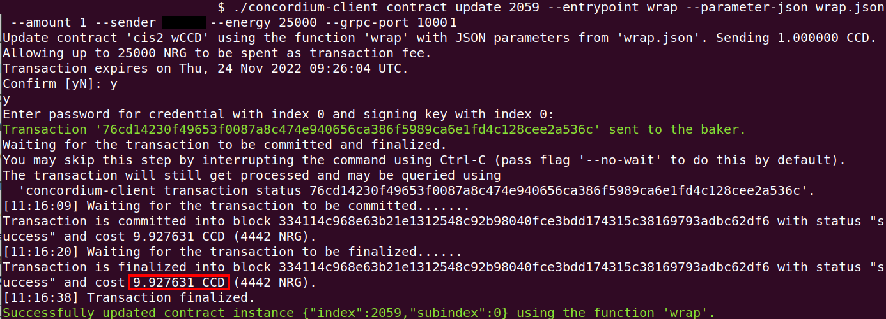

.. _wCCD-interacting:

========================================
Interacting with the wCCD token protocol
========================================

State-mutative functions
------------------------

The protocol has four state-mutative functions (``wrap``, ``unwrap``,
``transfer``, and ``updateOperator``) that you can invoke on the ``proxy`` contract.
These invokes will be passed through the fallback function on the ``proxy`` to the ``implementation`` contract.
You require a different schema and JSON file with your input parameters for every invoke.
These files are provided for download in each section.

The ``wrap`` function
=====================

Wrapping CCD refers to the process of converting the native currency CCD into
a ``CIS-2`` compliant token (wCCD) at a 1:1 ratio by sending CCD to the wCCD smart
contract and getting wCCD in return.
You can specify with the ``--amount`` flag how much CCD you want to wrap.

Download the schema `wrap_fallback_schema.bin <https://github.com/Concordium/concordium.github.io/tree/main/source/mainnet/smart-contracts/tutorials/wCCD/schemas>`_
for interacting with the ``wrap`` function
or create it yourself as described in the comments of the `upgradable wCCD smart contract <https://github.com/Concordium/concordium-rust-smart-contracts/pull/128>`_.

The ``wrap`` function requires some input parameters. Because you will use a ``schema``,
the input parameters can be provided with the ``--parameter-json`` flag.
Create a ``wrap.json`` file and insert the JSON object
from option 1 (Receiver is an account) or option 2 (Receiver is a smart contract).

.. dropdown:: Option 1 (Receiver is an account)

    .. code-block::

        {
            "data": "",
            "to": {
                "Account": [
                    ACCOUNT_ADDRESS
                ]
            }
        }

    The ``data`` field is only relevant if wCCD is sent to a smart contract as described in the next option.
    You can use your account address if you want to credit the wCCD to your own account.
    If you insert your account address correctly, the JSON object should look similar to the below JSON object.

    .. code-block:: json

        {
            "data": "",
            "to": {
                "Account": [
                    "4phD1qaS3U1nLrzJcgYyiPq1k8aV1wAjTjYVPE3JaqovViXS4j"
                ]
            }
        }

.. dropdown::  Option 2 (Receiver is a smart contract)

    .. code-block::

        {
            "data": "",
            "to": {
                "Contract": [
                    {
                        "index": INDEX,
                        "subindex": SUBINDEX
                    },
                    ENTRYPOINT_NAME
                ]
            }
        }

    The ``data`` field is only relevant if wCCD is sent to a smart contract.
    The ``OnReceivingCis2`` hook is executed in that case. This hook invokes the ``ENTRYPOINT_NAME``
    on the smart contract ``INDEX`` with the ``OnReceivingCis2Params`` parameters
    which include the above ``data`` field. This action allows the receiving smart contract to
    react to the credited wCCD amount. You can keep the data field empty
    if you don't want to send any additional information to the receiving smart contract.

    You can use the smart contract deployed at index 844 on testnet and
    its function entry point name ``receiveToken`` for testing.

    .. code-block:: json

        {
            "data": "",
            "to": {
                "Contract": [
                    {
                        "index": 844,
                        "subindex": 0
                    },
                    "receiveToken"
                ]
            }
        }

Before you execute the ``wrap`` function, let us check
the CCD balance of your sender ``ACCOUNT`` and the ``proxy`` contract.
The ``wrap`` function will send some CCD from your sender ``ACCOUNT`` to the ``proxy`` contract.

.. note::

    This tutorial is read by other people too and they might at the same
    time interact with the smart contracts and change their CCD or wCCD balances.

.. dropdown:: Checking the CCD balance of an account

    You can check the CCD balance of an account on `CCDScan <https://testnet.ccdscan.io/>`_.

    .. image:: ./images/wCCD_tutorial_1.png
        :width: 100 %

.. dropdown:: Checking the CCD balance of a smart contract

    You can check the CCD balance of a smart contract with this command.

    .. code-block:: console

        $./concordium-client contract show INDEX --grpc-port 10001

    .. image:: ./images/wCCD_tutorial_3.png
        :width: 100 %

Before you execute the ``wrap`` function, let us check
the wCCD balance of the ``to`` address. The ``to`` address will receive some wCCD
because the ``wrap`` function will credit some wCCD to the ``to`` address.

.. dropdown:: Checking the wCCD balance of an account

    Create a ``balanceOf.json`` file and insert the following JSON object.

    .. code-block::

        [
            {
                "address": {
                    "Account": [
                        ACCOUNT
                    ]
                },
                "token_id":""
            }
        ]

    .. note::

        You can query the balance of several addresses in the above array.

    If you insert the account address correctly, the JSON object should look similar to the below JSON object.

    .. code-block:: json

        [
            {
                "address": {
                    "Account": [
                        "4phD1qaS3U1nLrzJcgYyiPq1k8aV1wAjTjYVPE3JaqovViXS4j"
                    ]
                },
                "token_id":""
            }
        ]

    Execute the following command to get the wCCD balance as a return value.

    .. code-block:: console

        $./concordium-client contract invoke PROXY --entrypoint balanceOf --parameter-json balanceOf.json --energy 25000 --grpc-port 10001

    .. image:: ./images/wCCD_tutorial_4.png
        :width: 100 %

.. dropdown:: Checking the wCCD balance of a smart contract

    Create a ``balanceOf.json`` file and insert the following JSON object.

    .. code-block::

        [
            {
                "address": {
                    "Contract": [
                        {
                            "index": INDEX,
                            "subindex": SUBINDEX
                        }
                    ]
                },
                "token_id":""
            }
        ]

    .. note::

        You can query the balance of several addresses in the above array.

    If you insert the smart contract address correctly, the JSON object should look similar to the below JSON object.

    .. code-block:: json

        [
            {
                "address": {
                    "Contract": [
                        {
                            "index": 844,
                            "subindex": 0
                        }
                    ]
                },
                "token_id":""
            }
        ]

    Execute the following command to get the wCCD balance as a return value.

    .. code-block:: console

        $./concordium-client contract invoke PROXY --entrypoint balanceOf --parameter-json balanceOf.json --energy 25000 --grpc-port 10001

    .. image:: ./images/wCCD_tutorial_4.png
        :width: 100 %

**TODO: deploy the wCCD on testnet with the balanceOf_fallback_schema embedded into the smart contract
because I think this is the most common invoke executed throuh the fallback function (advantage: users don't  have to provide an extra schema with
a flag when querying the wCCD balance through the fallback function)**

**TODO: create all schemas again from the final version of the smart contracts deployed on testnet so minor changes are included**

.. note::

    The smallest unit of CCD is 1 micro CCD and equals the 10^{−6} (one millionth) of a CCD.
    CCD has 6 decimal places. 1 CCD is represented by the balance
    value of 1000000 on the blockchain and is worth the equivalent of a balance value of 1000000 wCCD.

You are ready now to wrap your CCD into wCCD with the following command.

.. code-block:: console

    $./concordium-client contract update WCCD_PROXY --entrypoint wrap --schema wrap_fallback_schema.bin --parameter-json wrap.json --amount AMOUNT --sender ACCOUNT --energy 25000 --grpc-port 10001

The below screenshot shows the wrapping of 1 CCD (1000000 micro CCDs) into 1000000 wCCD.

Confirm that the CCD balance of the sender ``ACCOUNT`` was decreased
by ``AMOUNT`` and that the CCD balance of the ``proxy`` contract was increased by ``AMOUNT``.

.. note::

    Keep in mind that the ``ACCOUNT`` also paid some CCD as transaction fees.
    The amount of transaction fees can be seen as shown in the above screenshot.

Confirm that the wCCD balance of the ``to`` address increased by ``AMOUNT``.

The ``unWrap`` function
=======================

Unwrapping CCD refers to the opposite process of converting the ``CIS-2``
compliant wCCD token at a 1:1 ratio back to the native currency CCD by sending
wCCD to the wCCD smart contract and getting CCD in return.

Download the schema `unwrap_fallback_schema.bin <https://github.com/Concordium/concordium.github.io/tree/main/source/mainnet/smart-contracts/tutorials/wCCD/schemas>`_
for interacting with the ``unwrap`` function
or create it yourself as described in the comments of the `upgradable wCCD smart contract <https://github.com/Concordium/concordium-rust-smart-contracts/pull/128>`_.

The ``unwrap`` function requires some input parameters. Because you will use a ``schema``,
the input parameters can be provided with the ``--parameter-json`` flag.
Create a ``unwrap.json`` file and insert the below JSON object.

.. dropdown:: Input parameters for the ``unwrap`` function

    .. code-block::

        {
            "amount": AMOUNT,
            "data": "",
                "owner": {
                    "Enum": [
                        {
                            "Account": [
                                ACCOUNT_ADDRESS
                            ]
                        },
                        {
                            "Contract": [
                                {
                                    "index": INDEX,
                                    "subindex": SUBINDEX
                                }
                            ]
                        }
                    ]
                },
                "receiver": {
                    "Enum": [
                        {
                            "Account": [
                                ACCOUNT_ADDRESS
                            ]
                        },
                        {
                            "Contract": [
                                {
                                    "index": INDEX,
                                    "subindex": SUBINDEX
                                },
                                ENTRYPOINT_NAME
                            ]
                        }
                    ]
                }
            }
        }

    If you insert everything correctly, the JSON object should look similar to
    the below JSON object that will unwrap 1000000 wCDD from an account
    and send the received CCDs back to the same account.

    .. code-block:: json

        {
            "amount": "1000000",
            "data": "",
            "owner": {
                "Account": [
                    "4phD1qaS3U1nLrzJcgYyiPq1k8aV1wAjTjYVPE3JaqovViXS4j"
                ]
            },
            "receiver": {
                "Account": [
                    "4phD1qaS3U1nLrzJcgYyiPq1k8aV1wAjTjYVPE3JaqovViXS4j"
                ]
            }
        }

The ``owner`` has to have at least a balance of AMOUNT in wCCD tokens
and the ``sender`` account has to be the ``owner`` address or be an ``operator`` of the ``owner`` address.
You are ready now to unwrap your wCCD into CCD with the following command.

.. code-block:: console

    $./concordium-client contract update WCCD_PROXY --entrypoint unwrap --schema unwrap_fallback_schema.bin --parameter-json unwrap.json --sender ACCOUNT --energy 25000 --grpc-port 10001

The below screenshot shows the execution of the ``unwrap`` function.

**TODO: add screenshot once a new protocol is deployed**

Confirm that the CCD balance of the ``receiver`` was increased
by ``AMOUNT`` (specified in the ``unwrap.json`` file) and that the CCD
balance of the ``proxy`` contract was decreased by ``AMOUNT``.

Confirm that the wCCD balance of the ``owner`` address decreased by ``AMOUNT`` specified in the ``unwrap.json`` file.

The ``transfer`` function
=========================

You can transfer the wCCD tokens from one address to another address.

Download the schema `transfer_fallback_schema.bin <https://github.com/Concordium/concordium.github.io/tree/main/source/mainnet/smart-contracts/tutorials/wCCD/schemas>`_
for interacting with the ``transfer`` function
or create it yourself as described in the comments of the `upgradable wCCD smart contract <https://github.com/Concordium/concordium-rust-smart-contracts/pull/128>`_.

The ``transfer`` function requires some input parameters. Because you will use a ``schema``,
the input parameters can be provided with the ``--parameter-json`` flag.
Create a ``transfer.json`` file and insert the below JSON object.

.. dropdown:: Input parameters for the ``transfer`` function

    .. code-block::

        {
            "amount": AMOUNT,
            "data": "",
            "from": {
                "Enum": [
                    {
                        "Account": [
                            ACCOUNT_ADDRESS
                        ]
                    },
                    {
                        "Contract": [
                            {
                                "index": INDEX,
                                "subindex": SUBINDEX
                            }
                        ]
                    }
                ]
            },
            "to": {
                "Enum": [
                    {
                        "Account": [
                            ACCOUNT_ADDRESS
                        ]
                    },
                    {
                        "Contract": [
                            {
                                "index": INDEX,
                                "subindex": SUBINDEX
                            },
                            ENTRYPOINT_NAME
                        ]
                    }
                ]
            },
            "token_id": ""
        }

    If you insert everything correctly, the JSON object should look similar to
    the below JSON object that will transfer 1 wCCD from an account address to another account address.

    .. code-block:: json

        [
            {
                "amount": "1",
                "data": "",
                "from": {
                    "Account": [
                        "4phD1qaS3U1nLrzJcgYyiPq1k8aV1wAjTjYVPE3JaqovViXS4j"
                    ]
                },
                "to": {
                    "Account": [
                        "4DH219BXocxeVByKpZAGKNAJx7s2w1HFpwaNu1Ljd1mXFXig22"
                    ]
                },
                "token_id": ""
            }
        ]

The ``from`` address has to have at least a balance of AMOUNT in wCCD tokens
and the ``sender`` account has to be the ``from`` address or be an ``operator`` of the ``from`` address.
You are ready now to transfer your wCCD to another address with the following command.

.. code-block:: console

    $./concordium-client contract update WCCD_PROXY --entrypoint transfer --schema transfer_fallback_schema.bin --parameter-json transfer.json --sender ACCOUNT --energy 25000 --grpc-port 10001

The below screenshot shows the execution of the ``transfer`` function.

.. image:: ./images/wCCD_tutorial_5.png
        :width: 100 %

Confirm that the wCCD balance of the ``to`` address was increased
by ``AMOUNT`` (specified in the ``transfer.json`` file) and that the wCCD
balance of the ``from`` address was decreased by ``AMOUNT``.

The ``updateOperator`` function
===============================

You can add one or more operator addresses to an address that you control.

These operators have access to your wCCD tokens
at that address and can transfer or unwrap them on your behalf.
You should only add operator addresses that you trust. The ``updateOperator`` function allows you
to add and remove operators.

For example, a smart contract address is often added as an operator so it can
access your tokens to perform some smart contract operations
without you having to interact with the smart contract again.

Download the schema `updateOperator_fallback_schema.bin <https://github.com/Concordium/concordium.github.io/tree/main/source/mainnet/smart-contracts/tutorials/wCCD/schemas>`_
for interacting with the ``updateOperator`` function
or create it yourself as described in the comments of the `upgradable wCCD smart contract <https://github.com/Concordium/concordium-rust-smart-contracts/pull/128>`_.

The ``updateOperator`` function requires some input parameters. Because you will use a ``schema``,
the input parameters can be provided with the ``--parameter-json`` flag.
Create an ``updateOperator.json`` file and insert the below JSON object.

.. dropdown:: Input parameters for the ``updateOperator`` function

    .. code-block::

        [
            {
                "operator": {
                    "Enum": [
                        {
                            "Account": [
                                ACCOUNT_ADDRESS
                            ]
                        },
                        {
                            "Contract": [
                                {
                                    "index": INDEX,
                                    "subindex": SUBINDEX
                                }
                            ]
                        }
                    ]
                },
                "update": {
                    "Enum": [
                        {
                            "Remove": []
                        },
                        {
                            "Add": []
                        }
                    ]
                }
            }
        ]

    .. note::

        You can add/remove several operator addresses in the above array simultaneously.

    If you insert everything correctly, the JSON object should look similar to
    the below JSON object that will add the account address "4DH219B..." as
    an operator to the ``sender`` account.

    .. code-block:: json

        [
            {
                "operator": {
                    "Account": [
                        "4DH219BXocxeVByKpZAGKNAJx7s2w1HFpwaNu1Ljd1mXFXig22"
                    ]
                },
                "update":
                {
                    "Add": []
                }
            }
        ]

You are ready now to update the operator on your account address with the following command.

.. code-block:: console

    $./concordium-client contract update WCCD_PROXY --entrypoint updateOperator --schema updateOperator_fallback_schema.bin --parameter-json updateOperator.json --sender ACCOUNT --energy 25000 --grpc-port 10001

The below screenshot shows the execution of the ``updateOperator`` function.

.. image:: ./images/wCCD_tutorial_6.png
        :width: 100 %

Non-state-mutative functions
----------------------------

To continue with the tutorial click :ref:`here<wCCD-front-end-set-up>`.
