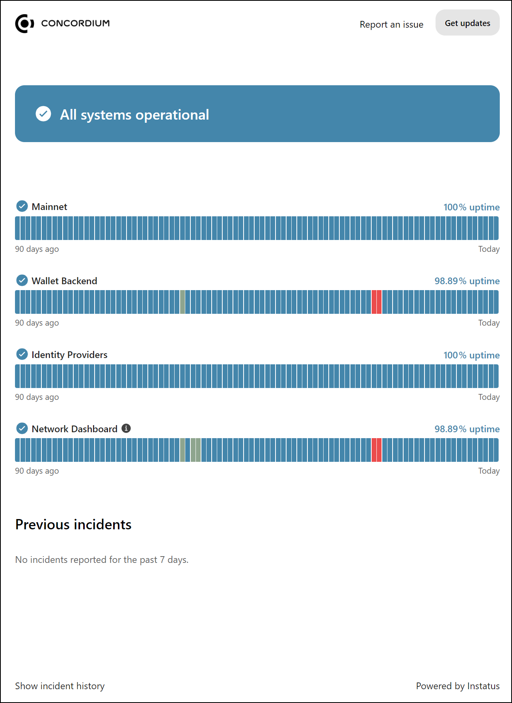
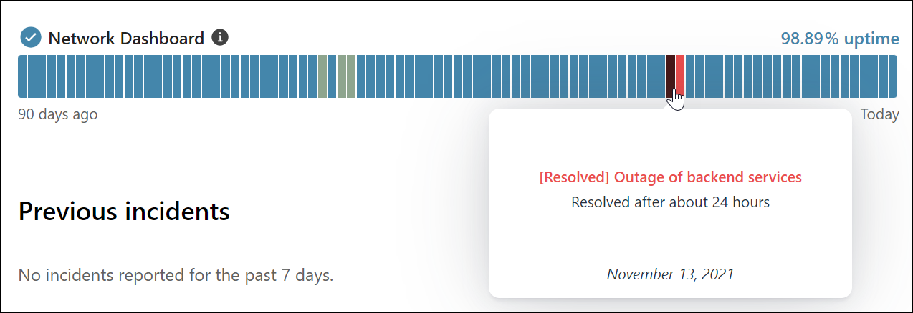
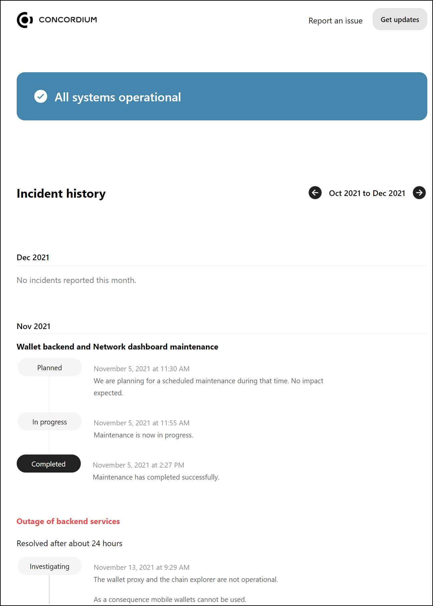

.. _dashboards:

============
Status Pages
============

The Concordium dashboards have been removed and now redirect to `CCDScan <https://ccdscan.io/>`__.

Status pages
============

Both Mainnet and Testnet have a status page. The status page shows incidents and planned outages. To open the status page, click the link for the `Mainnet status page <https://status.mainnet.concordium.software/>`_ or `Testnet status page <https://status.testnet.concordium.software/>`_.

To see information about an incident, use your pointing device to hover over a colored block.

To see more details about incidents, click **Show incident history** to see a detailed log about incidents and downtime.

To report an issue, click **Report an issue**. This copies the Concordium support email address to your clipboard so you can write an email to support.

Click **Get updates** to subscribe to updates on the status page using your preferred delivery method.
