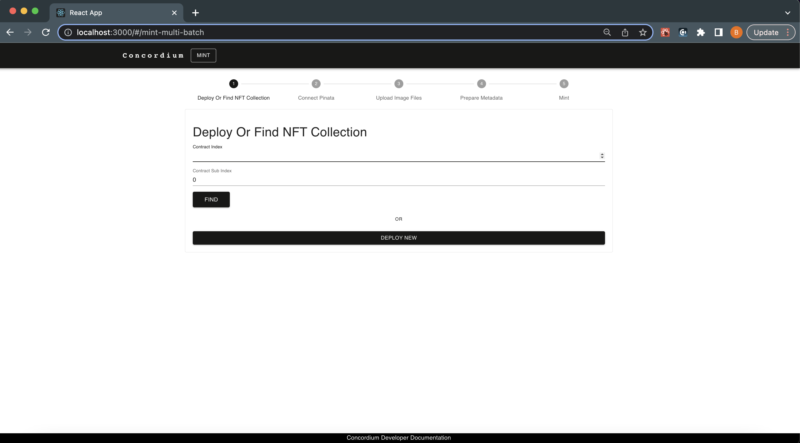

.. include:: ../../variables.rst

.. _minting-tool:

=========================
Low-code NFT minting tool
=========================

For non-developers, Concordium has developed a minting tool to mint your NFT collections without minimal development effort. With this super simple dApp you will be able to:

-  Connect with your |bw|

-  Create your own NFT Contract

-  Mint your own NFT

-  Mint you own Semi-Fungible Token

-  Mint your own NFT Collection

Install the minting tool
========================

Before starting, make sure that you have the following installed:

- |bw| - :ref:`setup instructions<setup-browser-wallet>`

- `node.js <https://nodejs.org/en/download/>`_ verion 14.17.0 or above. If you already have node.js run ``node -v`` to check the version. You can use `nvm <https://github.com/nvm-sh/nvm>`_ to manage multiple Node versions installed on a single machine.

- `Yarn <https://classic.yarnpkg.com/en/>`_ - a performance package manager for JavaScript; replaces the ``npm`` client.

- A code editor of your choice, such as Visual Studio Code.

Once you have the above installed, do the following:

#. Clone the repo and install its dependencies.

    .. code-block:: console

        git clone https://github.com/Concordium/concordium-dapp-examples/tree/main/low-code-nft-marketplace

    .. code-block:: console

        cd Low-Code-NFT-Framework/mint-ui && yarn install

    .. image:: images/minting-tool-clone-repo.png
        :width: 100%
        :alt: black screen of code editor with terminal window open at bottom

#. Now run your store web server locally with the following command.

    .. code-block:: console

        yarn start

It will start the minting screen in the example dApp in ``localhost:3000`` automatically, starting with the dashboard page.

Mint
====

Concordium provides a `library of sample images you can download <https://github.com/bogacyigitbasi/sample-images/blob/main/NFTs.zip>`_ and use to practice minting NFTs.

.. dropdown:: Mint NFTs with metadata

    In this section you will learn how to mint an NFT with metadata file from a new contract.

    When you mint an NFT, in most of the cases you will be storing a URL value that redirects people to a JSON-formatted file. That file should contain a link to the digital asset itself, its name, and description and could potentially include lots of additional attributes to suffice Concordium Interoperability Standard 2(CIS-2). You can host these files and assets anywhere but using a decentralized solution will be our approach.

    .. Note::

        CIS-2 token metadata example and details can be found in this link.

    To prepare the metadata, you should have a link to your digital asset, preferably from the Interplanetary File System (IPFS). You can check `this tutorial to learn about how you can store data on IPFS<upload-nft>` with running a node.

    When you have an IPFS link to the asset, create a JSON file in a text editor, fill it like below and save it.

    .. code-block:: JSON

        {
            "name": "YOUR NFT NAME",
            "description": "YOUR NFT DESCRIPTION",
            "display": {
                "url": "https://ipfs.io/ipfs....paste your url here"
            },
            "attributes": [
                {
                    "name": "some attribute",
                    "type": "string",
                    "value": "999"
                }
                {
                    "name": "another attribute",
                    "type": "string",
                    "value": "1"
                }
                {
                    "name": "third attribute",
                    "type": "string",
                    "value": "7.2"
                }
            ]
        }

    Now, you need to store this page on the IPFS as well; it will generate a URL that you will store on-chain.

    #. When your platform is up and running, click **DEPLOY NEW** to mint your brand-new NFTs as shown below.

        .. image:: images/minting-tool-deploy-new.png
            :width: 100%
            :alt: minting tool screen with deploy new button

    #. The wallet pops up and asks for your signature. Click **Sign & Submit**.

        .. image:: images/minting-tool-wallet-sign.png
            :width: 100%
            :alt: minting tool screen with wallet screen pop up

    #. You will see the figure below, since you are going to provide the metadata.json file, you don't need to use the connect Pinata function. Click **SKIP**.

        .. image:: images/minting-tool-skip-pinata.png
            :width: 100%
            :alt: minting tool screen with connect to pinata shown

    That will lead you to the Prepare Metadata section. Provide the ``metadata.json`` file's URL to the text box and click the "OK" button.

    Then you will be asked to specify the token ID and amount in the following screens. Your image will be fetched from IPFS or the server where you stored assets.

    Click **SET TOKEN ID**, and you will be asked for the quantity.

    In order to mint an NFT you must set this **Token Quantity** as 1 and then click the "SET QUANTITY" and "DONE" buttons.

    When every step is completed as described, the platform will show you the preview of the token and you can check even the metadata by clicking the token's display. If all is ok, click **MINT**. Your |bw| will pop up once more and ask for your approval. You can check the token details in the wallet, minting fees, etc.

    When the transaction is finalized, an alert window shows that your tokens are minted.

.. _contract-address:

    One thing to note in the figure above is "CONTRACT: 2668/0 (CIS2-MULTI)". This statement says that your tokens are minted on the contract with the address <2668,0>. A contract adderss has two parts; the index is the first number and the subindex is the second number which is always zero. This could be any contract deployed to Concordium. For example, when you create a new instance of an NFT contract, the creator account will be the owner of that contract instance. By using that address value, the owner can handle some owner-specific operations, anyone can check some accounts' balances if it's a token contract, etc. As an example, when you click **DEPLOY NEW**, you create a new contract instance that you own; and when you minted that NFT it is recorded in that smart contract instance's state on the blockchain. For every operation about that token like transfer, sell, etc. you will keep storing that changes on your contract's state. This is your contract now at that address.

.. dropdown:: Mint NFTs with Pinata

    The Concordium NFT Minting Tool has built-in integration with Pinata and IPFS that allows artists to mint their collection with a few steps.

    **NFT Metadata**

    If you have a huge collection, creating metadata might be an issue. You need to run an IPFS node or store the data in a server, use the URL in a JSON file that is compliant with CIS-2, and use the JSON to mint your token. Just the node running part might be an issue. Luckily, there are solutions like Pinata emerging every day. Pinata is a pinning solution, meaning it hosts your data and stores that in a decentralized way in multiple locations. It produces the URL that needs to be put in the metadata file.

    .. Note::

        Pinata is a commercial, pinning solution that pins your data stored on IPFS. You can find more info about it `in this link <https://app.pinata.cloud/>`_.

    When you upload data on IPFS, the most important thing that you need to be careful about is making sure that data is stored/hosted on at least one device; this is achievable by running a node all the time somewhere. But that may not be an option for everybody who wants to mint NFTs for various reasons like cost, time, and some technical skills. At that moment, Pinata solves that issue;  they run a node on your behalf and give you an API key. You can access your IPFS node via that API key through their gateway.

    Since IPFS and Pinata are widely used in the space, the Concordium NFT Minting Tool has built-in integration with them. To use this functionality create an API key on the platform and copy it.

    .. image:: images/pinata.png
        :width: 100%
        :alt: pinata screen shown

    **NFT minting**

    Now you will create a brand new contract instance for your NFT collection.

    #. Click **MINT** in the top navigation bar of your marketplace.

    #. In the Connect Pinata screen paste your API key and click **CONNECT**.

        .. image:: images/connect-pinata.png
            :width: 100%
            :alt: nft marketplace connection screen after clicking mint

    #. Once connected, upload images either by selecting them from a folder or just dragging and dropping them. You are not limited to uploading 1-2 images, and thanks to the template, the metadata generator is easier than creating for one metadata file for every item.

        .. image:: images/upload-images.png
            :width: 100%
            :alt: screen showing multiple image selection

     **Mint NFT collection**

    #. Set your token IDs and click **Upload** for each.

        .. image:: images/upload-set-token-id.png
            :width: 100%
            :alt: images uploaded and need id before creation

        The template's backend will use your API key to upload the data, and retrieves the IPFS link of it and then you will just complete the details about your tokens as described in the next step.

        .. image:: images/fetch-pinata-metadata.png
            :width: 100%
            :alt: images after data fetched

    #. Add data to them and the marketplace will create metadata for you when you click **CREATE** for each of the tokens. Specify the quantity as **1** and click **DONE**.

        .. image:: images/edit-metadata-create.png
            :width: 50%
            :alt: editing metadata and create option for each image

        .. image:: images/metadata-nearly-complete.png
            :width: 100%
            :alt: editing metadata

    #. Click **MINT**. Your |bw| prompts you to click **Sign and Submit** to approve the transaction and mint your NFTs.

        .. image:: images/mint-w-wallet-popup.png
            :width: 100%
            :alt: mint option shown in background dimmed with wallet popup visible

.. dropdown:: Mint NFTs from an existing contracts

    In this section you will learn how to mint an NFT with metadata file from an existing contract instance. If you completed the first section, you should already know what an :ref:`contract instance address<contract-address>` is. This contract instance address value of your NFT contract which is created by your account addresses where or in which smart contract instance your NFTs are located, for example, contract instance address:<2722,0>. There are certain operations encoded in the smart contracts that, for example, only an owner can transfer a token or only the contract owner can invoke the mint function, etc.

    **Exampæle**

    Assume that you are an artist and have a collection of two pieces. You deployed your contract at address:<2020,0> and minted these tokens with IDs 01 and 02. What if you want to add new pieces? If you create a new instance, you will get a new contract instance address (always remember because it's a new one), but then how can you tell people these new pieces belong to the same collection? Or, say you are having a party and minted 100 tokens as tickets, and your party is excellent so there are more people who want to come. What do you want to do? Correct, you want to mint new tokens for the same party.

    **Mint tokens**

    Minting is the same as the previous sections: you need to specify your contract instance address as shown below and click **FIND**.

    .. image:: images/mint-from-contract-index.png
        :width: 100%
        :alt: prepare to mint tokens from an existing contract by entering contract address

    It will check if the contract has some unique CIS-2 methods, like the ``supports()`` function which means the contract is compliant with CIS-2. Basically, you are checking whether the contract is a token contract or not. If you are the owner, you will be able to mint your new tokens exactly :ref:`as in the previous sections<mint-w-metadata>`. If you are not the owner of the contract, then you will end up with the error shown below.

    .. image:: images/mint-error.png
        :width: 100%
        :alt: error shown if you are not the owner of the contract you are executing
