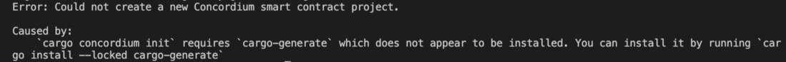
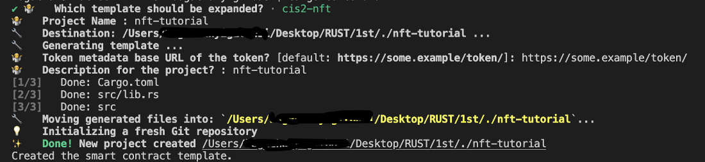
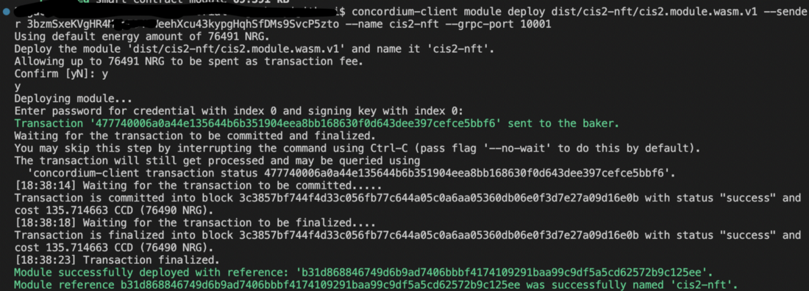
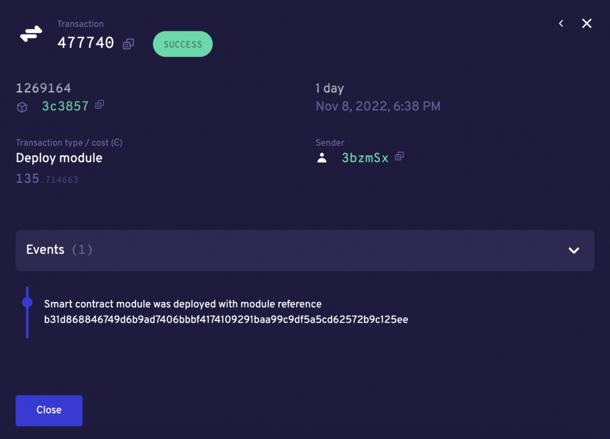
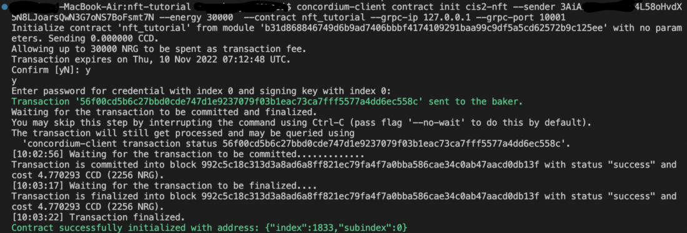
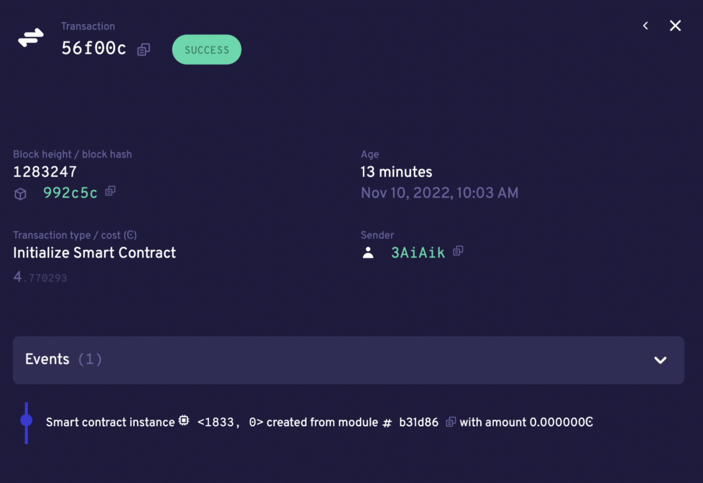

.. include:: ../../variables.rst
.. _build-smart-contract:

================================================
Initialize, build, and deploy the smart contract
================================================

Now you are ready to build your smart contract. You'll be using the ``cis2-nft`` contract template provided by Concordium.

Initialize Cis2-NFT contract template
=====================================

You will use ``cargo-concordium`` that you installed in the first part to initialize the template.

First, you need to install the ``cargo-generate`` tool and then initialize the folder. By default, it’ll create a cis2-nft contract template.

.. code-block:: console

    cargo install --locked cargo-generate

.. code-block:: console

    cargo concordium init

If you try the init command before installing cargo-generate you will get an error similar to the one below. And you may need to update your ``rustc`` version before installing ``cargo-generate``. To do this, use ``rustup update``.

If everything is correct, the ``init`` command will show something like the following. You will have a cargo project with the project name and cis2-nft contract in it.

Build your smart contract
=========================

Now you are ready to build your contract. First, open up your ``lib.rs`` file under ``/src``. You need to specify the ``TOKEN_METADATA_BASE_URL`` parameter in the contract. Since this is an NFT, you store a URL to its metadata on chain. Add your IPFS link like below.

.. code-block:: rust

    /// The baseurl for the token metadata, gets appended with the token ID as hex
    /// encoding before emitted in the TokenMetadata event.
    pub const TOKEN_METADATA_BASE_URL: &str = "<YOUR IPFS METADATA URL HERE>";

Now, create a ``dist/cis2-nft`` folder to keep your compiled WASM module file and then build it with the following command.

.. code-block:: console

    cargo concordium build --out dist/cis2-nft/cis2.module.wasm.v1

.. _deploy-nft-sc:

Deploy your smart contract
==========================

To deploy your smart contract you will use the ``concordium client`` command line tool. You can read more about this tool in :ref:`this article<concordium-client>`.

Before deploying your smart contract, make sure that you have imported your wallet. When you export it from your wallet run the command below in the same directory where your wallet export is.

For the |bw|, use the following command:

.. code-block:: console

    concordium-client config account import <Wallet.export> --name <Your-Wallet-Name>.json

In order to deploy you need to specify the compiled module file name and the other arguments which will be passed from the terminal. Once you run the command below, it will ask for confirmation. Type **y**. You will be asked to input a password.

To deploy run the command below:

.. code-block:: console

    concordium-client module deploy dist/cis2-nft/cis2.module.wasm.v1 --sender <YOUR-ADDRESS> --name <YOUR-MODULE-NAME> --grpc-port 20001

If the command is successful, you will see something similar to below.

You can also verify it either by looking at `CCDScan <https://testnet.ccdscan.io/>`__ or the `testnet dashboard lookup section <https://dashboard.testnet.concordium.com/>`_.

Initializing the smart contract
===============================

After deploying a contract you have to initialize it. It’s like object-oriented programming: you create a class which is a module, and then you initialize it to create an object. It is the same here. An object of a class is a way to store both states of the class and its functionality. In order to initialize an instance of the contract you need the module name and contract, then run the following command.

.. code-block:: console

    concordium-client contract init <YOUR-MODULE-NAME> --sender <YOUR-ADDRESS> --energy 30000  --contract <CONTRACT-NAME> --grpc-ip 127.0.0.1 --grpc-port 20001

If successful, you will see something similar to the below.

You need the index value that is the address of this instance, which in the example shown is 1833. You can check it in CCDScan.

You can even name the contract instance with following command for easy usage.

.. code-block:: console

    concordium-client contract name <YOUR-INDEX> --name <YOUR-INSTANCE-NAME>

Continue to the :ref:`final part<mint-transfer>` of the tutorial to mint and transfer your NFT.
