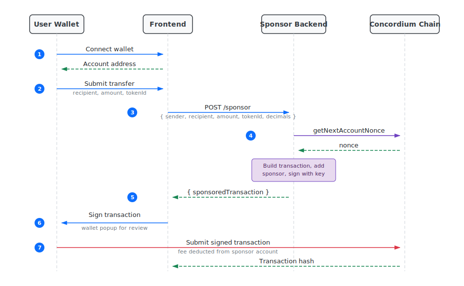

.. include:: ../../variables.rst
.. _protocol-level-sponsored-transactions:

======================
Sponsored transactions
======================

Sponsored transactions allow users to interact with the Concordium blockchain without paying :ref:`transaction fees<transaction-fees>` themselves. Instead, a sponsor wallet covers the fee on behalf of the user.

This tutorial walks through a frontend/backend architecture for sponsored transactions, focusing on clarity so you can adapt it to your own project. The tutorial has two parts:

1. :ref:`Set up a sponsor service <set-up-a-sponsor-service>` - A secure backend service that holds the sponsor wallet's private key, creates transactions, and signs them on behalf of the sponsor.
2. :ref:`Create a sponsored transaction <create-a-sponsored-transaction>` - A frontend implementation that requests sponsorship from the backend API and submits the transaction through the user's wallet.

.. note::

   A full working example of a dApp using sponsored transactions is available on `GitHub <https://github.com/Concordium/concordium-dapp-examples/tree/main/DevnetSponsoredTx>`_.

.. note::

   For production use, keeping the sponsor private key on a secure backend is essential. The examples use ``@concordium/web-sdk`` version 12.0.0. See the `Transaction.sponsor function documentation <https://docs.concordium.com/concordium-node-sdk-js/12.0.0/functions/transactions.Transaction.sponsor.html>`_ for details.

Prerequisites
=============

Before starting this tutorial, you should have:

- Node.js and npm installed
- A Concordium wallet with CCD funds for the sponsor account
- Access to a Concordium node (gRPC endpoint)
- ``@concordium/web-sdk`` version 12.0.0 or later

How sponsored transactions work
================================

In a standard transaction, the sender pays the transaction fee. With sponsored transactions:

1. The user connects their wallet and initiates an action (e.g. a token transfer or a checkout).
2. The frontend sends the transfer details to the backend, which builds the full transaction, adds the nonce and expiry, and signs it with the sponsor key.
3. The user reviews and signs the transaction in their wallet to authorize the transfer.
4. The sponsor's account pays the transaction fee when the transaction is submitted to the chain.

This is useful for onboarding new users who may not have CCD to pay for fees, or for dApps that want to provide a frictionless experience.

The following diagram shows the full flow between the user's wallet, frontend, sponsor backend, and the chain:

.. toctree::
   :hidden:
   :maxdepth: 1

   Set up a sponsor service <./set-up-a-sponsor-service.rst>
   Create a sponsored transaction <./create-a-sponsored-transaction.rst>
