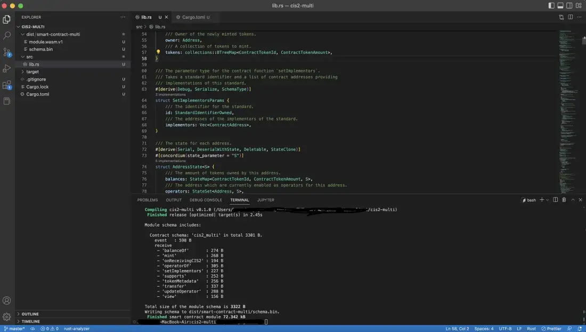
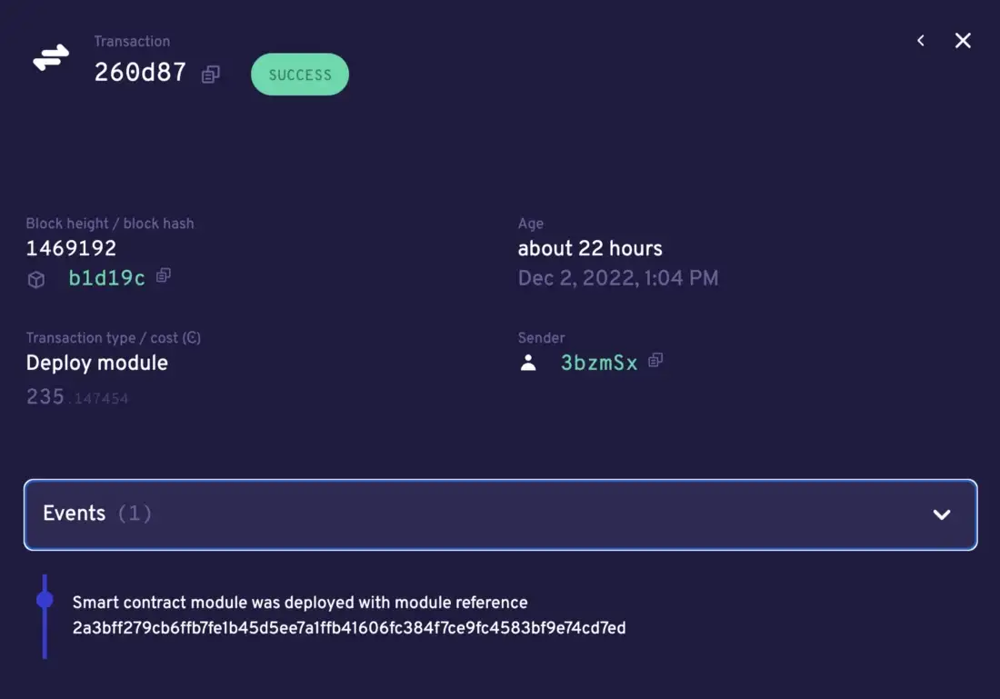
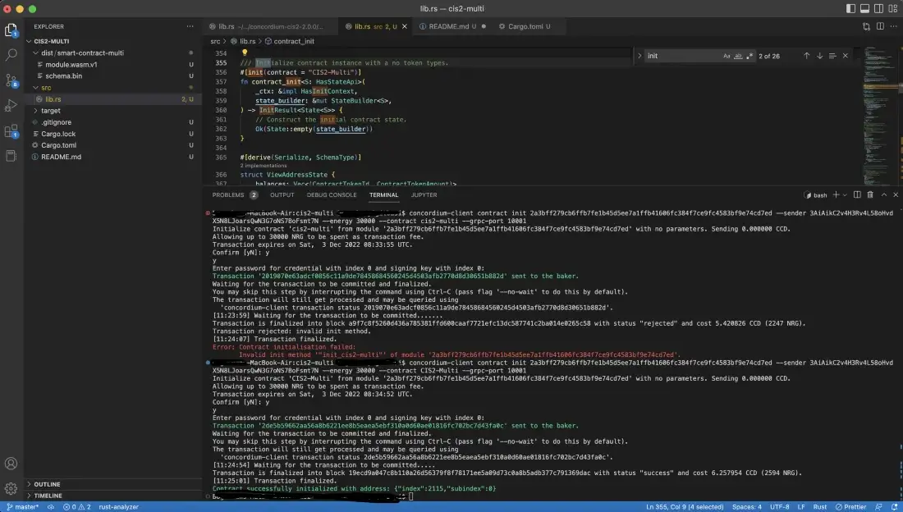

.. _build-sft-sc:

============================
Smart contract modifications
============================

In this tutorial, you will use the example ``cis2-multi`` contract template from Concordium, which can be found `here <https://github.com/Concordium/concordium-rust-smart-contracts/tree/main/examples/cis2-multi>`_ for further reading. In this tutorial you will add a couple of things and update some functions to give more flexibility to the template.

First, you will add a new struct called ``TokenMetadata``. It needs to implement the ``Serialize`` and ``SchemaType`` traits. For those who are familiar with the Ethereum ecosystem, it's similar to the ABI.

Two functions of this struct are implemented to get the provided ``metadata_url`` and ``hash`` values. See the ``to_metadata_url()`` function, which returns MetadataUrl struct which is the part of the CIS-2 standard of the metadata and an optional hash of the content and you need this while minting.

.. code-block:: rust

    #[derive(Debug, Serialize, Clone, SchemaType)]
    pub struct TokenMetadata {
        /// The URL following the specification RFC1738.
        #[concordium(size_length = 2)]
        pub url: String,
        /// A optional hash of the content.
        #[concordium(size_length = 2)]
        pub hash: String,
    }

    impl TokenMetadata {
        fn get_hash_bytes(&self) -> Option<[u8; 32]> {
            let mut hash_bytes: [u8; 32] = Default::default();
            let hex_res = hex::decode_to_slice(self.hash.to_owned(), &mut hash_bytes);

            match hex_res {
                Ok(_) => Some(hash_bytes),
                Err(_) => Option::None,
            }
        }

        fn to_metadata_url(&self) -> MetadataUrl {
            let mut hash_bytes: [u8; 32] = Default::default();
            hex::decode_to_slice(self.hash.to_string(), &mut hash_bytes).unwrap();
            MetadataUrl {
                url: self.url.to_string(),
                hash: self.get_hash_bytes(),
            }
        }
    }

When you have the ``TokenMetadata`` add one more line to the minting params struct. When you invoke the mint (contract_mint) function with the parameters it basically parses the input params and creates the struct below. Add ``TokenMetadata`` to your tokens collection. Now it has a ``ContractTokenId``, ``TokenMetadata``, and ``ContractTokenAmount``.

.. code-block:: rust

    /// The parameter for the contract function `mint` which mints a number of
    /// token types and/or amounts of tokens to a given address.
    #[derive(Serial, Deserial, SchemaType)]
    struct MintParams {
        /// Owner of the newly minted tokens.
        owner: Address,
        /// A collection of tokens to mint.
        tokens: collections::BTreeMap<ContractTokenId, (TokenMetadata, ContractTokenAmount)>,
    }

Always remember, a blockchain itself is a state-keeping machine. If you send a transaction, you change the state. If you mint an NFT or transfer it, the state is changed again. Basically, if you make any change to the data structure, you change the state. So what is this state? Look at the code snippet below.

.. code-block:: rust

    /// The contract state,
    ///
    /// Note: The specification does not specify how to structure the contract state
    /// and this could be structured in a more space efficient way.
    #[derive(Serial, DeserialWithState)]
    #[concordium(state_parameter = "S")]
    struct State<S = StateApi> {
        /// The state of addresses.
        state: StateMap<Address, AddressState<S>, S>,
        /// All of the token IDs
        tokens: StateMap<ContractTokenId, MetadataUrl, S>,
        /// Map with contract addresses providing implementations of additional
        /// standards.
        implementors: StateMap<StandardIdentifierOwned, Vec<ContractAddress>, S>,
    }

The ``State`` struct above keeps the general state of the contract, which means for this use case it should track all the tokens and subsequent states of those tokens: who owns what, what amount, holder history, etc. The struct uses ``MetadataUrl`` for tokens to keep not only IDs but also hash and URL. The ``MetadataUrl`` is a CIS-2 implemented struct that keeps these values. Now, you have to change some statements that either initiate or insert this data type.

.. code-block:: rust

    /// Construct a state with no tokens
        fn empty(state_builder: &mut StateBuilder) -> Self {
            State {
                state: state_builder.new_map(),
                tokens: state_builder.new_map(),
                implementors: state_builder.new_map(),
            }
        }

The ``empty()`` function of the ``State`` initializes an empty ``State`` instance. This is important for your contracts because every time you call the ``init()`` function you should create a clear, empty ``State``.

The other minor update is to the ``mint()`` function of the ``State``. Since you are going to give the metadata parameters as input to your minting function it should accept ``token_metadata: &TokenMetadata``.

.. code-block:: rust

    /// Mints an amount of tokens with a given address as the owner.
    fn mint(
        &mut self,
        token_id: &ContractTokenId,
        token_metadata: &TokenMetadata,
        amount: ContractTokenAmount,
        owner: &Address,
        state_builder: &mut StateBuilder,
    ) {
        self.tokens
            .insert(*token_id, token_metadata.to_metadata_url());
        let mut owner_state = self
            .state
            .entry(*owner)
            .or_insert_with(|| AddressState::empty(state_builder));
        let mut owner_balance = owner_state.balances.entry(*token_id).or_insert(0.into());
        *owner_balance += amount;
    }

The next update will be on the ``mint()`` function of the contract. You need to pass the correct values, which are given by the user in a form of JSON object(MintParams) to the ``State``’s mint function and you should call the ``to_metadata_url`` while emitting the event in logger. One final addition to the contract’s ``mint()``function is ensuring that the ``token_id`` is unique.

.. code-block:: rust

    /// Mint new tokens with a given address as the owner of these tokens.
    /// Can only be called by the contract owner.
    /// Logs a `Mint` and a `TokenMetadata` event for each token.
    /// The url for the token metadata is the token ID encoded in hex, appended on
    /// the `TOKEN_METADATA_BASE_URL`.
    ///
    /// It rejects if:
    /// - The sender is not the contract instance owner.
    /// - Fails to parse parameter.
    /// - Any of the tokens fails to be minted, which could be if:
    ///     - Fails to log Mint event.
    ///     - Fails to log TokenMetadata event.
    ///
    /// Note: Can at most mint 32 token types in one call due to the limit on the
    /// number of logs a smart contract can produce on each function call.
    #[receive(
        contract = "CIS2-Multi",
        name = "mint",
        parameter = "MintParams",
        error = "ContractError",
        enable_logger,
        mutable
    )]
    fn contract_mint(
        ctx: &ReceiveContext,
        host: &mut Host<State>,
        logger: &mut Logger,
    ) -> ContractResult<()> {
        // Get the contract owner
        let owner = ctx.owner();
        // Get the sender of the transaction
        let sender = ctx.sender();

        ensure!(sender.matches_account(&owner), ContractError::Unauthorized);

        // Parse the parameter.
        let params: MintParams = ctx.parameter_cursor().get()?;

        let (state, builder) = host.state_and_builder();
        for (token_id, token_info) in params.tokens {
        ensure!(
                state.contains_token(&token_id),
                ContractError::Custom(CustomContractError::TokenAlreadyMinted)
            );
            // Mint the token in the state.
            state.mint(
                &token_id,
                &token_info.0,
                token_info.1,
                &params.owner,
                builder,
            );

            // Event for minted token.
            logger.log(&Cis2Event::Mint(MintEvent {
                token_id,
                amount: token_info.1,
                owner: params.owner,
            }))?;

            // Metadata URL for the token.
            logger.log(&Cis2Event::TokenMetadata::<_, ContractTokenAmount>(
                TokenMetadataEvent {
                    token_id,
                    metadata_url: token_info.0.to_metadata_url(),
                },
            ))?;
        }
        Ok(())
    }

Add one final change to the ``tokenMetadata()`` function. As you can see in :ref:`this previous tutorial<nft-view-fn>`, this function combines the ``url`` value and ``token_id`` and returns it. Instead, you are going to read the ``url`` from the ``state`` with ``token_id`` and return it.

.. code-block:: rust

    /// Get the token metadata URLs and checksums given a list of token IDs.
    ///
    /// It rejects if:
    /// - It fails to parse the parameter.
    /// - Any of the queried `token_id` does not exist.
    #[receive(
        contract = "cis-2",
        name = "tokenMetadata",
        parameter = "ContractTokenMetadataQueryParams",
        return_value = "TokenMetadataQueryResponse",
        error = "ContractError"
    )]

    fn contract_token_metadata(
        ctx: &ReceiveContext,
        host: &Host<State>,
    ) -> ContractResult<TokenMetadataQueryResponse> {
        // Parse the parameter.
        let params: ContractTokenMetadataQueryParams = ctx.parameter_cursor().get()?;
        // Build the response.
        let mut response = Vec::with_capacity(params.queries.len());

        for token_id in params.queries {
            // Check the token exists.
            ensure!(
                host.state().contains_token(&token_id),
                ContractError::InvalidTokenId
            );
            let token_url = &host.state().tokens.get(&token_id).unwrap().url[..];
            // let token_hash = host.state().tokens.get(&token_id).unwrap().hash.unwrap();

            let metadata_url = MetadataUrl {
                url: token_url.to_string(),
                hash: None,
            };
            response.push(metadata_url);
        }
        let result = TokenMetadataQueryResponse::from(response);
        Ok(result)
    }

Build the contract module
=========================

Make sure you are working in the correct directory, and create a ``dist`` folder for your files: schema and smart contract compiled into Wasm. One small reminder here, remember CIS-2 is a standard that allows you to mint fungible, non-fungible and semi-fungible tokens. Concordium’s token standard is applicable to all types of tokens. Once you have created the folder, run the following command.

.. code-block:: console

    cargo concordium build --out dist/smart-contract-multi/module.wasm.v1 --schema-out dist/smart-contract-multi/schema.bin

Deploy the smart contract
=========================

Now, deploy your contract with the following command.

.. code-block:: console

    concordium-client module deploy dist/smart-contract-multi/module.wasm.v1 --sender <YOUR-ADDRESS> --name cis2_mult --grpc-port 20001

You will need the module hash value when creating an instance so keep that. You can check your deployment status either from Concordium’s block explorer, CCDScan, or on your terminal’s output.

Initialize the smart contract
=============================

Maybe you're wondering why you need to create an instance of the contract. When you create a new instance of a new contract, as mentioned earlier, you simply create a new one with a refreshed state. The account that creates the instance is the owner. There might be cases when you want to call some functions with only the owner of the contract, and some publicly open for everyone.

Run the following command to initialize your smart contract.

.. code-block:: console

    concordium-client contract init <YOUR-MODULE-HASH> --sender <YOUR-ADDRESS> --energy 30000 --contract <YOUR-CONTRACT-NAME> --grpc-port 20001

Here you can see the successfully initialized contract instance with index 2115.

