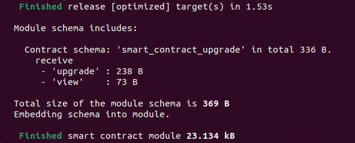
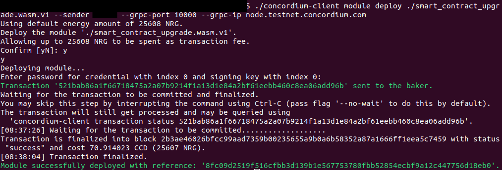
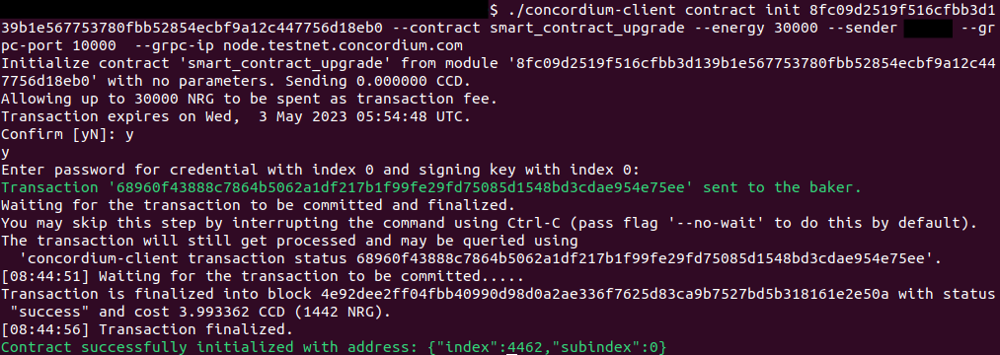
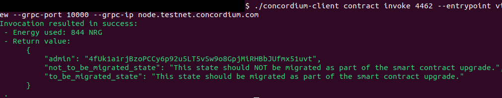
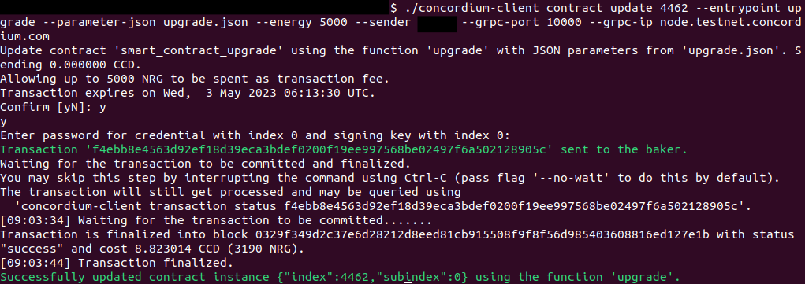
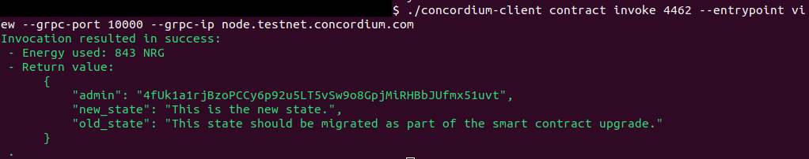
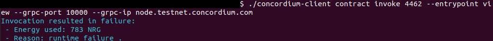

.. include:: ../../variables.rst
.. _smart-contract-upgrade:

====================
Native upgradability
====================

The goal of this tutorial is to deploy a ``contract-version1``, upgrade its logic, and migrate its state to ``contract-version2``.

The `contract-version1 <https://github.com/Concordium/concordium-rust-smart-contracts/tree/main/examples/smart-contract-upgrade/contract-version1>`_
includes an ``upgrade`` function and the `contract-version2 <https://github.com/Concordium/concordium-rust-smart-contracts/tree/main/examples/smart-contract-upgrade/contract-version2>`_
includes a ``migration`` function. These functions are explored in the next two sections.

The ``migration`` function
==========================

When deploying ``contract-version1``, you might not know the exact logic of the ``contract-version2`` yet.
``Contract-version2`` might be a smart contract that fixes a security bug in your smart contract code which will be discovered at some point in the future.
For that reason, it is good to have the option to call a ``migration`` function in ``contract-version2`` when executing the upgrade mechanism in ``contract-version1``.
This allows you to add additional execution logic when upgrading the smart contract.

A ``migration`` function could have a variety of different purposes such as:

- Log some events.
- Change values in the state.
- Change the shape of the smart contract state.

.. note::

   There is no universal ``migration`` function and it is not necessary for all upgrades to call a ``migration`` function.
   In the example smart contract, a ``migration`` function is provided that should be suitable for most use cases.
   In more detail, the example ``migration`` function
   focuses on how to change the shape of your smart contract state since this bullet point from above is non-trivial.

``Contract-version1`` allows you to call a ``migration`` function as part of the upgrade.
The ``migration`` function in ``contract-version2`` changes the shape of the state from ``contract-version1`` to ``contract-version2``.

The ``upgrade`` function
========================

A native smart contract upgrade can be triggered on the ``host`` as seen in the code snippet below:

.. code-block:: rust

   #[receive(
      ...
      low_level
   )]
   fn contract_name(
      ...
      host: &mut LowLevelHost,
      ...
   )  ... {
      ...
      let result = host.upgrade(moduleReference);
      ...
   }

The ``upgrade`` functions in the example smart contracts are marked as ``low_level``. This is *necessary* since the default (*high_level*) mutable functions store the state of the contract at the end of
execution. This conflicts with migration since the shape of the state *might* be changed by the ``migration`` function. If the state is then written
by the default (*high_level*) ``upgrade`` function, it would overwrite the state stored by the ``migration`` function.

Greater control is given to the smart contract developer when using ``low_level`` functions (e.g., additional state manipulation
capabilities are exposed which are unavailable when using *high_level* functions). These additional state manipulation features are necessary to change the
shape of the state during the ``migration`` but they bear the risk that the state becomes corrupted if the ``migration`` function has some coding bugs.
Make sure you test your upgrade thoroughly (with integration tests as well as manual tests on testnet)
and ensure your state is migrated as intended before doing
the same smart contract upgrade on mainnet.

.. note::

   To write smart contract code safely and to avoid accidentally corrupting your state,
   you shouldn't use ``low-level`` functions unless strictly necessary (e.g., for ``upgrade``/``migration`` functions).
   Smart contract functions are by default
   *high_level* (no need to add this attribute explicitly).

.. note::

   You can also write a very simple upgrade mechanism using a *high_level* function with no ``migration`` function at all. This upgrade
   mechanism requires that the shape of the smart contract state is the same in ``contract-version1`` and ``contract-version2``.
   This means, the ``State`` struct in ``contract-version1`` and ``contract-version2`` has to be identical.

   .. code-block:: rust

      #[receive(
         contract = "contract_name",
         name = "upgrade",
         error = "ContractError",
         mutable
      )]
      fn contract_upgrade(
         _ctx: &ReceiveContext,
         host: &mut Host<State>,
      ) -> ContractResult<()> {
         // TODO: Include some authorization checks.

         // Trigger the upgrade.
         host.upgrade(params.module)?;

         // No `migration` function.

         Ok(())
      }

The ``upgrade`` function in ``contract-version1`` can be invoked with the following JSON file (input parameter):

.. code-block:: json

   {
      "migrate": {
         "Some": [
            [
            "<EntryPointNameOfMigrationFunction>",
            "<InputParametersOfMigrationFunction>"
            ]
         ]
      },
      "module": "<ModuleReferenceContractVersion2>"
   }

The section :ref:`executing an upgrade<input_parameters>` will give examples of how to set the input parameter for the ``upgrade`` function.

.. note::

   If the module reference should be upgraded without invoking a ``migration`` function, use the JSON file (input parameter) below instead:

   .. code-block:: json

      {
         "migrate": {
            "None": [
            ]
         },
         "module": "<ModuleReferenceContractVersion2>"
      }

.. warning::

   Since more responsibility is given to the smart contract developer, smart contract ``upgrade``/``migration`` functions
   should be coded and executed by experts that know about the underlying risks. You are about to become such an expert.

You now have the required knowledge to execute the upgrade mechanism on testnet in the next section.

Executing an upgrade
====================

Clone the `smart contract upgrade example <https://github.com/Concordium/concordium-rust-smart-contracts/tree/main/examples/smart-contract-upgrade>`_.

.. code-block:: console

    $git clone --recurse-submodules git@github.com:Concordium/concordium-rust-smart-contracts.git

Navigate to the ``contract-version1`` example folder:

.. code-block:: console

    $cd ./examples/smart-contract-upgrade/contract-version1

Compile the smart contract to a Wasm module which you will deploy to testnet in the next step.

.. code-block:: console

    $cargo concordium build --out smart_contract_upgrade.wasm.v1

.. note::

   Comprehensive instructions on how to download and set up ``cargo-concordium`` can be found in :ref:`Setup the development environment<setup-env>`.

This command will create the ``smart_contract_upgrade.wasm.v1`` file in your current folder. Deploy the smart contract module to testnet with the command:

.. code-block:: console

    $concordium-client module deploy ./smart_contract_upgrade.wasm.v1 --sender <YourAccountAddress> --grpc-port 20000 --grpc-ip grpc.testnet.concordium.com --secure

.. note::

   Comprehensive instructions on how to download and set up ``concordium-client`` and how to import an account that you can use
   for the placeholder ``YourAccountAddress`` above can be found in :ref:`Setup the development environment<setup-env>`.

Since other users will read this tutorial, you will likely get an error that the module above is already deployed.
If the module is already deployed or not deployed, it does not make a
difference because in both cases the console output will print the ``moduleReference`` that you need for the next step.

Initialize a ``contract-version1`` smart contract instance with the command:

.. code-block:: console

   $concordium-client contract init <ModuleReference> --contract smart_contract_upgrade --energy 30000 --sender <YourAccountAddress> --grpc-port 20000  --grpc-ip grpc.testnet.concordium.com --secure

For example, when using the module reference from the image above, the command will look as follows:

.. code-block:: console

   $concordium-client contract init 8fc09d2519f516cfbb3d139b1e567753780fbb52854ecbf9a12c447756d18eb0 --contract smart_contract_upgrade --energy 30000 --sender <YourAccountAddress> --grpc-port 20000  --grpc-ip grpc.testnet.concordium.com --secure

As seen in the image above, this command returns your smart contract index ``4462``.

Before upgrading the ``contract-version1``, you can check its state with the view function as follows:

.. code-block:: console

   $concordium-client contract invoke <YourContractVersion1Index> --entrypoint view --grpc-port 20000 --grpc-ip grpc.testnet.concordium.com --secure

For example, when using the smart contract index from the image above, the command will look as follows:

.. code-block:: console

   $concordium-client contract invoke 4462 --entrypoint view --grpc-port 20000 --grpc-ip grpc.testnet.concordium.com --secure

You should see the following output.

You need to compile and deploy ``contract-version2`` before you can upgrade your smart contract instance ``contract-version1``.

Navigate to the ``contract-version2`` example folder:

.. code-block:: console

    $cd ./examples/smart-contract-upgrade/contract-version2

Compile the smart contract to a Wasm module which you will deploy to testnet in the next step.

.. code-block:: console

    $cargo concordium build --out smart_contract_upgrade.wasm.v1

.. image:: ./images/compile_contract_version2.png
   :alt: Compile contract version 2
   :align: center

This command will create the ``smart_contract_upgrade.wasm.v1`` file in your current folder. Deploy the smart contract module to testnet with the command:

.. code-block:: console

    $concordium-client module deploy ./smart_contract_upgrade.wasm.v1 --sender <YourAccountAddress> --grpc-port 20000 --grpc-ip grpc.testnet.concordium.com --secure

.. image:: ./images/deploy_contract_version2.png
   :alt: Deploy contract version 2
   :align: center

The ``moduleReference`` returned when deploying ``contract-version2`` is different from the ``moduleReference`` when deploying ``contract-version1``.
This shows that the module's code is not identical.

Create a file named ``upgrade.json`` with the following content by inserting the ``moduleReference`` returned by the previous step:

.. _input_parameters:

.. code-block:: json

   {
      "migrate": {
         "Some": [
            [
            "migration",
            ""
            ]
         ]
      },
      "module": "<ModuleReferenceContractVersion2>"
   }

For example, when using the module reference from the image above, the file will look as follows:

.. code-block:: json

   {
      "migrate": {
         "Some": [
            [
            "migration",
            ""
            ]
         ]
      },
      "module": "31539c983f2ee56822041230d7fd20a3516da9271837e23bb77111bb8c4c7dcd"
   }

When invoking the ``upgrade`` function with the file above, it specifies that the smart contract
code should be upgraded to the module ``31539c983f2ee56822041230d7fd20a3516da9271837e23bb77111bb8c4c7dcd``
and the ``migration`` function should be invoked
with no input parameters (empty string: ``""``) as part of the upgrade.

Upgrade the smart contract as follows:

.. code-block:: console

   $concordium-client contract update <YourContractVersion1Index> --entrypoint upgrade --parameter-json upgrade.json --energy 5000 --sender <YourAccountAddress> --grpc-port 20000 --grpc-ip grpc.testnet.concordium.com --secure

For example, when using the smart contract index from the image above, the command will look as follows:

.. code-block:: console

   $concordium-client contract update 4462 --entrypoint upgrade --parameter-json upgrade.json --energy 5000 --sender <YourAccountAddress> --grpc-port 20000 --grpc-ip grpc.testnet.concordium.com --secure

You should see the following output.

You can check that the state migration was successful by inspecting the state with the view function:

.. code-block:: console

   $concordium-client contract invoke <YourContractVersion1Index> --entrypoint view --grpc-port 20000 --grpc-ip grpc.testnet.concordium.com --secure

If the migration function had a bug and changed the shape of the state incorrectly, your state might be corrupted. You might see different output errors in case of a corrupted state. One example is shown below:

