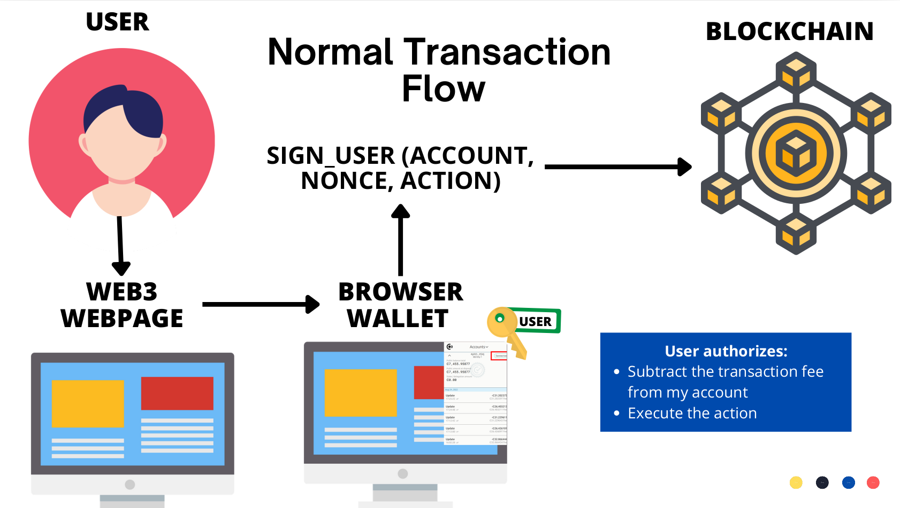
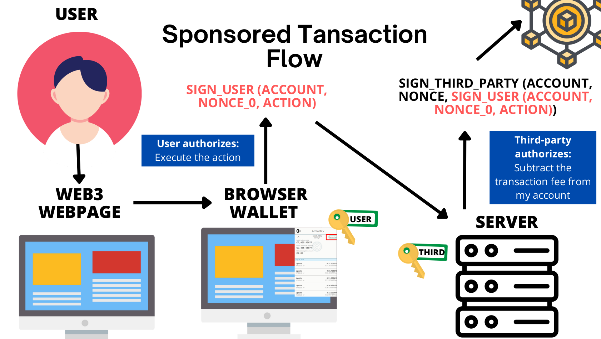

.. include:: ../../variables.rst
.. _sponsoredTransactions:

.. image:: sponsoredTransactions.png
   :width: 40%
   :align: center
   :alt: An eSealing dApp

=============================
A Sponsored Transactions dApp
=============================

In this tutorial, you are going to get familiar with how to implement a sponsored transaction mechanism in a smart contract,
how to sign messages in a wallet and verify the signature in the smart contract and
how to send a transaction from a backend server to the blockchain.

The dApp consists of three components that you will explore as part of this tutorial:

- A `smart contract` that verifies signatures.

- A `frontend` that requests the user (sponsoree) to sign messages.

- A `backend` that has access to a wallet (sponsor) and sends transactions to the blockchain.

What are sponsored transactions?
================================

Sponsored transactions are a mechanism for a sponsor address (third-party) to submit a transaction
to a smart contract on behalf of a sponsoree account (user/client). The user/client
should sign its intended action in the |bw| (or |mw-gen2| that uses WalletConnect) to authorize the third-party to execute a specific action on its behalf.
After the user/client signed its action, the signature is communicated to the third-party. The third-party account (invoker to the smart contract)
pays for the transaction fees and submits the transaction on-chain. The signature is verified in the smart
contract to ensure the action was authorized by the user/client.

What are the use cases of sponsored transactions?
=================================================

Sponsored transactions are a useful tool for third-party service providers to onboard conventional clients/users that
don't want to acquire crypto (such as CCD) from an exchange.
The third-party can have a traditional fiat channel open (off-chain) with the conventional clients/users to charge for its service of
offering to submit transactions on behalf of the user on-chain.The third-party
service provider has its own wallet funded with some CCD at the backend to submit the user's transaction on-chain.
The third-party pays the transaction fee to execute the transaction on-chain.

What is the difference between a normal transaction vs. a sponsored transaction?
================================================================================

A normal transaction sent to a smart contract is signed by the user's wallet and authorizes the blockchain to subtract the transaction fee from the user's wallet as well as to execute a specific action. For example, the action could be to transfer some tokens from the user's address to another address.

The user creates a normal transaction by signing its ``account`` address, its ``nonce``, and the ``action``. The ``nonce`` increases sequentially every time the user sends a transaction to the blockchain to prevent replay attacks. The `nonce <https://en.wikipedia.org/wiki/Cryptographic_nonce>`_ is of type u64 (8 bytes) and by design >= 1.

A sponsored transaction decouples the transaction fee authorization (third-party wallet) from the action authorization (user's wallet).
The user signs a message (in that case the prepend is ``account`` address and 8 zero bytes) to authorize the ``action``. Hence, the 8 zero bytes ensure that the user does not accidentally sign a valid transaction. This means the red signature is not a transaction, while the black signature is a valid transaction in the image below. The user's signature is sent to the backend server.
The third-party creates a valid transaction at the backend server, which is sent to the blockchain.

.. note::
   The `CIS-3 standard <https://proposals.concordium.software/CIS/cis-3.html>`_ formally defines sponsored transactions.

.. toctree::
   :hidden:
   :maxdepth: 1

   Exploring the sponsored Transactions Smart Contract <./sponsoredTransactionsSmartContract.rst>
   Exploring the sponsored Transactions dApp <./sponsoredTransactionsFrontendAndBackend.rst>
