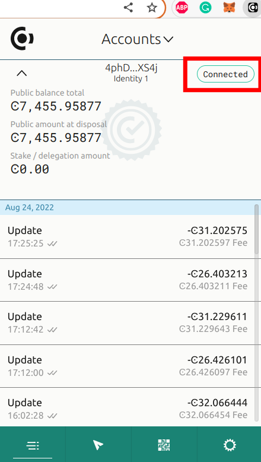

.. include:: ../../variables.rst
.. _voting-frontend:

========================
Setting up the frontend
========================

This is the second part of :ref:`the voting smart contract tutorial<voting-sc>`. In this part of the tutorial,
we will create a web frontend application to make it easier for users to interact with the smart contract.

Non-tech users will likely not be able to interact with smart contracts via a Concordium node
and some users may choose not to host their own Concordium node locally. This tutorial part shows you
a setup that eliminates the need for the user to host their own Concordium node.

You can lower the bar for entry by coding an appealing frontend that provides additional information
to your users. Web frontends are a familiar sight nowadays, but to use
the frontend, users will also need to download the |bw| (or simply "the browser wallet") as a browser extension.
The installation and safe usage of the browser wallet might be new for people using your frontend.

Providing comprehensive explanations and step-by-step guides on your website on topics
related to the browser wallet is important for a good user experience. The browser wallet
connects via `HTTPS <https://en.wikipedia.org/wiki/HTTPS>`_ to a server that is connected to a Concordium node. This setup alleviates the
need for the user to host their own Concordium node.

.. note::

    Before you start the second part of this tutorial, make sure you have:

    - Access to a Chromium-based web browser (such as Google Chrome)

    - `git <https://git-scm.com/>`_ installed to be able to clone a repository from `GitHub <https://github.com/>`_

    - `node.js <https://nodejs.org/en/download/>`_ and `yarn <https://yarnpkg.com/getting-started/install>`_ installed

    ``Node.js`` is a JavaScript runtime environment and ``yarn`` is a package manager
    used in combination with ``node.js``. You can download `node.js <https://nodejs.org/en/download/>`_  and
    `yarn <https://yarnpkg.com/getting-started/install>`_  on their official websites.

|bw|
-------------------------

Concordium's browser wallet is an extension to Chromium-based browsers such as Google Chrome.
The browser wallet allows you to interact with the chain and make transactions, by connecting to a (gRPC) server that communicates with a node.
The browser wallet hosts the private keys corresponding to the accounts of the user.

Your frontend code that is run in the browser constructs the transaction object
and sends it to the browser wallet extension. The transaction object is signed by the private key hosted in the wallet
and transmitted to the server via HTTPS. This server has access to a Concordium node and converts
the request (including the signed transaction object) that comes via HTTPS from the browser wallet
to a request that the Concordium node can execute. The signed transaction is
transmitted via peer-to-peer communication to other Concordium nodes and becomes
part of the Concordium blockchain.

Installation
------------

To continue the tutorial, we'll need to install the |bw|. Install the extension for your browser as described :ref:`here<setup-browser-wallet>`.

The wallet connects to a server hosted by Concordium which will take care of the Concordium node on your behalf.

For testing you'll need some CCD in your account. Send some CCD to your new account or request some CCD from the :ref:`testnet faucet button<testnet-faucet>` within the wallet.
Check that your account balance is displayed and you have enough
CCD to be able to execute transactions.

.. note::
    The wallet is connected to a website when you see the green ``Connected`` button.
    You can toggle on/off the connection by clicking on the button.

Running the web frontend
-------------------------

You have successfully added the |bw| to your browser in the previous section.
In the next step of the tutorial, you are going to clone a voting demo frontend written with the popular frontend framework `React <https://reactjs.org/>`_
and run it locally. The demo frontend has the required packages installed to connect to the wallet
and implements common flows to deal with the different states that the wallet could be in. For example,
the frontend will display a ``Connect`` button that can be used to connect to the wallet extension. Furthermore, the frontend has flows
to react to events, such as when the user switches accounts or connects/disconnects an account.

Clone this `repository <https://github.com/Concordium/concordium-browser-wallet>`_.

.. code-block:: console

    $git clone https://github.com/Concordium/concordium-browser-wallet

Navigate to the ``examples/voting`` subdirectory, then build and run the frontend as described below:

- Run ``yarn`` in the root folder to install all dependencies.

.. code-block:: console

    $yarn

- Run ``yarn build`` to build the package.

.. code-block:: console

    $yarn build

- Navigate to the voting example folder.

.. code-block:: console

    $cd ./examples/voting/

- Run ``yarn watch`` to enable hot-reload (useful for development) of the web frontend whenever you do any changes to the code.

.. code-block:: console

    $yarn watch

- Run ``yarn start`` in another terminal to start the web frontend.

.. code-block:: console

    $yarn start

The command will log a URL in the console. Open this URL in the Chrome browser.

.. note::

    Make sure that your wallet is connected to testnet and not to mainnet.

You completed the local frontend setup. You are running your own local dApp now. If you want, you can compare it with Concordium's
`voting dApp <https://voting.testnet.concordium.com/>`_ hosted on testnet. You can use your |bw|
to connect to the dApp.
