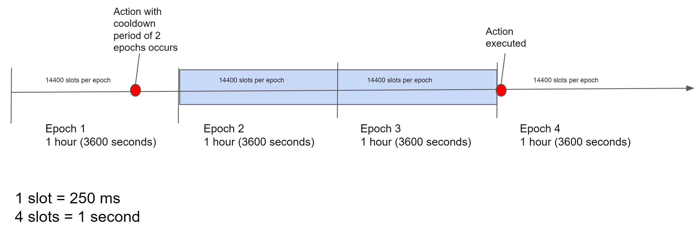

.. _baker-concept:

======
Bakers
======

Baking is key to the Concordium blockchain. The blockchain consists of multiple baker nodes that maintain the blockchain by baking and finalizing blocks.

How baking works
================

A node is a baker node when it participates actively in the network by creating new blocks that are added to the chain. A baker collects, orders, and validates the transactions that are included in a block to maintain the integrity of the blockchain. The bakers sign each block that they bake so that the block can be verified and executed by the rest of the participants of the network.

The chain a baker builds upon is the :ref:`best chain <glossary-best-chain>` when making a new block. The best chain is selected using :ref:`consensus protocol <glossary-consensus>`. In particular, the best chain has the most finalized blocks and the most blocks after the last finalized block.

Baker keys
----------
A node uses a set of cryptographic keys called baker keys to sign the blocks that it bakes. The baker keys are uniquely determined from the associated account. The baker keys are used for signing the block that the node bakes and for verifying whether the baker has won the :ref:`lottery <glossary-lottery-power>` as described below. To become a baker node, the node must be configured with a set of baker keys.

Baker account
-------------

Each account can use a set of baker keys to register a baker. Whenever a baker bakes a valid block that gets included in the chain, a reward is paid to the baker's account after some time. The baker account also receives an award after each :ref:`epoch <glossary-epoch>`. The reward per block is determined by the contents of the block, and is usually lower than the reward that is paid after.

The account can be viewed either in the Desktop Wallet or the Mobile Wallet, depending on where the account was created.

Rewards are added to the staked amount by default. However, you can choose to receive the rewards in the account balance instead of staking them automatically.

.. _concepts-baker-stake:

Stake and lottery
-----------------

A baker needs to stake a part of its CCD balance on the baker account. Later, the baker can then manually release a part of or all of the staked amount. The staked amount cannot be moved or transferred until it's released by the baker.

.. note::

   If an account owns an amount that was transferred with a release schedule,
   the amount can be staked even if it hasn't been released yet.

To be chosen to bake a block, the baker must take part in a
*lottery*. The greater the baker's stake, the greater the baker's chance of winning the lottery and being selected to bake a block.

The same stake is used when calculating whether a baker is included in the :ref:`finalization <glossary-finalization>` committee or not.

Time concepts
-------------
The Concordium blockchain divides time into :ref:`epochs <glossary-epoch>` and :ref:`slots <glossary-slot>`.

.. image:: ../images/concepts/epochs-slots.png
   :alt: timeline showing how 14400 slots make up one epoch

When considering the rewards and other baking-related concepts, the concept of an *epoch* is used as a unit of time that defines a period in which the set of current bakers and stakes are fixed. Epochs have a duration of 1 hour and the duration is fixed at the :ref:`Genesis block <glossary-genesis-block>`.

Epochs are subdivided into slots. On any given :ref:`branch <glossary-branch>`, each slot can have a maximum of one block, but multiple blocks on different branches can be produced in the same slot. Slots have a duration of 250ms, and the duration is fixed at the :ref:`Genesis block <glossary-genesis-block>`.

A :ref:`cool-down period <glossary-cool-down-period>` describes a period of time during which certain activities or transactions are frozen. For example, if you decrease a baker stake in the desktop wallet, the stake will be decreased after a cool-down period. The cool-down period is 2 epochs. During the cool-down period, you’ll not be able update the stake. After the cool-down period, the amount by which you decreased your stake is returned to your disposable balance.

Finalization
============
Finalization is a unique feature of the Concordium blockchain, in that it ensures that baked blocks become finalized as quickly as possible and with 100% certainty.

What is finalization?
---------------------

Finalization is the voting process by which a block is marked to be “finalized”, i.e. part of the authoritative chain. Transactions that are part of finalized blocks are considered authoritative. New blocks can be only added following the last finalized block to ensure the integrity of the chain. The finalization process is conducted periodically by the bakers with a staked amount of at least 0.1% of the total amount of existing CCD, known as the Finalization committee.
When a sufficiently large number of members of the committee have received the block and agree on its outcome, the block is finalized. Newer blocks must have the finalized block as an ancestor to ensure the integrity of the chain.

Finalization committee
----------------------

The finalization committee is formed by the bakers with a staked amount of at least 0.1% of the total amount of existing CCD. This specifically implies that in order to participate in the finalization committee you will probably have to modify the staked amount to reach the threshold.

Participating in the finalization committee produces rewards on each block that is finalized. The rewards are paid to the baker account some time after the block is finalized.
