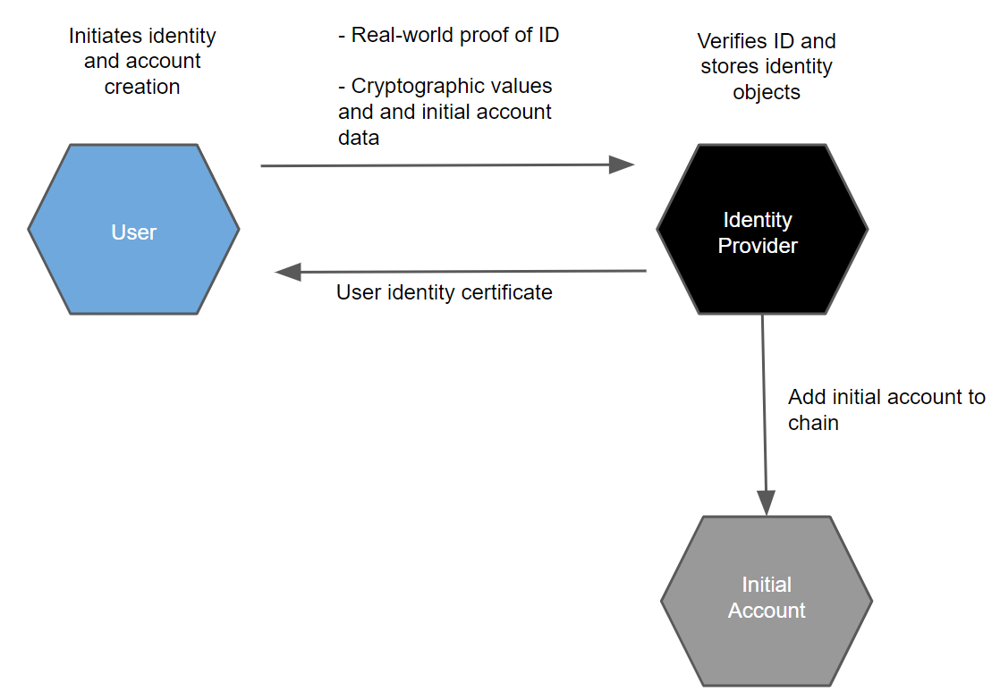

.. _reference-id-accounts:

==========
Identities
==========

.. contents::
   :local:
   :backlinks: none

Accounts and identities are strongly linked on the Concordium Platform. To be able to hold, send, or receive :ref:`CCD<glossary-ccd>` or become a baker on the Concordium blockchain, you need an account and an identity. This is regardless of whether you are using the Mobile Wallet, Desktop Wallet, or Concordium Client for your transactions.

Before you can use the Concordium Platform, an identity provider must verify and record your real-world identity. This identification is performed when you create your first account, the initial account.

About identities
================

Identities are issued by an identity provider. There is a :ref:`registry of selected identity providers and their contact information publicly accessible from the Concordium blockchain<identity-commands>`. Concordium Foundation will maintain the list in the beginning.

.. only:: mainnet

   It is possible to create a company identity that is not associated with a specific individual but is issued with documents that identify a company.
   Company identities are only relevant for a few companies. The way they are created differs from how individual identities are created. For more information, see :ref:`Company identity creation<company-identities>`.

While identities facilitate compliance with relevant regulations, they also allow users to be represented on-chain in a way that protects users’ privacy. That is, transactions on the chain are processed without exposing the identity of the sender or receiver. The identity of an account owner can only be revealed via the process of :ref:`anonymity revocation<revoke-anomity>`. Anonymity revocation can only happen in exceptional circumstances, for example if authorities have detected suspicious activity on the account, and requires action by one or more anonymity revokers and the identity provider who issued the account's identity.

Every account on the chain must be derived from an identity that is verified and signed by an approved identity provider. It is publicly visible which identity provider issued an identity for an account, and who the anonymity revokers are for the account and the identity. In addition to this basic information which enables regulatory compliance, an account owner can choose to publicly reveal other values on their account. These values are called :ref:`attributes<glossary-attribute>` and can be, for example, nationality or country of residence. Publicly accessible attributes enable anybody to check the attributes before interacting with an account. Being able to see who issued the identity enables whoever wishes to interact with an account to judge the level of risk in the transaction. If you choose to reveal attributes, you should have a good reason to do so. The general recommendation is not to reveal attributes.

Attributes
----------

Each identity contains a number of cryptographic values and a number of
user-chosen attributes, such as nationality or country of residence. These
attributes are certified by the identity provider. The cryptographic values are
a number of public and private keys, a signature from the identity provider, as
well as a number of secret values the user must use to be able to use the
identity to create accounts.

You are in control of which attributes are revealed to the public. You can choose not to reveal any attributes at all to maintain your anonymity, which is the general recommendation.

Obtain an identity
------------------

You can create identities in the :ref:`Desktop Wallet <create-initial-account-desktop>` or in the :ref:`Mobile Wallet <create-identity>`. Identity creation is an :ref:`off chain<glossary-off-chain>` action.

.. Warning::
   Currently, it is not possible to exchange identities and accounts between the Mobile Wallet and the Desktop Wallet. If you try to import a file that has been exported from the Mobile Wallet into the Desktop Wallet, the import will fail, and likewise, if you try to import a file exported from the Desktop Wallet into the Mobile Wallet.

Identity issuance requires *Identity Verification*, which is the process of verifying the real-life identity of the user. This typically requires taking photographs or scans of identification documents, such as a passport. Identity verification also checks that the user-chosen attributes are valid for the user.

Upon verification of the user's identification documents and attributes, the Identity provider issues a :ref:`user identity certificate<glossary-user-identity-certificate>`. The User identity certificate contains attributes about the user. It is basically the Identity Provider’s signature over some cryptographic keys of the user and the validated personal attributes.

About accounts
==============

The user gets an :ref:`glossary-initial-account` at the same time as an *identity* has been issued by an :ref:`identity provider<glossary-identity-provider>`. As the initial account is submitted to the chain by the
identity provider, the identity provider knows the owner of the initial account. For this reason, the user may not want to use the initial account and create a regular account instead. There can only be one initial account for one identity.

The user additionally creates account keys for an initial account, which the user stores privately. The identity provider then verifies that the attributes in the user identity information
are valid for the user and stores them locally in an identity object that is specific to the user. Identity objects are only held by identity providers. The identity provider then opens an
account, the initial account, on behalf of the user. At the end of the identity verification process, the user receives a user identity certificate that can be used for creating
additional accounts and the user gets access to the initial account on the Concordium Platform. These certificates are valid for a given period and users can obtain new certificates
in connection with updated identity verification by an identity provider.

Based on the user identity certificate the user can subsequently create other accounts (see below) that can only be linked to the user if the anonymity revokers and the identity provider are
involved. This gives a user a way to create accounts with an additional layer of privacy protection compared to that in the initial account. The owner of a regular account is not known to the identity providers or any other single entity. To facilitate compliance with relevant regulations, a regular account can only be created from an *identity* which is issued :ref:`glossary-off-chain` by an Identity provider. While an account has to be created from an identity, the user's privacy is still protected, and the account owner's identity can only be revealed via the process of :ref:`anonymity revocation<revoke-anomity>`, which can only happen under stringent regulations. In particular, a key feature of the design of identities and accounts is that the identity provider cannot reveal the identity of an account on their own.

Once you have an identity and a user identity certifcate from an identity provider, you can use it to create more accounts on the Concordium Platform. This is typically done using an app or wallet that guides users through the account creation process. The creation of an account is an :ref:`glossary-on-chain` action that requires sending a transaction to a node that participates in the Concordium network. The input to the transaction is a *credential*, which contains a number of :ref:`cryptographic proofs<glossary-cryptographic-proof>`, as well as a selection of attributes the user wishes to reveal publicly. The proofs establish that the attributes the user revealed publicly are the ones approved by the identity provider. The proofs reveal no other information. In particular, the identity provider itself cannot determine the owner of the account. Note that revealing attributes publicly is completely optional. The benefit gained from revealing attributes is that other users may decide whether to trust the account based on the publicly available information.

An example is that you might need to reveal your nationality sometimes. So you might have one account with no attributes revealed, and another account that reveals your nationality. When required, you can use the account with the nationality revealed while keeping
all other activity anonymous.

.. image:: ../images/concepts/account-creation.png
   :alt: graphic drawing showing how user creates accounts

.. Note::
   It is possible to create a shared account where multiple users share one account. For more information, see :ref:`Overview of shared accounts with multiple credentials<overview-shared-accounts>`.

Any time you create a new account, you should make a :ref:`backup<backup>`. Backups protect your account keys, ensuring that you do not lose access to your CCDs.

.. _revoke-anomity:

.. include:: ../snippets/revoking-anonymity.rst
