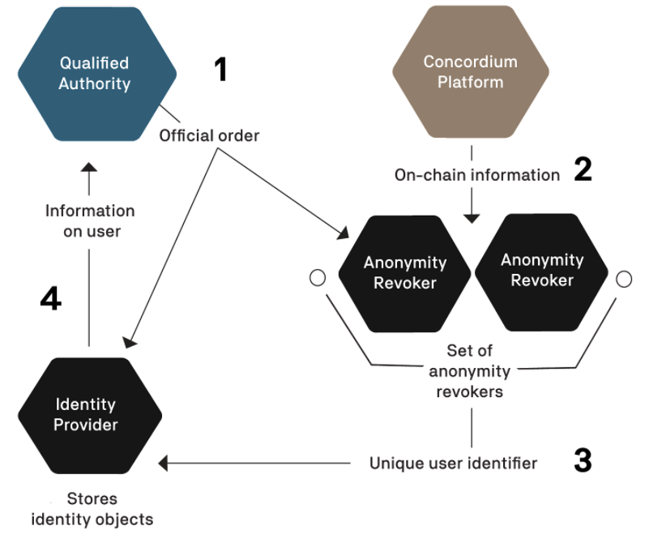

.. _reference-id-accounts:

=======================
Identities and accounts
=======================

.. contents::
   :local:
   :backlinks: none

To be able to hold, send, or receive CCD or become a baker on the Concordium blockchain, you need an account and an identity. This is regardless of whether you are using the Mobile Wallet, Desktop Wallet, or Concordium Client for your transactions.

Before you can use the Concordium Platform, an identity provider must verify and record your real-world identity. This identification is performed when you create your first account, the initial account.

About identities
----------------

Identities are issued by an identity provider. There is a registry of selected identity providers and their contact information publicly accessible from the Concordium blockchain. Concordium Foundation will maintain the list in the beginning.

.. Note::

   It is possible to create a company identity that is not associated with a specific individual but is issued with documents that identify a company.
   Company identities are only relevant for a few companies. The way they are created differs from how individual identities are created. For more information, see :ref:`Company identity creation<company-identities>`.

While identities facilitate compliance with relevant regulations, they also allow users to be represented on-chain in a way that protects the users’ privacy. That is, transactions on the chain are processed without exposing the identity of the sender or receiver.

Every account on the chain must be derived from an identity that is verified and signed by an approved identity provider. It is publicly visible which identity provider issued an identity for an account, and who the anonymity revokers are for the account and the identity. In addition to this basic information which enables regulatory compliance, an account owner can choose to publicly reveal other values on their account. These values are called attributes and can be, for example, nationality or country of residence. Publicly accessible attributes enable anybody to check the attributes before interacting with an account. Being able to see who issued the identity enables whoever wishes to interact with an account to judge the level of risk in the transaction.

:ref:`Anonymity revocation<revoking-anomity>` can only happen in exceptional circumstances, for example if authorities have detected suspicious activity on the account, and requires action by one or more anonymity revokers and the identity provider who issued
the account's identity.

Attributes
^^^^^^^^^^

Each identity contains a number of cryptographic values and a number of
user-chosen attributes, such as nationality or country of residence. These
attributes are certified by the identity provider. The cryptographic values are
a number of public and private keys, a signature from the identity provider, as
well as a number of secret values the user must use to be able to use the
identity to create accounts.

You are in control of which attributes are revealed to the public. You can choose not to reveal any attributes at all, and your anonymity against the general public is maintained.

Obtain an identity
^^^^^^^^^^^^^^^^^^

You can create identities in the :ref:`Desktop Wallet <create-initial-account-desktop>` or in the :ref:`Mobile Wallet <create-identity>`. Identity creation is an :ref:`off chain<glossary-off-chain>` action. The |Net| release presently supports the Notabene identity issuance flow. (Is this still true?)

.. Warning::
   Currently, it is not possible to exchange identities and accounts between the Mobile Wallet and the Desktop Wallet. If you try to import a file that has been exported from the Mobile Wallet into the Desktop Wallet, the import will fail, and likewise, if you try to import a file exported from the Desktop Wallet into the Mobile Wallet.

Identity issuance requires *Identity Verification*, which is the process of verifying the real-life identity of the user. This will typically involve taking photographs or scans of identification documents, such as a passport. Identity verification also checks that the user-chosen attributes are valid for the user.

The purpose of having an identity is to facilitate regulatory compliance. However, your privacy is still protected. Your identity is not visible on the blockchain, and the identity of an account owner can only be revealed via the process of :ref:`anonymity revocation<revoking-anomity>`.

About accounts
==============

The user gets an :ref:`glossary-initial-account` at the same time as an *identity* has been issued by an :ref:`identity provider<glossary-identity-provider>`. As the initial account is submitted to the chain by the
identity provider, the identity provider knows the owner of the initial account. For this reason, the user may not want to use the initial account and create a regular account instead.

The owner of a regular account is not known to the identity providers or any other single entity. To facilitate compliance with relevant regulations, a regular account can only be created from an *identity*
which is issued :ref:`glossary-off-chain` by an Identity provider. While an account has to be created from an identity, the user's privacy is still protected, and the account owner's identity can only be revealed via the process of :ref:`anonymity revocation<revoking-anomity>`, which can only happen under stringent regulations. In particular, a key feature of the design of identities and accounts is that the identity provider cannot reveal the identity of an account on their own.

Once you have an identity, you can use it to create more accounts. The creation of an account is an :ref:`glossary-on-chain` action that requires sending a transaction to a node that participates in the Concordium network. The input to the transaction is a *credential*, which contains a number of cryptographic proofs, as well as a selection of attributes the user wishes to reveal publicly. The proofs establish that the attributes the user revealed publicly are the ones approved by the identity provider. The proofs reveal no other information. In particular, the identity provider itself cannot determine the owner of the account. Note that revealing attributes publicly is completely optional. The benefit gained from revealing attributes is that other users may decide whether to trust the account based on the publicly available information.

The user additionally creates account keys for an initial account, which the user stores privately. The identity provider then verifies that the attributes in the user identity information
are valid for the user and stores them locally in an identity object that is specific to the user. Identity objects are only held by identity providers. The identity provider then opens an
account, the initial account, on behalf of the user. At the end of the identity verification process, the user receives a user identity certificate that can be used for creating
additional accounts and the user gets access to the initial account on the Concordium Platform. These certificates are valid for a given period and users can obtain new certificates
in connection with updated identity verification by an identity provider. While the identity provider can link the initial account to the user, nobody else can. Based on
the user identity certificate the user can subsequently create other accounts (see below) that can only be linked to the user if the anonymity revokers and the identity provider are
involved. This gives a user a way to create accounts with an additional layer of privacy protection compared to that in the initial account.

Once a user has acquired a user identity certificate from an identity provider, they can create more accounts on the Concordium Platform. This is typically done using an app or wallet that guides users through the account creation process.

.. Note::
   It is possible to create a shared account where multiple users share one account. For more information, see :ref:`Overview of shared accounts with multiple credentials<overview-shared-accounts>`.

Benefits of revealing attributes
--------------------------------

Every account on the chain must be derived from an identity that is verified and
signed by an approved identity provider. It is publicly visible which identity
provider issued an identity for an account and who the anonymity revokers are
for the account and the identity. In addition to this basic information which
enables regulatory compliance, an account owner can choose to publicly reveal
other values on their account, such as their nationality or country of
residence. Since this information is publicly accessible, anybody can check it
before interacting with an account. Moreover, being able to see who issued the
identity enables whoever wishes to interact with an account to judge the level
of risk in the transaction.

.. _revoking-anomity:

Revoking anonymity
==================

The identity of a user can only be revealed to a qualified authority as part of a valid legal process. A qualified authority is a governmental body that has authority to act in a relevant jurisdiction. For example, a local police force, a local court or an investigatory division of a local authority that regulates financial conduct will all have authority to act in their relevant jurisdictions. These authorities are qualified to begin the process of revoking the anonymity of a user when they proceed through established legal channels and make a formal request. The outcome of such a request is likely to be that a qualified authority obtains an official order, which may be in the form of a warrant, court order, or similar instrument. Only after a qualified authority validly serves an official order upon the relevant anonymity revokers and identity provider can the real-world identity of a user be revealed and only to the extent set out in the order.

When legally obliged, the anonymity revokers and identity provider work together to determine the owner of an account and determine which accounts belong to the same owner. Anonymity revocation is a multi-stage process requiring cooperation of multiple parties.

Each account has an encryption of a specific user identifier. This number can be decrypted by a sufficient number of the anonymity revokers working together. The set of anonymity revokers and the number of them required to decrypt the user identifier are determined when the identity is issued.

After the authorities have identified an on-chain transaction or account they would like to investigate, in order to reveal the real-world identity of a user, the following process must be followed:

1. The qualified authority must identify the anonymity revokers and identity provider associated with the account they would like to deanonymize and present them with an official order.
2. Per the terms of the official order, the anonymity revokers inspect and decrypt the available on-chain data for the user.
3. The anonymity revokers extract the unique user identifier from the collected data.
4. With this unique user identifier, the qualified authority can work with the relevant identity provider to retrieve the real-world identity of the user. The anonymity revokers can also decrypt a value that is held by the identity provider and allows the revokers to find all accounts the user has created from a given identity. Additionally, this value allows anonymity revokers to see the amount of CCDs in the shielded balance of deanonymized accounts.

All of these actions are subject to rules and processes, and only the relevant entities learn any information about the account owner. No information is publicly revealed.
