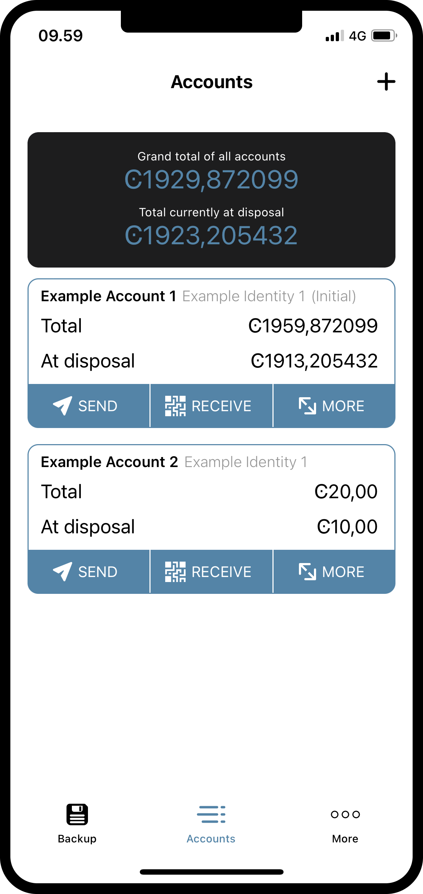
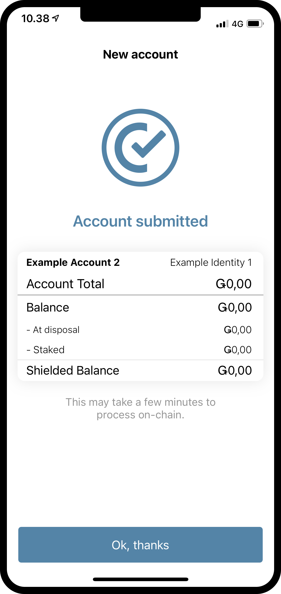

.. _create-account-mw:

==============================================
Create a new account with an existing identity
==============================================

.. contents::
   :local:
   :backlinks: none

When you created your identity, it came with an initial account. The initial account is a special account that the identity provider submits
to the chain. When you already have an identity, you can submit more accounts to the chain with that identity yourself.

Read the following or watch the video to learn how to create a new account.

.. raw:: html

   <iframe width="560" height="315" src="https://www.youtube.com/embed/gtDXnuoMOes" title="YouTube video player" frameborder="0" allow="accelerometer; autoplay; clipboard-write; encrypted-media; gyroscope; picture-in-picture" allowfullscreen></iframe>

|

Create a new identity and initial account
=========================================

#. Go to the **Accounts** page.

#. Tap the **+** in the upper right corner.

#. Enter a name for your new account. Press **Next**.

#. Choose which identity you want to use to create the account.

#. You now have the option to reveal some attributes publicly on the account. Unless you have a good reason to do so, we recommend that you don't reveal any attributes.

   - If you want to reveal some attributes, tap **Reveal account attributes**, select the attributes you want to reveal, and then tap **Submit account**.

#. If you don’t want to reveal any attributes, tap **Submit account**.

#. Finally, tap **Ok, thanks**.

Your new account is now visible on the Accounts page. It might take a little while for it to finalize on the chain.

|

.. image:: ../images/mobile-wallet/MW15.png
      :width: 25%

|

.. Note::
   To access the **Balance** or **Shielded balance** of the new account, tap the Balance or Shielded balance areas on the account card.
