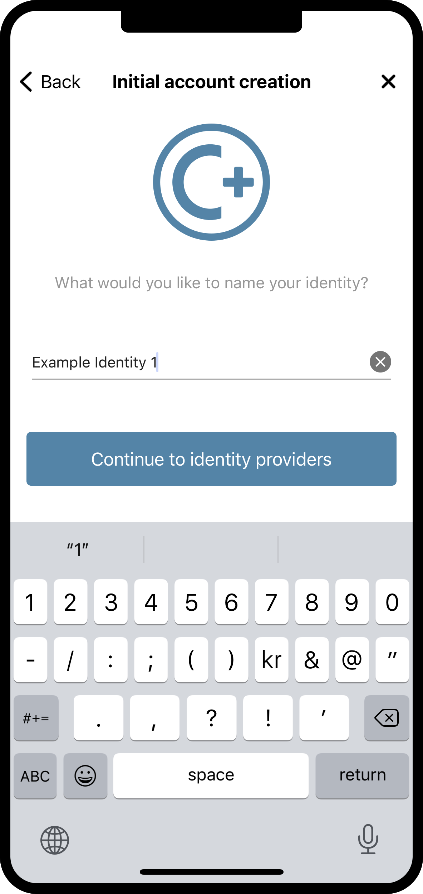
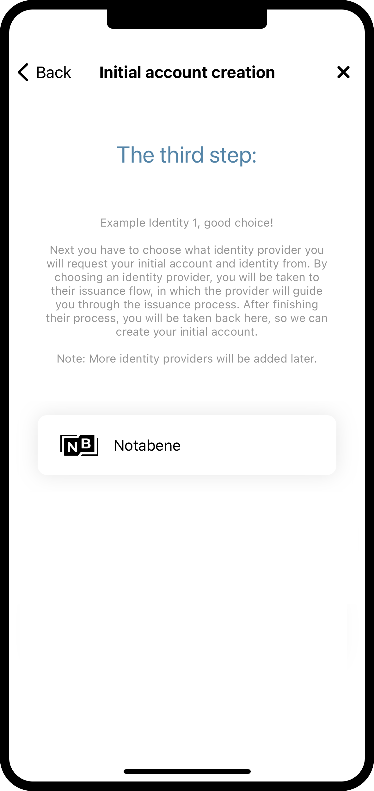
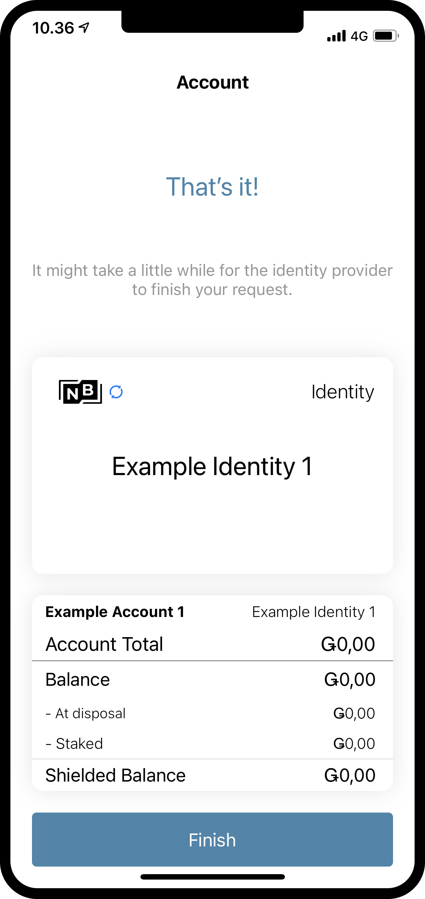

.. _create-identity:

==============================================================
Create an identity and an initial account in the Mobile Wallet
==============================================================

.. contents::
   :local:
   :backlinks: none

You can submit requests for additional :ref:`identities<glossary-identity>` and :ref:`initial accounts<glossary-initial-account>` in the Mobile Wallet. You do this from the **Identities** page.

To learn more about identities and accounts, see :ref:`<reference-id-accounts>` and :ref:`<managing_accounts>`.

.. Warning::
   Currently you can’t import accounts and identities created in the Concordium Desktop Wallet in the Mobile Wallet, and vice versa.

Create a new identity and initial account
=========================================

#. Go to the **Identities** page.

#. Tap the **+** in the upper right corner.

#. Enter a name for your initial account. This name is only stored locally in the app and is only known by you. Tap **Continue**.

#. Enter a name for your identity. Again, this name is only stored locally in the app and only known by you. Tap **Continue to identity providers**.

#. Select a third-party identity provider from the list. An external web page opens within the app.

#. Enter the information requested by the third-party identity provider.  The information might vary depending on the identity provider. However, they will ask you to provide photos of identification documents and a selfie.

#. When you have submitted the information to the identity provider, you will have a pending initial account and identity in your app. The verification or rejection is usually retrieved from the identity provider within minutes, but check your app frequently to retrieve the result. It might take up to seven days for the result to appear.

|

|

.. Warning::
   **When your identity and initial account has been verified, backup is essential. If you lose your mobile phone or need to restore your mobile phone and you don't have a backup from the Mobile Wallet, you can't access your wallet and your CCDs are permanently inaccessible.**
   **Concordium does not take any responsibility if you lose access to your accounts. Concordium strongly advise you to complete a backup every time you create an account and store the backup file in a secure place - preferably offline.**
   For more information, see :ref:`Make a backup of identities and accounts in Mobile Wallet<export-import-mw>`.

.. Note::
   To access the **Balance** of the new account, tap the Balance area on the account card or tap More.
