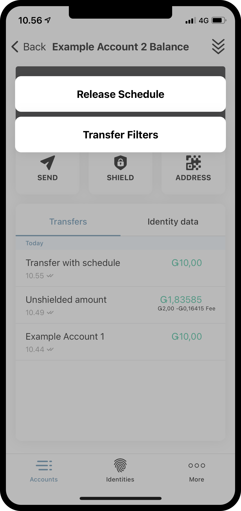
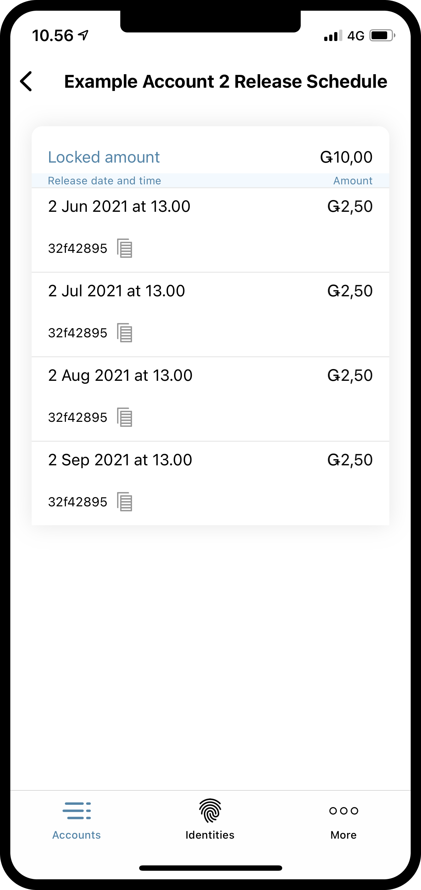

.. _inspect-release-schedule-mw:

==========================
Inspect a release schedule
==========================

.. contents::
   :local:
   :backlinks: none

Some transfers contain a release schedule. This means that the CCD in the transfer can be seen on the account, but they are locked
until one or more specific points in time. While the funds are locked, they cannot be transferred, but they will be part of the total amount on the account.
By inspecting the release schedule, you can see when the releases are unlocked.

Find and inspect a release schedule
===================================

#. Go to the **Accounts** page.

#. Tap the balance area of the account that received the transaction with a release schedule or tap |moredetails|.

#. Tap the |hamburger| menu in the upper right corner.

#. Tap **Release Schedule**.

You can now see the coming releases on the account.

|

.. image:: ../images/mobile-wallet/MW55.png
      :width: 25%

|

.. |moredetails| image:: ../images/more-arrow.png
             :alt: Button with More and double-headed arrow
