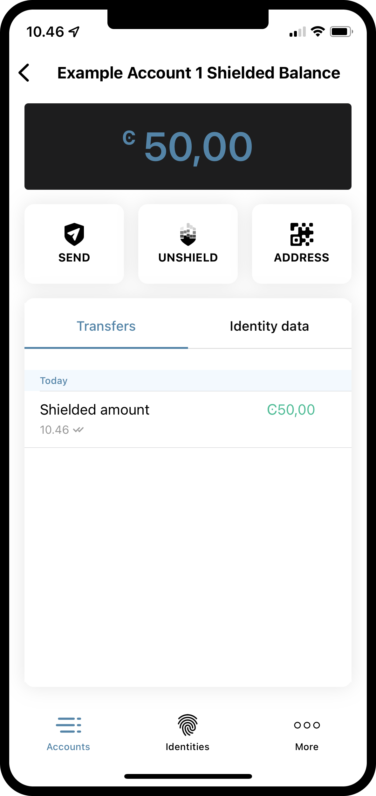
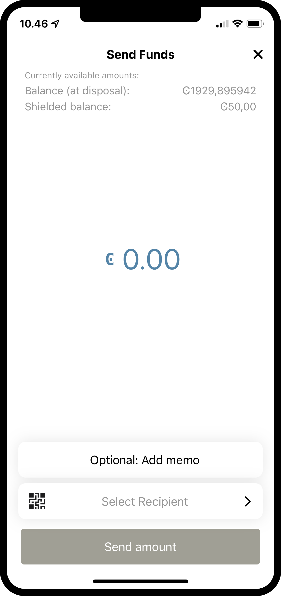
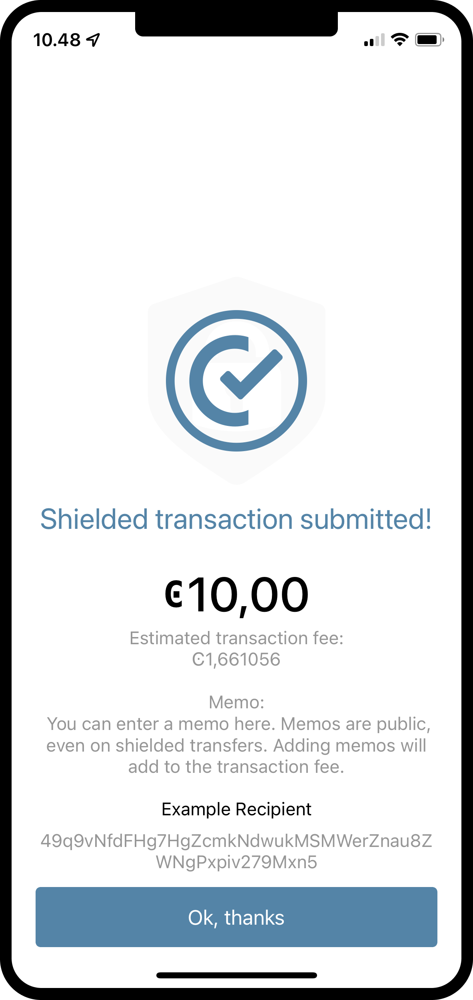

.. _make-shielded-transfer-mw:

=============================================
Make a shielded transfer in the Mobile Wallet
=============================================

.. contents::
   :local:
   :backlinks: none

This topic describes how to make a shielded CCD transaction from an account in the Mobile Wallet. If you are looking
for a guide on  how to make a regular CCD transfer, you can find the guide :ref:`here <make-simple-transfer-mw>`.

.. Note::
   A shielded transfer is a transfer between two accounts, where the **amount** of the transfer is encrypted. The sender, receiver, and potential memo will be publicly visible on the blockchain.

.. Warning::

   Do not shield or transfer all of your funds or you will not have enough funds to cover transaction fees for unshielding or sending them.

Make a shielded CCD transfer from an account
============================================

#. Go to the Accounts page.

#. Tap the Account you want to transfer CCD from, and then tap the **Shielded balance** area of the account card.

#. Tap **SEND**.

#. Enter the amount you want to transfer.

#. Tap **Select recipient** to select the recipient of the transfer.

   - You can either choose a recipient that already exists in your Address Book, or add a new one by selecting the **QR** or **+** symbols in the upper right corner.

#. *Optional*: You can add a memo to your transaction. A memo is a short message that will be shown with the transaction. Memos are publicly visible on the chain, so be careful what you write. Adding a memo will also add to the fee of the transaction.

#. Finally, tap **Send amount**.

#. Confirm your choices, and tap **Yes, send funds**.

Your transaction is now submitted to the chain. It might take a little while for it to finalize on the chain, and you can follow the status of the transaction in the log.

|

|

.. Note::
   All transfers and transactions cost a fee, including shielding and unshielding transactions. The fee is based on the set NRG for that transaction and the current exchange rate.
   The cost of transaction fees is stable in Euros, and therefore the price in CCD varies depending on the CCD to EUR exchange rate. The fee will always be deducted from the **Balance** of the account, so it is important to have some available CCDs to cover fees.
   You can see the fee in the transaction log.
