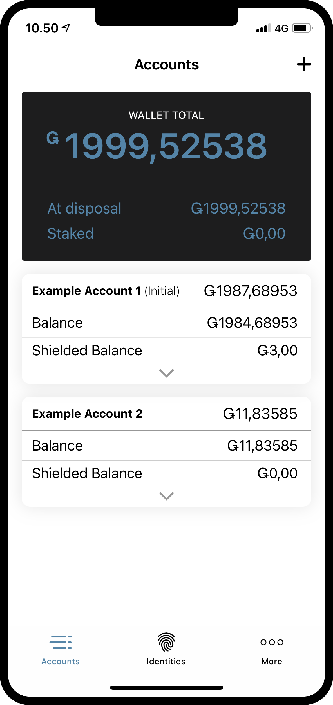
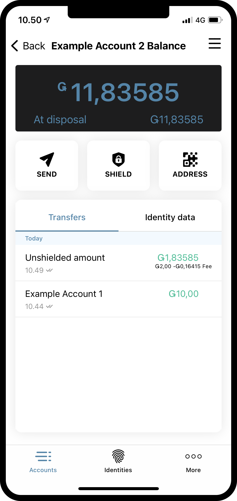
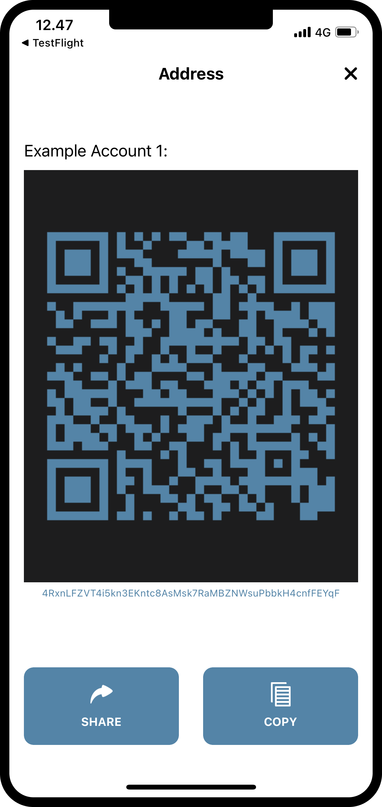

.. _share-address-mw:

===================================
Find and share your account address
===================================

.. contents::
   :local:
   :backlinks: none

If you need to share your account address with someone, it can be found from the individual account page.

Read below or watch the video to learn how to share your account address.

.. raw:: html

   <iframe width="560" height="315" src="https://www.youtube.com/embed/ldSitbxrsjs" title="YouTube video player" frameborder="0" allow="accelerometer; autoplay; clipboard-write; encrypted-media; gyroscope; picture-in-picture" allowfullscreen></iframe>

|

Share your account address
==========================

#. Go to the **Accounts** page.

#. Press the balance of the account you want to find the address to.

#. Press **ADDRESS**.

#. Share your address:

   - You can let someone scan your QR code from their installation of the Concordium Mobile Wallet.

   - You can press **SHARE** and then share the address via the options in the OS prompt.

   - You can press **COPY** to copy the address and then paste it somewhere of your own choosing.

|

|