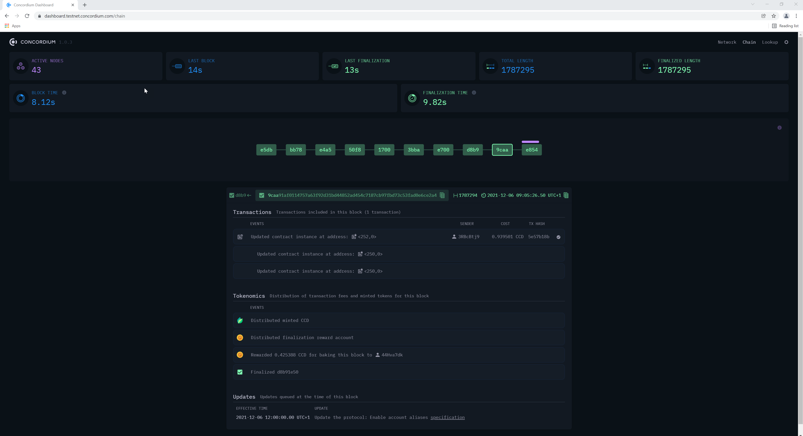
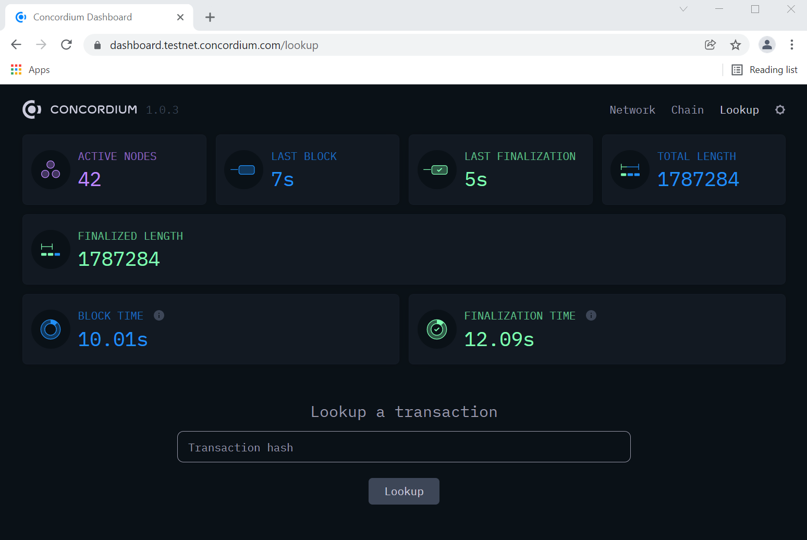
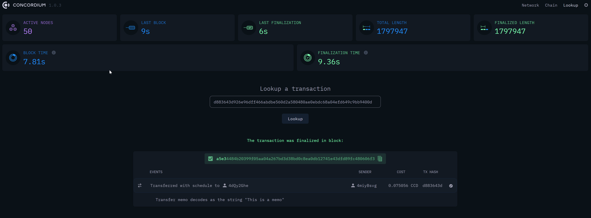
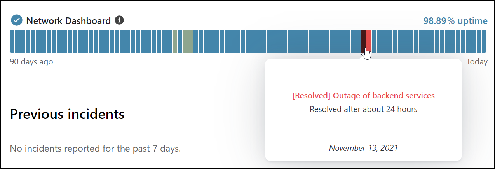
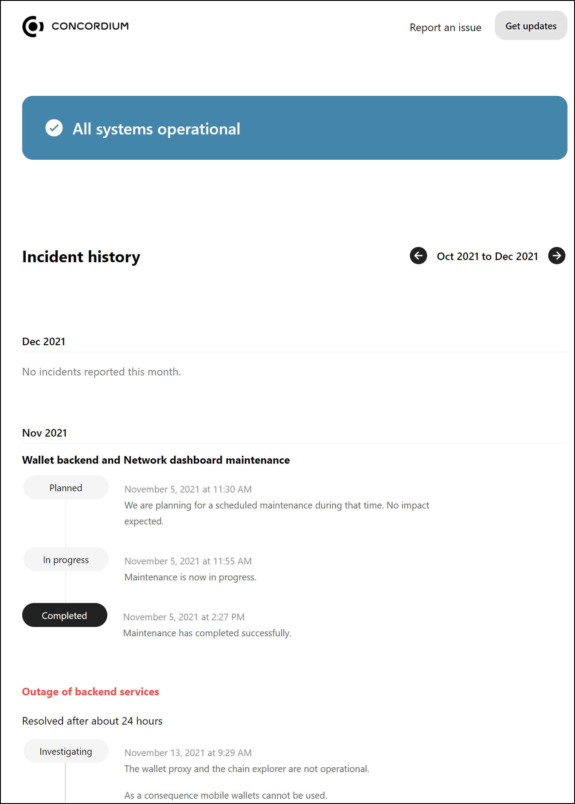

.. _dashboards:

===========================
Dashboards and Status Pages
===========================

.. contents::
   :local:
   :backlinks: none

Dashboard pages
===============

To open the dashboards, click the link for the  `Mainnet dashboard and block explorer <https://dashboard.mainnet.concordium.software/>`_ or `Testnet dashboard and block explorer <https://dashboard.testnet.concordium.com/>`_.

.. Note::
    You may need to adjust your display resolution to be able to view all columns in the table on the dashboard. Alternatively, use the zoom function in your browser to zoom in and out.

Use the **Network**, **Chain** and **Lookup** options to switch between the three dashboard pages.

.. image:: ../images/dashboards/db-intro.png

Click |lightmode| to switch to light mode. Click |darkmode| to switch to dark mode.

.. |darkmode| image:: ../images/dashboards/db-toggle-dark-mode.png
             :alt: Dark moon

.. |lightmode| image:: ../images/dashboards/db-toggle-light-mode.png
             :alt: Gear wheel

Network dashboard
-----------------

The **Network** dashboard page shows the statistics for the chain and the participants on the chain.

.. image:: ../images/dashboards/db-network.png

The tiles at the top show overall statistics. Due to the nature of this information, it is difficult to validate. Therefore, this information may not be fully accurate.

* **Active nodes:** number of currently active nodes.
* **Last block:** time since last block
* **Last finalization:** time since last finalization occurred.
* **Total Length:** Current total length (number of blocks) of the chain
* **Finalized Length:** Current finalized length (number of finalized blocks) of the chain.
* **Block time:** Average time between verified blocks.
* **Finalization time:** Average time between completed finalizations.

The table below the tiles shows details per participant in the chain. You can also click on a participant name to see details.

* **Name:** participant name
* **Baker:** if the participant is a baker, baker ID
* **Uptime:** amount of uptime in minutes (m), days (d), hours (h), months (mon), or years (y)
* **Client:** client version the participant is running
* **Avg ping:** average ping time between the peers of the participant
* **Peers:** Number of peers connected to the participant
* **Sent:** number of packets sent by the participant during uptime
* **Received:** number of packets received by the participant during uptime
* **Block:** block hash of the block that is considered the best block by the participant
* **Length:** length of participant’s chain up to the best block
* **Fin Block:** block hash of last finalized block in participant’s chain
* **Fin Length:** length of participant’s chain up to last finalized block
* **Last Fin:** timestamp for when last finalization occurred
* **Block EMA:** Exponential moving average of the period between valid blocks
* **Fin EMA:** Exponential moving average of the period between finalization

Chain dashboard
---------------

The **Chain** dashboard page shows a visualization of the chain. Click on any block to see the data for it.

The purple bar above the block shows the portion of the nodes that think it's the best block. Sometimes you might see the bar in different sizes above different blocks, because all the nodes are not in agreement.

* **Transactions:** shows the transactions included in the block if there are any.
* **Tokenomics:** shows the events for the block and transaction fees and minted tokens for the block.
* **Updates:** shows the updates queued at the time of the block.

Lookup dashboard
----------------

The **Lookup** dashboard page contains a search function to search for a transaction by the transaction hash.

Once the transaction lookup is complete, you see the transaction information.

Status pages
============

Both Mainnet and Testnet have a status page. The status page shows incidents and planned outages. To open the status page, click the link for the `Mainnet status page <https://status.mainnet.concordium.software/>`_ or `Testnet status page <https://status.testnet.concordium.software/>`_.

.. image:: ../images/dashboards/db-status-page.png

To see information about an incident, use your pointing device to hover over a colored block.

To see more details about incidents, click **Show incident history** to see a detailed log about incidents and downtime.

To report an issue, click **Report an issue**. This copies the Concordium support email address to your clipboard so you can write an email to support.

Click **Get updates** to subscribe to updates on the status page using your preferred delivery method.
