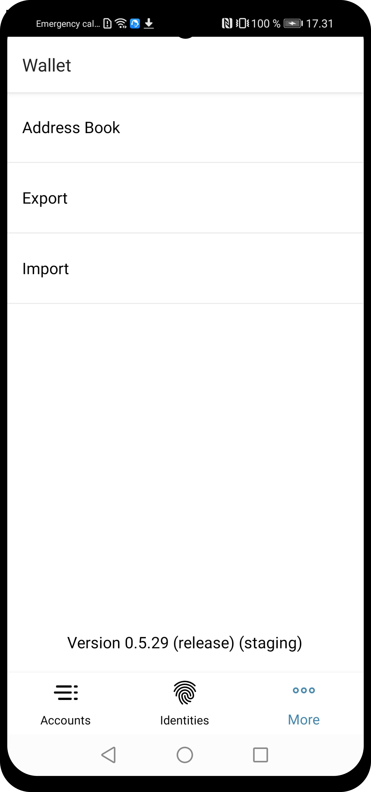
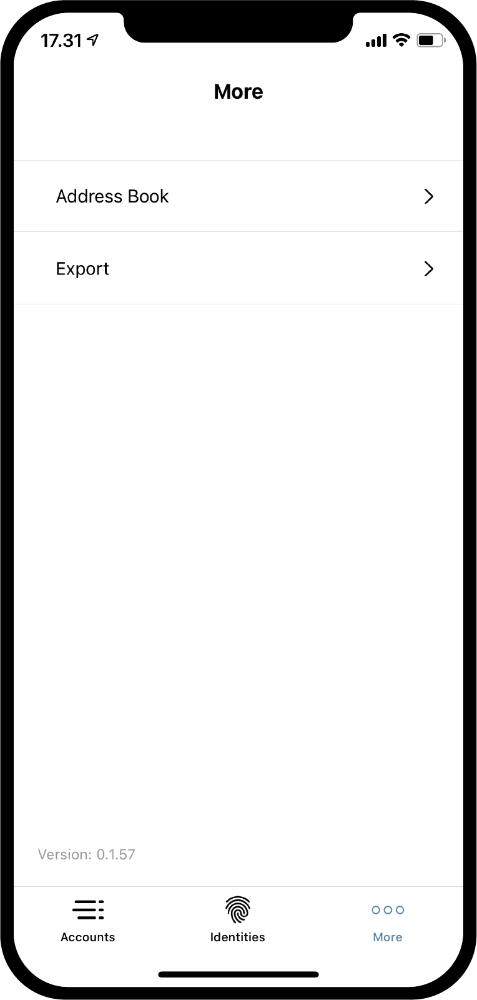
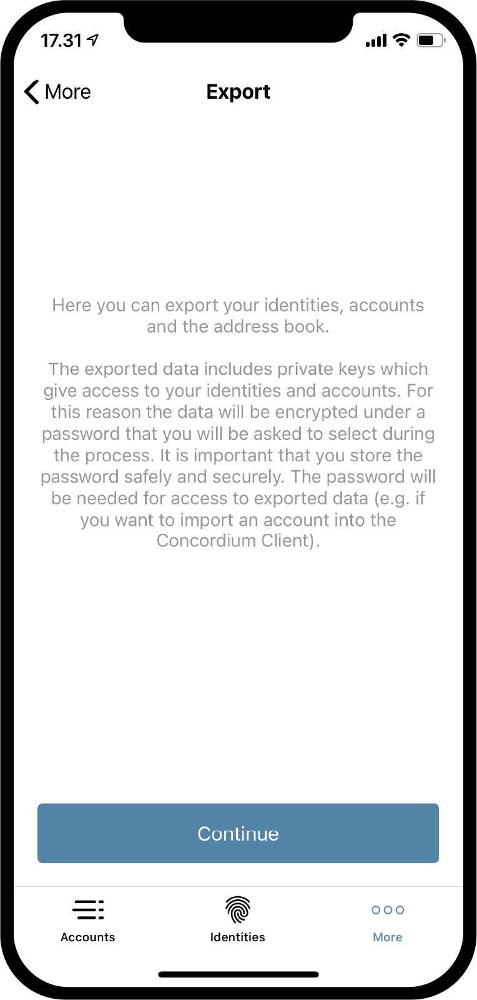
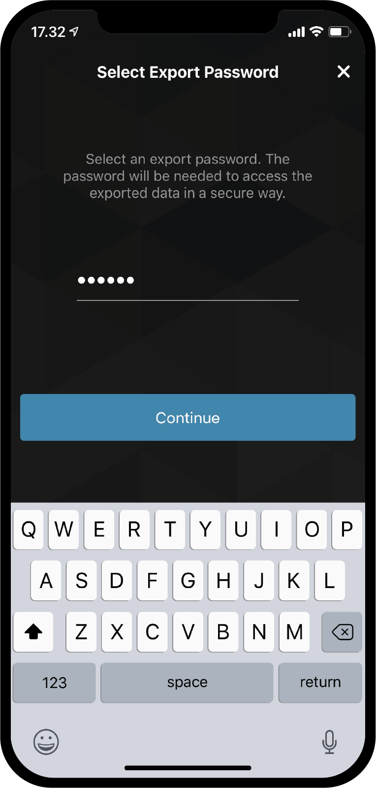

.. _Discord: https://discord.gg/xWmQ5tp

.. _testnet-explore-more:

=======================================
Concordium ID: Explore the *More* page
=======================================

.. contents::
   :local:
   :backlinks: none

Export
======
Using the Concordium ID app it is possible to export your accounts and identities. To get started, browse to the *More* page.
Depending on whether you are using the Android or iOS version of the app, the *More* page will look slightly different.
On Android you will see three menu items: *Address Book*, *Export* and *Import*. On iOS you will only see *Address Book* and *Export*.
This is because the Import feature works in two different ways depending on the platform, but we will get back to that.

To start an export, press the **Export** option. Doing that will take you to a new page, that briefly explains what an export means.
We recommend reading this carefully. Pressing **Continue** will take you to a page on which you will be asked to enter a password for
your export file. After entering it twice, you can **Continue**. As a last step, you will be prompted by either iOS or Android on what
you want to do with your exported file, using the layover from the phone’s operating system.

Import
======
As mentioned in the previous section, the import feature works slightly differently on iOS and Android. On Android you press
the *Import* option on the *More* page, which will let you browse to the file you want to import. Depending on your phone and
Android version, this might look different specific to the operating system. On iOS you have to browse to the file from outside
Concordium ID, and then press it and choose the *Share option*. This will let you choose Concordium ID as the app to handle the file.

Having opened the file on either platform, you will first be asked to enter the password chosen on export. After pressing **Continue**
you will have to verify yourself with the passcode or the biometrics chosen, when you set up the app. Finally you will get a list
of the *Accounts*, *Identities* and the *Address Book* entries you have imported.

.. image:: images/concordium-id/imp1.png
      :width: 32%
.. image:: images/concordium-id/imp2.png
      :width: 32%

Address Book
============
As the name suggests, the *Address Book* is a place to keep account addresses. If you browse to the *Address Book* you will see that
the addresses of your own accounts are already stored there. Besides seeing your own addresses, you can also add more entries to
the *Address Book*, either by pressing the **QR code symbol**, or pressing the **plus sign** in the upper right corner. By doing that you
can enter a new recipient address and give it a nickname in your *Address Book*. The entries in your address book can of course be
searched, when you make a transfer.

.. image:: images/concordium-id/add1.png
      :width: 32%
.. image:: images/concordium-id/add2.png
      :width: 32%

Support & Feedback
==================

If you run into any issues or have suggestions, post your question or
feedback on `Discord`_, or contact us at testnet@concordium.com.
