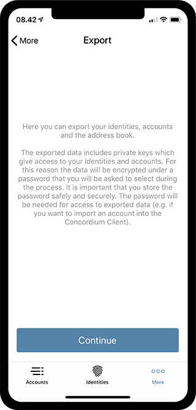

================================================================
Exporting and importing IDs and accounts using the mobile wallet
================================================================

.. contents::
   :local:
   :backlinks: none

Using the mobile wallet it is possible to export your IDs, accounts and
address book. This brief guide will show you how it works.

Export
======

The first step of exporting your IDs, accounts and address book, is to
go the **More** menu. The **More** menu will look slightly different,
depending on whether you use iOS or Android. On Android you will see the
three options **Address Book**, **Export** and **Import**, while you
will only see **Address Book** and **Export** on iOS. This will be
explained in the `Import`_ section of this guide.

.. image:: images/ei1_wireframe.png
   :align: center
.. image:: images/ei12_wireframe.png
   :align: center

To export your data, you of course just press the **export** option on
either platform, taking you to the next page, which will explain that
you have to encrypt your exported data with a password. By clicking
continue, you will be asked to choose a password for the file. After
inputting your password and clicking continue, you will be asked to
re-enter your password. When that is done, you will be taken to your
phone's export interface, allowing you to choose what to do with the
exported file.

.. note::

   The password you choose on export, will also be the password used to import
   and make transactions with the [CLI](/testnet/docs/client).

.. image:: images/ei4_wireframe.png
   :align: center

.. _Export: #export
.. _Import: #import

Import
======

The process of importing is slightly different on iOS and Android,
because of the way the two systems handle files.

iOS
---

As we saw on one of the first screenshots, iOS did not have an import
option in the **More** menu. Instead, you just open the file you
exported from whatever media you chose to share or keep the file with.
This will prompt the iOS system to ask you, what you want to do with the
file, and in this prompt you just choose to open it with the Concordium
mobile wallet app.

Upon choosing the app, you will be asked to enter the password you chose
during export. If the password is correct, you will then be asked to
authenticate yourself, using your biometrics, passcode or password. If
succesful, you will be shown a screen with information about what has
been imported.

.. image:: images/ei5_wireframe.png
   :align: center
.. image:: images/ei6_wireframe.png
   :align: center

Android
-------

On Android you have the option of choosing **Import** in the **More**
menu. By clicking that, you can browse to the location, where you keep
your exported file. Choosing your imported file, you will be prompted by
the app to enter the password chosen during export. If the password is
correct, you will be prompted to authenticate with biometrics, passcode
or password, which will then lead you to a screen showing the import
result.

.. image:: images/ei7_wireframe.png
   :align: center
.. image:: images/ei8_wireframe.png
   :align: center
.. image:: images/ei9_wireframe.png
   :align: center
.. image:: images/ei10_wireframe.png
   :align: center

Concordium Client
-----------------

Exported files from both iOS and Android can also be imported with our
CLI, `Concordium Client`_.

.. _support--feedback:

Support & Feedback
==================

If you run into any issues or have suggestions, post your question or
feedback on `Discord`_, or contact us at testnet@concordium.com.

.. _Concordium Client: /testnet/docs/client
.. _Discord: https://discord.gg/xWmQ5tp
