.. _Discord: https://discord.gg/xWmQ5tp

.. _guide-account-transactions:

===============================================================
Get started with accounts and transactions in the mobile wallet
===============================================================

.. contents::
   :local:
   :backlinks: none

Before following this guide you should have finished requesting your initial account and identity, as described in :ref:`the previous chapter<mobile-get-started>`.

Create a new account
====================
Before getting into how accounts, their balances and transactions work, let’s create a second account. Start by going
to the *Accounts* page. In the upper right corner you should see a **plus sign**. Press that to continue. On the next screen
you will be asked to name your new account. In this example we will choose the name *Example Account 2*, but you can
choose whichever name you want.

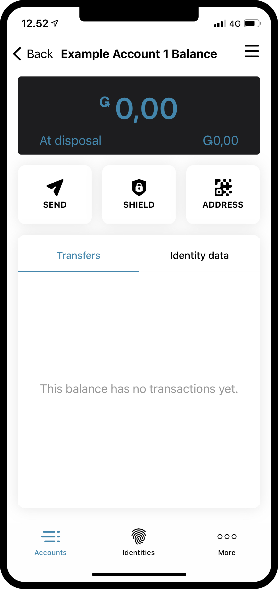

When pressing **Next**, you will be met with a screen on which you must decide which identity to use to open the new account.
So far you probably only have one, but if you have more you can pick whichever identity you want from the list. By
clicking on an identity, you will be taken to the next screen. When creating a non-initial account, i.e. an account
that is not created upon identity creation, you can choose to reveal a number of :ref:`glossary-attribute`. This is not necessary,
and if you do not have a specific reason to do so, we recommend not revealing any, as revealed attributes go on-chain and cannot be removed.

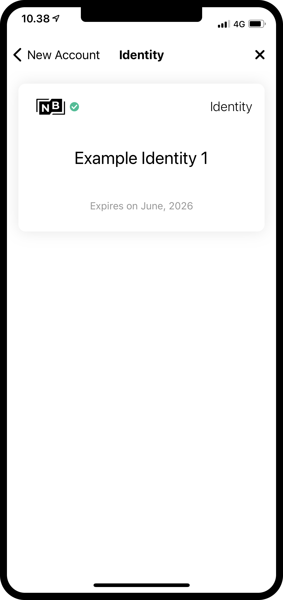

If you do press the **Reveal account attributes button**, you will be taken to the following page. You can tick
off the attributes you would like to reveal, and then press **Submit account**. Pressing **Submit account** on this or the previous
page, will take you to the final account creation page, which will give you a short overview and tell you that the account
has been submitted.

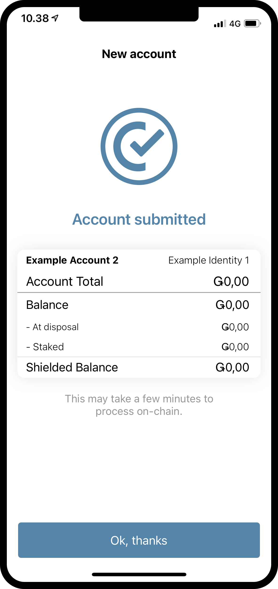

By pressing **Ok, thanks** on the submission overview, you will be taken back to the account page. You might see that your new
account is still pending, as it can take a few minutes to finalize on chain. If you have not tried to do so yet, you can
try pressing the downwards facing arrow on one of the account cards, to see that it will fold out the card. This reveals
two new pieces of information, *at disposal* and *staked*. The at disposal field will tell you how much of the accounts balance is
at available for use at the given moment, and the staked amount you can read more about on the :ref:`accounts<managing_accounts>` page.

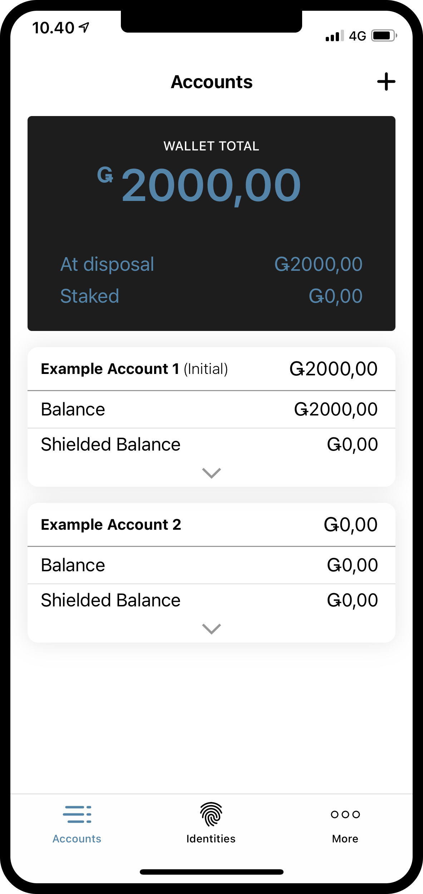

Make a transaction
====================
Next up, try pressing the **Balance** area of your newly created account. On this
screen you can see the current balance of your account. Given that you have just created a brand new account, the balance might still be 0.
The following examples are made with some GTU on the balance, to demonstrate the functionality of the app. In this example we have 2000 GTU
available on the balance. By pressing the **SEND** button, we will be taken to a screen, that will let us make a transfer.

On this page you can see the amount of GTU at disposal on the balance, and the amount of GTU on the shielded balance, which we will come back to later.
You can also input the amount you want to transfer, and lasty you can click the button that will let you select the receiver of the transaction.
Let's try inputting an amount, press the **Select Recipient** button and then select a receiver. Right now the only recipient we have in our address book, is
our *Example Account 2*. If you do not have your desired receiver in your address book already, you can add a new entry by pressing the + in the
upper right corner.

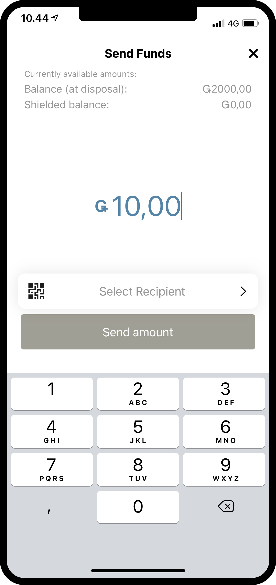
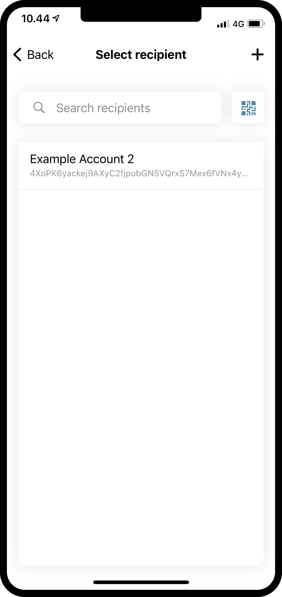

With the amount and recipient chosen, we can press **Send Funds** to continue. By doing this we are met by a confirmation screen on
which we can verify the amount, recipient and sending account.  By pressing **Yes, send funds**, we will verify ourselves using a passcode
or biometrics, and then the transaction is submitted to the chain. It might take a bit for the transaction to finalize.

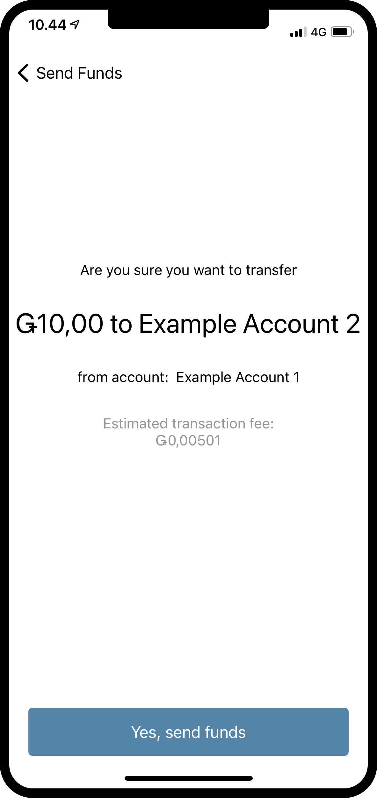

We can now see that the *Example Account 1*’s *Transfers* log shows that the amount has been deducted, plus a *fee*. All transactions will
cost a fee, and depending on the type of transaction the fee might differ. Pressing the transaction will let you see more details.

.. image:: ../images/mobile-wallet/MW30.png
      :width: 32%

.. _move-an-amount-to-the-shielded-balance:

Move an amount to the shielded balance
======================================
If we go back to the *Accounts* screen, we can now see that the 10 GTU has been transferred to the *Balance* of *Example Account 3*. As you might
have noticed before, the accounts also have a :ref:`glossary-shielded-balance`. In short, the shielded balance is for keeping shielded (encrypted) amounts
of GTU on the account. Let’s try adding some shielded GTU to our *Example Account 1*. Start by pressing the **Balance** area of the account card.

Next, press the **SHIELD** button and enter an amount of GTU to *shield*, which is the action of adding some GTU to the *Shielded Balance*.

We can now continue and confirm the transaction, just like we did before with the regular transfer. The transaction might take a moment
to finalize on the chain.

By going back to the *Accounts* page, it can now be seen that there is 10 GTU on the *Shielded Balance* of *Example Account 1*. If the *Shielded
Balance* area of the account card is pressed, we can see that there is a *Shielded amount* transaction in the shielded balance transfers log.
Making a shielding transaction will also cost a fee, but this fee will be deducted from the regular balance of the account. Try going
back and have a look at the transfer log of the regular *Balance*.

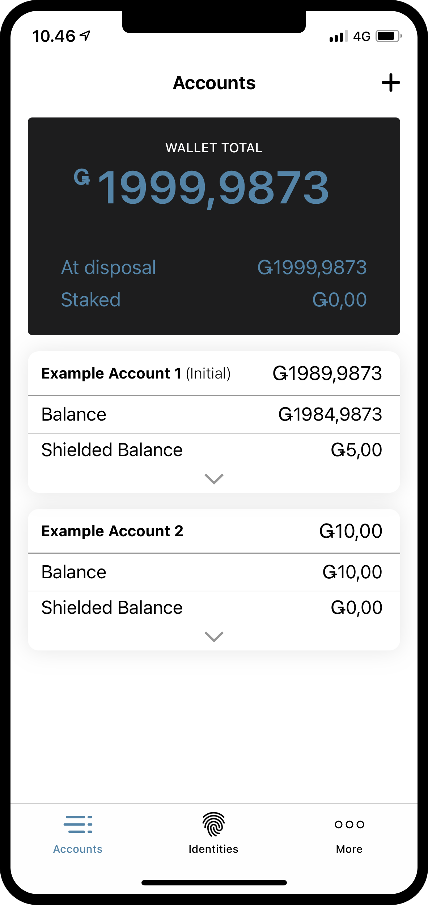

Make a shielded transfer
========================
Having some shielded GTU available, we can now try making a *Shielded transfer*, which means that we can make a transfer with an encrypted
amount of GTU. The first step is to browse to the *shielded balance* page of the account containing shielded GTU.
Then press the **SEND** button. You will now be able to enter an amount and choose a recipient. In this example we have chosen to
transfer 2 GTU. When pressing the **Select Recipient** button, you will be able to choose a recipient. We will choose
*Example Account 2* in this example.

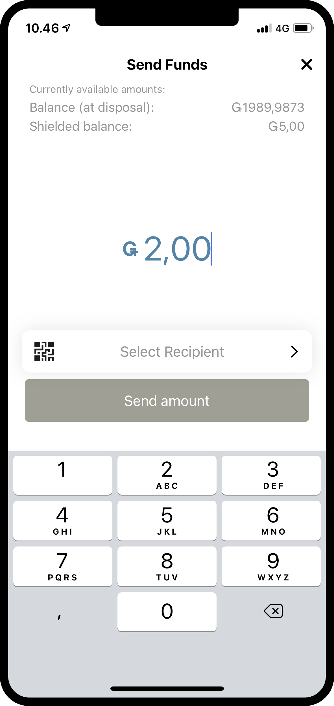
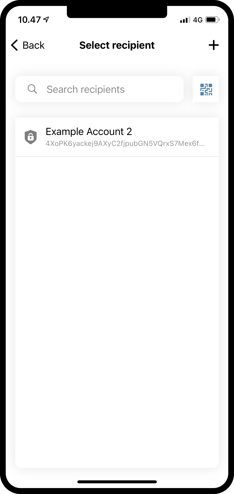

With the amount and recipient in place, you can now continue. Just like the other transactions you will now see a confirmation screen,
and by continuing from that you will be able to verify yourself with a passcode or biometrics, and then submit the shielded transaction
to the chain. Again, the transaction might take a moment to finalize on the chain.

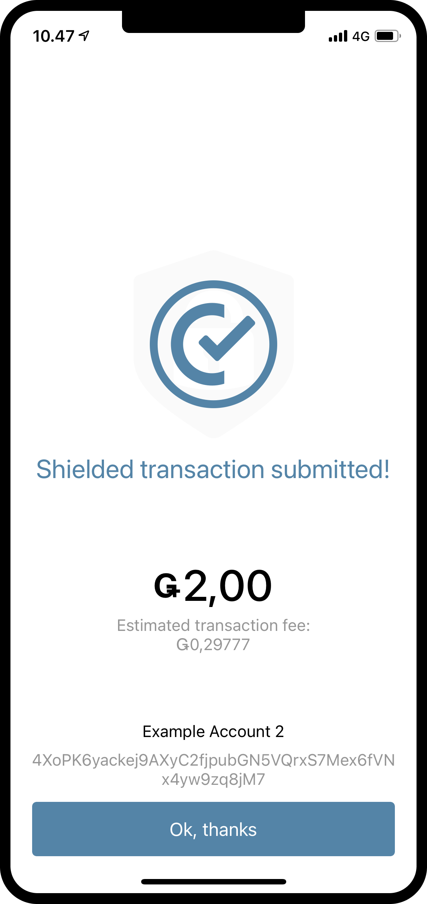

Now, if you go back to the *Accounts* screen, you should be able to see that a little shield has appeared beside the amount on the
*Shielded Balance* of the receiving account. This indicates that there are newly received shielded transactions on the shielded balance.
Try pressing the shielded balance, and notice that you have to enter a passcode or use your biometrics to enter it.
This happens because you need to decrypt received shielded transactions, before you can see the amount.

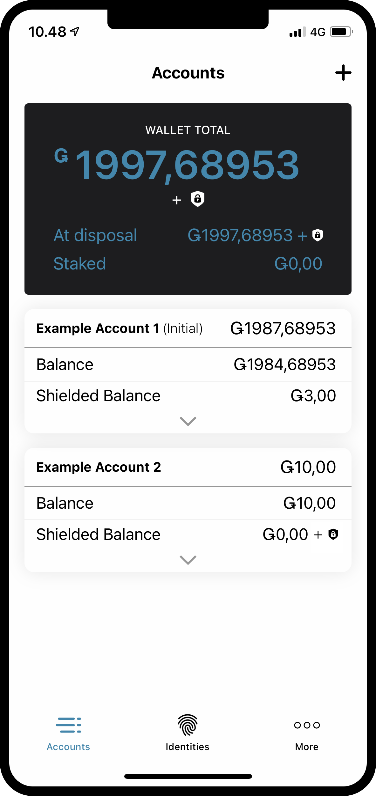

Unshield an amount
==================
After the decryption, the amount is now visible in the *shielded balance* and on the account card on the *Accounts* screen. Now, what if we
want to move some GTU from a shielded balance to a regular balance? Let’s try to move the 2 GTU to the regular balance via the action of
*Unshielding* an amount. To do this, press the **UNSHIELD** button in the shielded balance, and enter the amount to be *unshielded*.

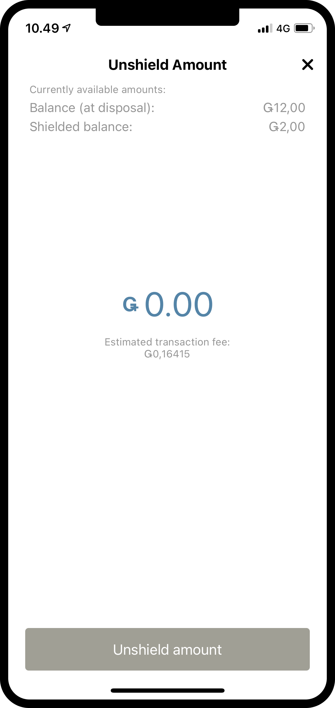

Now finish the transaction like you did with the other ones, and try browsing to the regular balance of the account to see the unshielding.
If the transaction has finalized on chain, you should now be able to see that an *Unshielded amount* has ticked in on the regular balance.
Notice how it is not 2 GTU, even though the amount you just unshielded was 2. This is because the fee for making any transaction, including
an unshielding, will be deducted from the regular balance of the account responsible for the transaction.

.. image:: ../images/mobile-wallet/MW50.png
      :width: 32%

Share your account address
==========================
If you want to share the address of your account, this can be easily done by pressing the **Address** button. This will take you to a page
where you have multiple options of sharing the account address. Try pressing the **Share** button, and share your address with someone.

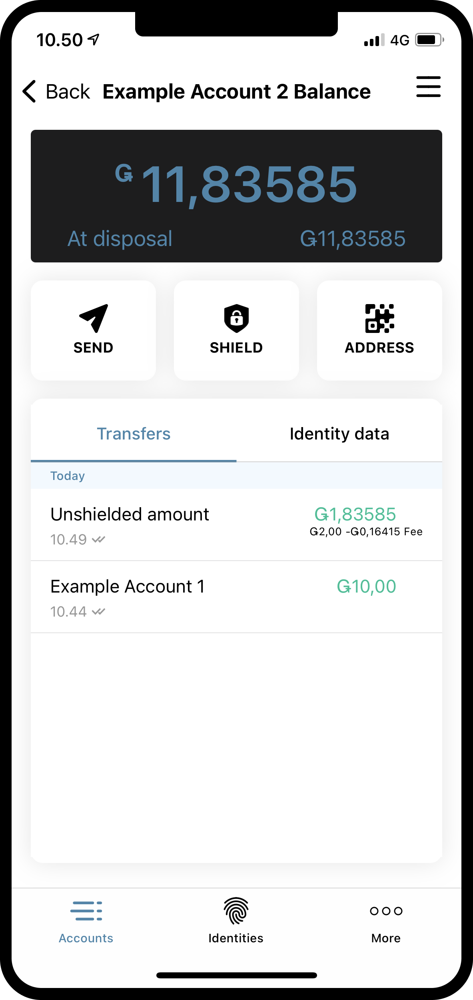

Inspect a release schedule
==========================
On the Concordium blockchain it is possible to make a transaction that releases the transferred amount over time. This is called a
*transfer with a schedule*. For now we will not get into how to make such a transfer as it cannot be done from Concordium Mobile Wallet,
but let’s check out how a release schedule can be inspected. If you receive a transfer with a release schedule, you can press the
**burger menu** in the upper right corner of the balance screen. This will allow you to press **Release Schedule**, and by doing this you
will be taken to a screen containing information on how much GTU will be released and when.

.. image:: ../images/mobile-wallet/MW55.png
      :width: 32%
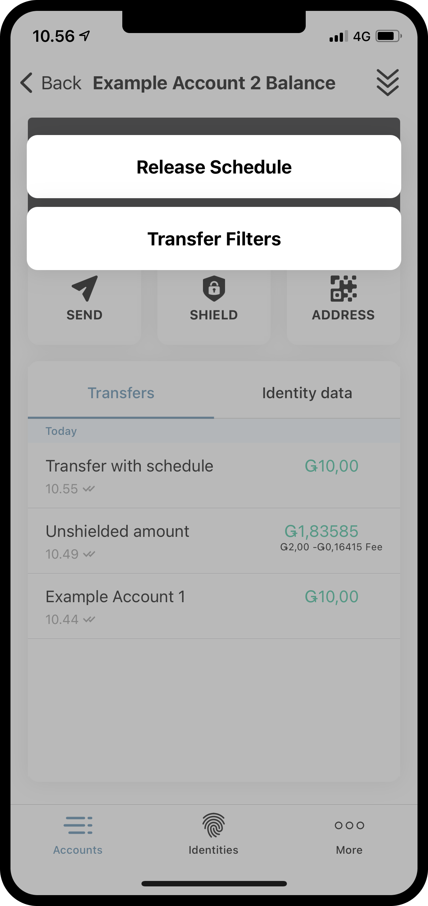

