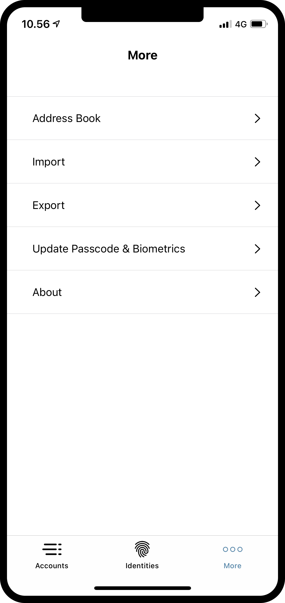
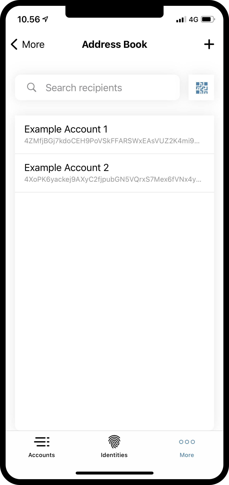
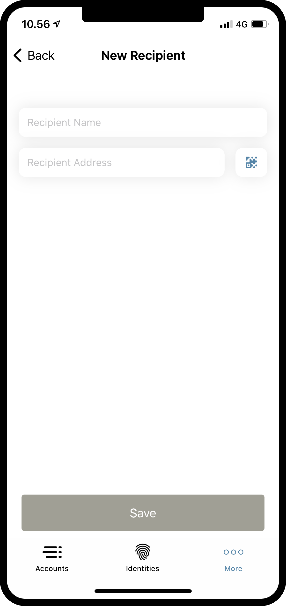
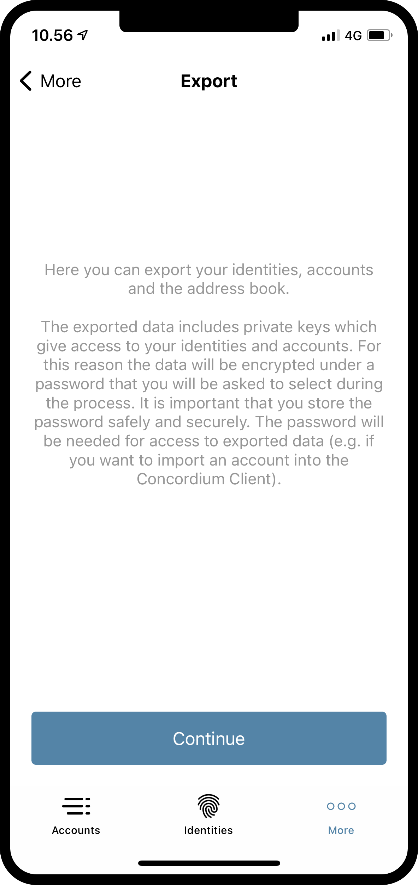
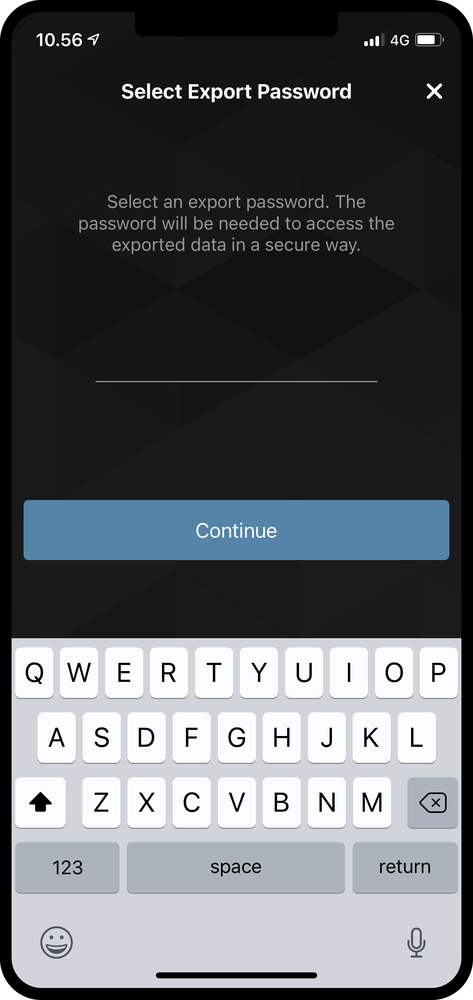

.. _Discord: https://discord.gg/xWmQ5tp

.. _testnet-explore-more:

============================================
Explore the *More* page in the Mobile Wallet
============================================

.. contents::
   :local:
   :backlinks: none

The More page
=============
As you might have noticed, there is a page called *More* on the right side of the menu at the bottom of the screen. On this page
there are five options to be found.

- Address Book
- Import
- Export
- Update Passcode & biometrics
- About

Address Book
============
As the name suggests, the *Address Book* is a place to keep account addresses. If you browse to the *Address Book*, you will see that
the addresses of your own accounts are already stored there. Besides seeing your own addresses, you can also add more entries to
the *Address Book*, either by pressing the **QR code symbol**, or pressing the **plus sign** in the upper right corner. By doing that you
can enter a new recipient address and give it a nickname in your *Address Book*. The entries in your address book can of course be
searched, when you make a transfer.

Export
======
Using Concordium Mobile Wallet it is possible to export your accounts and identities. This can e.g. be useful to create back-ups, or to move
your ID's and accounts if you get a new phone. To start an export, press the **Export** option. Doing that will take you to a new page that
briefly explains what an export means. We recommend reading this carefully. Pressing **Continue** will take you to a page on which you will
be asked to enter a password for your export file. After entering it twice, you can **Continue**. As a last step, you will be prompted by
either iOS or Android on what you want to do with your exported file, using the layover from the phone’s operating system.

Import
======
The import feature works slightly differently on iOS and Android. On Android you press the *Import* option, which will let you browse to the
file you want to import. Depending on your phone and Android version, this might look different specific to the operating system. On iOS you
have to browse to the file from outside Concordium Mobile Wallet, and then press it and choose the *Share option*. This will let you choose
Concordium Mobile Wallet as the app to handle the file.

Having opened the file on either platform, you will first be asked to enter the password chosen on export. After pressing **Continue**
you will have to verify yourself with the passcode or the biometrics chosen, when you set up the app. Finally you will get a list
of the *Accounts*, *Identities* and the *Address Book* entries you have imported.

Update Passcode & Biometrics
============================
Using this option it is possible to change the passcode or full password that you use to unlock your app. It is also possible to enable or disable
biometrics.

.. note::
   It is not possible to change your passcode, password or biometrics if you have pending identities or accounts on your phone.

About
=====
In the About option you can find support information and the app version number.
