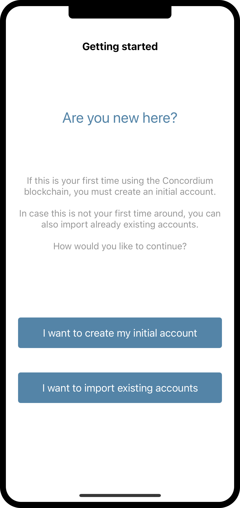
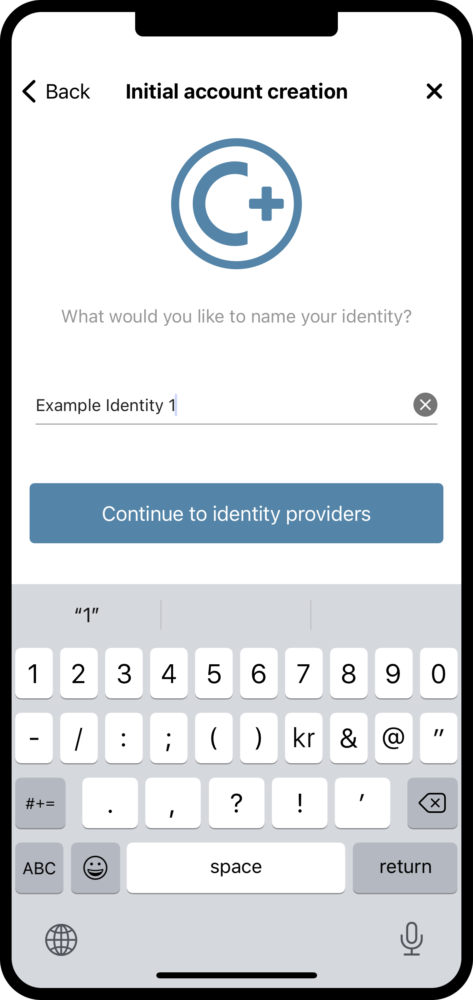
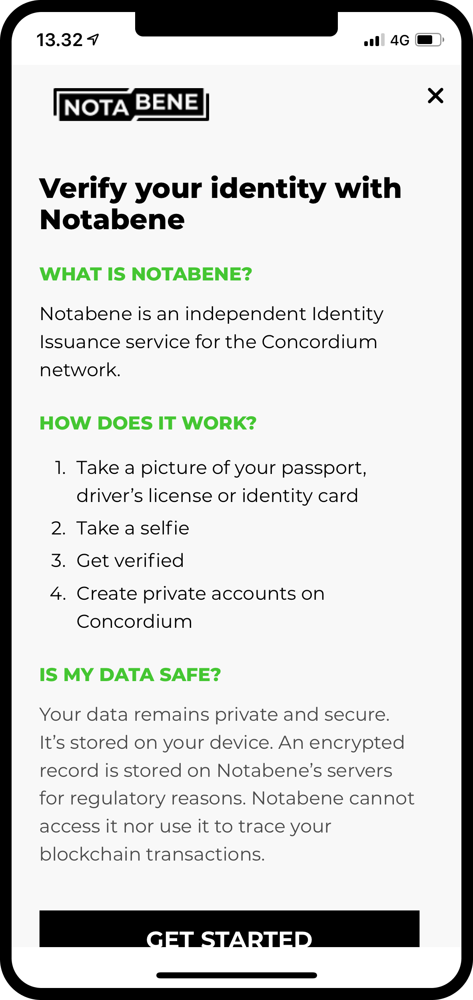
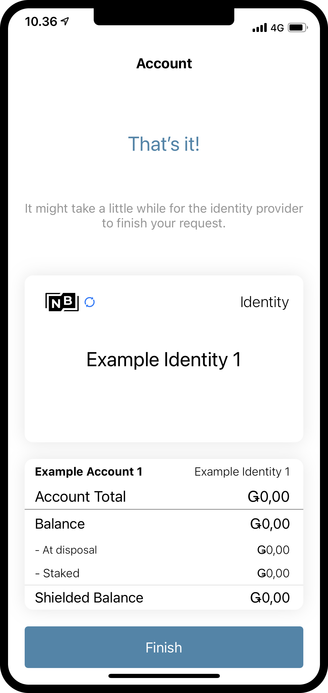

.. _Discord: https://discord.gg/xWmQ5tp

.. _mobile-get-started:

=======================================
Get started with the mobile wallet
=======================================

.. contents::
   :local:
   :backlinks: none

.. todo::

   Insert link to download section.

Before following this guide you should have finished installing Concordium Mobile Wallet, as described in :ref:`Downloads <downloads>`.

Set up a passcode and biometrics
================================

When you open the Concordium ID app for the first time, you will be greeted by a flow
that will help you setup a passcode and biometric authentication, create an :ref:`glossary-initial-account`,
and it will also guide you through getting an :ref:`glossary-identity`. The initial account is a special type of account,
that is submitted to the chain by the :ref:`glossary-identity-provider`, upon creation of an identity. You can make the
the same transactions from an initial account as from regular accounts, but the owner of the initial account will be
known by the identity provider. After your identity is created you will be able to submit accounts to the chain
yourself, and these will be unknown by the identity provider. You can learn more about accounts on the :ref:`Identities
and accounts<reference-id-accounts>` page.

After reading and accepting the Terms and Conditions for the Concordium Mobile Wallet, the first screen you will meet when
opening Concordium ID is this one. It will just explain that you have to go through this process to get started.

If you are ready to continue, you can press **Continue**. The next screen will ask you to input
a six-digit passcode. If you would rather use a full password including letters, you can also choose to do so here.

Having chosen either a passcode or a full password, you will get the option to also use biometrics if your phone
supports it, i.e. facial recognition or fingerprint. We recommend using biometrics if you have the option to do so.

Request your initial account and identity
=========================================

Next up, you will get a choice between making a new initial account and identity, or importing an already existing set.
Assuming this is the first time you are using Concordium Mobile Wallet, you can choose **I want to create my initial account** to continue.

On the next screen you will see a description of what the initial account is and the three steps you have to finish to get it,
along with your identity. In short, the initial account is an account submitted to the chain by the identity provider of your
choice, which means they will know that you are the owner of the account. Later you will be able to submit accounts to the
chain by yourself, which means the owner of these accounts will be only known by you.

The three steps mentioned above are:

1. Naming of your initial account
2. Naming your identity
3. Requesting the initial account and identity from an :ref:`glossary-identity-provider` of your choice

You will meet the first step on the next page, which prompts you to enter a name for your initial account. Pressing continue
will take you to the next page, on which you have to name your identity. Both of these names will only be known by yourself,
so you can name them more or less whatever you want (There are a few constraints on what letters and signs you can use).

In the examples below, we choose to call our initial account *Example Account 1* and our identity *Example Identity 1*. As
mentioned, you can choose whichever names you want.

By pressing **Continue to identity providers**, you will be taken to a page where you have to choose between *identity providers*.
An identity provider is an external third party who will verify who you are, before returning an identity object to be used for creating accounts on the chain.
For now Notabene is the only option, but more might be added later.

By pressing an identity provider button, you will be taken to the provider's identity issuance flow. It will look similar to the one below.

After finishing the identity issuance flow, you will be met with the following screen. It will show you an overview
of your identity and the initial account.

Depending on the identity provider you have chosen, the layout of the identity card might differ slightly. You can see that the
Example Account 1 is held by the identity Example Identity 1. The account created during this process will be marked with *(Initial)*
in the app, so you know which account is the initial account submitted to the chain by the identity provider.

By pressing **Finish** you will be taken to the *Accounts screen*. On this screen you will be able to see your newly created initial
account. It might be showing a *Pending icon*, which means the identity provider is still working on submitting and creating your
initial account and identity. You can also navigate to the *Identities screen* by clicking on **Identities** at the bottom of the
display. On this screen you can see your newly created identity, which might also still be pending in case the identity provider
has not finished it yet. All you have to do now, is to wait for them to finish.

.. image:: ../images/mobile-wallet/MW65.png
      :width: 32%
